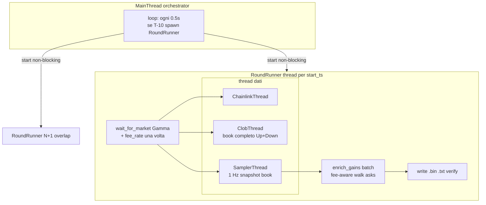

# Piano 0607 — Collector sync + thread

## Obiettivo

Sostituire l'architettura `asyncio` attuale con un collector **mono-processo, multi-thread**, dove ogni round ha i propri thread isolati e i round si **sovrappongono** (nessun gap, nessuno skip alternato). Codice asciutto, POC leggibile, niente async.

In più: replicare il calcolo **majority_gain** come l'UI Polymarket ("To win" su $100 per il lato maggioritario), usando **orderbook completo** salvato ogni secondo in memoria e fee crypto corrette, con arricchimento **solo a fine round** (zero HTTP durante campionamento).

Riferimento problemi: [docs/report-0607.md](f:\btc5min\docs\report-0607.md)

---

## Architettura target



**Thread per round (4 totali):**

| Thread | Ruolo | Durata |
|--------|-------|--------|
| `RoundRunner` | Gamma REST + fee_rate, avvia feed, join, enrich + flush | `T-10` → `T+300` + write |
| `ChainlinkThread` | WS RTDS, `price` + `price_to_beat` | fino a `market_end_ts` |
| `ClobThread` | WS CLOB, **book completo** bid+ask per Up e Down | fino a `market_end_ts` |
| `SamplerThread` | 1 Hz: snapshot book + best bid/ask + chainlink → buffer | `market_start_ts` → `market_end_ts` |

Il **MainThread** fa solo scheduling.

---

## Majority gain — specifica di calcolo

### Semantica

- **Lato**: sempre la quota **maggioritaria** al secondo del campionamento.
  - `up_mid = (up_bid + up_ask) / 2`, `down_mid = (down_bid + down_ask) / 2`
  - Se `up_mid > down_mid` → lato **Up**; se `down_mid > up_mid` → **Down**
  - Se `up_mid == down_mid` (50¢-50¢) → **Up** (scelta fissa, indifferente)
- **Input**: snapshot **asks** del token maggioritario a quel secondo (book completo salvato in memoria).
- **Importo**: `BET_USD = 100.0` (come UI Polymarket).
- **Output nel `.bin`**: `majority_gain = (to_win / BET_USD) - 1` dove `to_win` = payout totale se la scommessa maggioritaria vince (= numero di share ricevute, ciascuna paga $1).

Esempio UI: To win **$150.46** su $100 → `majority_gain = 0.5046`.

### Algoritmo `market_buy_gain(asks, amount_usd, fee_rate)`

Replica market buy Polymarket con fee taker crypto:

```
fee(shares C, price p) = C × fee_rate × p × (1 − p)
```

1. Ordina `asks` per prezzo crescente (miglior ask prima).
2. Budget residuo `B = amount_usd`.
3. Per ogni livello `(p, size)` finché `B > 0`:
   - Costo USDC per comprare `size` share a `p`: `cost = size × p`
   - Fee su quelle share: `fee = size × fee_rate × p × (1 − p)`
   - Se `cost + fee <= B`: compra tutte le `size` share, `B -= cost + fee`
   - Altrimenti: risolvi quante share `c` entrano in `B` (equazione lineare in `c` a prezzo fisso `p`), compra `c`, `B = 0`
4. `C_tot` = share totali acquistate.
5. `to_win = C_tot`
6. `gain = to_win / amount_usd - 1`

**Nota**: questo è VWAP fee-aware, non il bug attuale di `_calculate_buy_market_price` che restituisce solo il prezzo dell'ultimo livello.

### Fee rate

- Recuperato **una volta** all'inizio del round (nel `RoundRunner`, prima dei feed):
  - `GET https://clob.polymarket.com/markets/{condition_id}` oppure campo da Gamma se disponibile
  - Per mercati BTC crypto: `fee_rate = 0.072` (documentato Polymarket marzo 2026)
  - Se API non restituisce il valore → eccezione (no default nascosto, regola D2)
- Salvato in `RoundState.fee_rate`, usato solo in `enrich_gains` a fine round.

### Zero HTTP durante campionamento

| Fase | HTTP |
|------|------|
| Inizio round | Gamma `wait_for_market` + 1 fetch `fee_rate` |
| Ogni secondo | **nessuno** — book da WS CLOB |
| Fine round | **nessuno** — `enrich_gains` usa solo `book_snapshots` in RAM |

---

## Orderbook in memoria

### Struttura per snapshot

Nuovo tipo in [`src/book.py`](f:\btc5min\src\book.py) (modulo piccolo):

```python
BookSide = list[tuple[float, float]]  # (price, size) ordinato

@dataclass
class BookSnapshot:
    up_bids: BookSide
    up_asks: BookSide
    down_bids: BookSide
    down_asks: BookSide
    up_bid, up_ask, down_bid, down_ask: float  # best, per record .bin
```

- `book_snapshots: list[BookSnapshot]` — una entry per tick, parallela a `RoundBuffer._rows`
- **Non** serializzato nel `.bin` v2 (resta in RAM fino a enrich, poi scartato)
- Formato binario invariato: 8 colonne per tick come oggi; `majority_gain` riempito prima di `write_round`

### ClobThread — book completo

[`src/feed_clob.py`](f:\btc5min\src\feed_clob.py) mantiene due book in `RoundState`:

- Evento `book`: sostituisce intero lato bid/ask del token
- Evento `price_change` / `best_bid_ask`: aggiorna livelli (stessa logica Polymarket CLOB)
- Best bid/ask derivati dal book (`bids[0]`, `asks[0]` dopo sort)

Il sampler ogni secondo, sotto lock:
1. `copy.deepcopy` dei due book (snapshot immutabile)
2. append tick a `RoundBuffer` con best bid/ask + chainlink, `majority_gain=0.0`
3. append `BookSnapshot` a `book_snapshots`
4. `log_sample(...)` su **stderr** — vedi sezione sotto

---

## Log campionamento console (verifica visiva vs sito)

### Scopo

Durante il campionamento, ogni tick campionato viene stampato in **console** con tutti i valori disponibili in quel momento, **escluso `majority_gain`** (calcolato solo a fine round). Serve per confronto live con l'UI Polymarket affiancata al terminale.

### Canale: stderr, non collector.log

| Output | Destinazione | Contenuto |
|--------|--------------|-----------|
| Log orchestratore / round (`INFO`, errori) | **stdout** → `data/collector.log` via `collect.bat` | start round, PTB, done, verify |
| Log campionamento (`SAMPLE`) | **stderr** → **solo console** | una riga per tick campionato |

**Modifica [`collect.bat`](f:\btc5min\collect.bat):**

```bat
python -m src.main 1>>"%LOG%"
```

Oggi `2>&1` manda anche stderr nel file — va **rimosso**, altrimenti il log SAMPLE finirebbe in `collector.log`.

### Implementazione

Modulo [`src/sample_log.py`](f:\btc5min\src\sample_log.py) (minimo):

```python
import logging, sys

_sample = logging.getLogger("sample")
_sample.propagate = False
_sample.addHandler(logging.StreamHandler(sys.stderr))
_sample.setLevel(logging.INFO)

def log_sample(start_ts, countdown_sec, up_bid, up_ask, down_bid, down_ask,
        chainlink, price_to_beat, majority_side, up_ask_levels, down_ask_levels) -> None:
    _sample.info(
        "round=%s sec=%3d side=%s up=%.2f/%.2f down=%.2f/%.2f btc=%.2f ptb=%s book_lvls up=%d down=%d",
        start_ts, countdown_sec, majority_side,
        up_bid, up_ask, down_bid, down_ask, chainlink,
        f"{price_to_beat:.2f}" if price_to_beat is not None else "-",
        up_ask_levels, down_ask_levels)
```

- Chiamata da `run_sampler` subito dopo append tick/buffer.
- `majority_side`: calcolato al volo con `majority_side()` (solo midpoint, no gain).
- `price_to_beat`: valore se già catturato, altrimenti `"-"`.
- `book_lvls`: numero livelli ask nel snapshot (indicatore profondità book per debug slippage).
- Con **overlap** round, il prefisso `round=<start_ts>` distingue due stream simultanei.

Esempio riga console:

```
round=1783303200 sec=298 side=Up up=0.52/0.53 down=0.47/0.48 btc=63511.68 ptb=63511.68 book_lvls up=14 down=11
```

### Cosa NON loggare nel SAMPLE

- `majority_gain` / `to_win` (fine round)
- Dump completo orderbook (troppo verboso) — solo best bid/ask + conteggio livelli
- Messaggi orchestratore (restano su stdout/logger `main` / `round`)

### `main.py` logging

- `logging.basicConfig(..., stream=sys.stdout)` — solo logger root → stdout → file con `collect.bat`
- Logger `sample` con `propagate=False` — non eredita handler root, resta su stderr

---

## Stato condiviso per round

[`src/round_state.py`](f:\btc5min\src\round_state.py):

```python
class RoundState:
    lock: threading.Lock
    chainlink_price: float | None
    price_to_beat: float | None
    up_book: OrderBook   # bids + asks lists
    down_book: OrderBook
    fee_rate: float
    market_start_ts, market_end_ts, start_ts: int
    up_token_id, down_token_id: str
    buffer: RoundBuffer
    book_snapshots: list[BookSnapshot]
    last_countdown_sec: int | None
    stop: threading.Event
```

---

## Flusso temporale per round

```
T-10   RoundRunner.start()
T-10   wait_for_market() + fetch fee_rate
T-10   ChainlinkThread + ClobThread start
T-5    Chainlink reconnect se serve (fix PTB §7.3)
T-0    SamplerThread: 1 Hz
       → ogni sec: deepcopy book Up+Down + best quotes + chainlink
       → majority_gain = 0.0 (placeholder)
T+300  stop → join thread
T+300  enrich_gains(state):
       per ogni i: side = majority_side(tick_i)
                  asks = book_snapshots[i].{up|down}_asks
                  buffer[i].gain = market_buy_gain(asks, 100, fee_rate)
T+300  write .bin / .txt / verify
```

**Overlap**: round N+1 parte a `T-10` mentre N è ancora in campionamento — round isolati, nessuno skip.

---

## Moduli

### [`src/clob_api.py`](f:\btc5min\src\clob_api.py) — riscrittura

- `majority_side(up_bid, up_ask, down_bid, down_ask) -> str`  # "Up" | "Down"
- `market_buy_gain(asks: BookSide, amount_usd: float, fee_rate: float) -> float`
- `enrich_gains(buffer, book_snapshots, fee_rate) -> None` — loop su righe, set colonna gain
- `fetch_fee_rate(condition_id: str) -> float` — 1 chiamata REST a inizio round
- **Elimina** `majority_gain()` con HTTP per tick e `_calculate_buy_market_price` errato

### [`src/round_runner.py`](f:\btc5min\src\round_runner.py)

- `run_sampler`: snapshot book ogni secondo + `log_sample()` su stderr
- flush: `enrich_gains` → `build_round_header` → `write_round` → `write_round_txt` → `verify_round`

### [`src/sample_log.py`](f:\btc5min\src\sample_log.py)

- Logger dedicato stderr, una riga per tick campionato

### [`src/feed_clob.py`](f:\btc5min\src\feed_clob.py)

- Book completo per token, non solo best 4 prezzi

### [`src/main.py`](f:\btc5min\src\main.py)

- Orchestratore sync, overlap `T-10`, `--once --start-ts`

### Invariati (con adattamenti minimi)

| Modulo | Cambio |
|--------|--------|
| [`binary_format.py`](f:\btc5min\src\binary_format.py) | Nessuno — v2, 8 colonne |
| [`round_buffer.py`](f:\btc5min\src\round_buffer.py) | Aggiungere `set_gain(i, gain)` per enrich |
| [`settlement.py`](f:\btc5min\src\settlement.py) | Invariato |
| [`verify.py`](f:\btc5min\src\verify.py) | Invariato (V14 gain >= -1) |
| [`convert.py`](f:\btc5min\src\convert.py) | Invariato |
| [`market.py`](f:\btc5min\src\market.py) | Aggiungere `condition_id` in parse se serve per fee_rate |

### Da eliminare

`ws_chainlink.py`, `ws_clob.py`, `collector_worker.py`, `collector_once.py`

---

## Mapping problemi report → soluzione

| Problema | Soluzione |
|----------|-----------|
| §7.1 Skip round alternati | Overlap thread per round |
| §7.2 600-900 HTTP/sec | Book da WS; gain calcolato in RAM a fine round; 1 HTTP fee_rate a inizio |
| §7.3 PTB non catturato | Chainlink thread dedicato + reconnect T-5 |
| §7.4 Codice morto | Elimina async, callback, branch morto |
| §7.5 Sync in async | Tutto sync+thread |
| Gain impreciso (best ask only) | Book completo + walk fee-aware come UI |
| Lato sbagliato | Sempre lato maggioritario per midpoint |

---

## Validazione

1. **3 round consecutivi** → 3 file `.bin`, nessun `skipping round` nel log
2. `python -m src.verify data/` → tutti OK, 300 tick ciascuno
3. **Confronto UI Polymarket** (criterio principale gain):
   - Su 5 secondi random per round, aprire UI con $100 sul lato maggioritario
   - Verificare `to_win_ui / 100 - 1 ≈ majority_gain` nel `.bin` (tolleranza ±2% per latenza book)
4. Confronto best bid/ask vs UI (come prima)
5. **Log SAMPLE in console**: durante campionamento, prezzi su stderr coincidono con UI (±1¢); righe assenti in `collector.log`

---

## Stima codice

| Modulo | ~righe |
|--------|--------|
| `book.py` | 40 |
| `clob_api.py` | 80 |
| `feed_clob.py` | 120 |
| `round_runner.py` | 100 |
| `round_state.py` | 45 |
| `sample_log.py` | 20 |
| altri | ~250 |

**~635 righe** collector core (book completo + gain fee-aware giustificano l'aumento vs stima precedente).

---

## [`collect.bat`](f:\btc5min\collect.bat)

```bat
python -m src.main 1>>"%LOG%"
```

Solo **stdout** nel file log. **stderr** (righe SAMPLE) resta in console.

---

## Dipendenze

```
httpx>=0.27
websocket-client>=1.7
numpy>=1.26
```

Rimuovere `websockets`.
