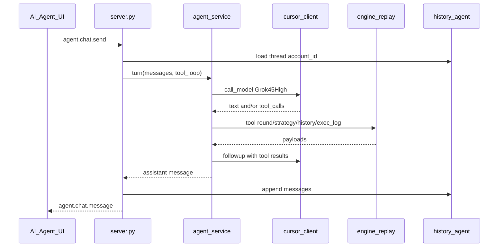

# AI Agent tab (phased)

## Decisioni fissate

- Runtime **ibrido (C)**: chat sul server dashv2 + tool controllati (niente filesystem libero dell’SDK).
- Modello **Grok 4.5 High** dedicato all’agent (indipendente da `cursor_label` codegen).
- Chat **persistita per account attivo**.
- Correzioni strategia **solo via rules** → `strategy.update` + codegen; mai patch `.py` isolato.
- Contesto max in fasi; round via tool summary/tick; log esecuzione fatti+`reason` in jsonl per sessione.
- UI: 4ª tab sinistra + layout chat + sidebar contesto; **no streaming** in v1.
- Lingua IT; refuse off-topic.
- Delivery **v1 → v2 → v3**.

---

## v1 — Tab chat + contesto + refuse + proposte rules

### UI
- Nuova tab **AI AGENT** in [`dashv2/static/index.html`](dashv2/static/index.html) accanto a CANDLES / ACCOUNTS / BOT.
- Layout: colonna chat (messaggi + input) + sidebar contesto (account attivo, strategie, round caricato, bot status).
- Wire in [`dashv2/static/js/app.js`](dashv2/static/js/app.js) / [`render.js`](dashv2/static/js/render.js) / CSS; persist tab in `LEFT_TAB_IDS`.

### Backend chat
- Nuovo modulo [`dashv2/agent_chat.py`](dashv2/agent_chat.py): thread per `account_id` sotto `history/agent/account_{id}/thread.json` (messaggi `{role, content, ts}`).
- [`dashv2/agent_service.py`](dashv2/agent_service.py): system prompt dedicato (IT, dominio-only, rules-first, refuse off-topic); assembla contesto fisso per turno:
  - account summary + history rows recenti
  - catalog strategie (id, name, description, rules; `.py` della selezionata se presente)
  - session/bot status del round corrente
- Estendere [`dashv2/cursor_client.py`](dashv2/cursor_client.py) / config: modello agent fisso da `setup.json` (es. `agent_cursor_label: "Grok 4.5 High"`) distinto da codegen.
- Socket.IO human-only: `agent.chat.send`, `agent.chat.clear`, eventi `agent.chat.message` / `agent.chat.error` (ack senza streaming).
- Turno: prompt = system + contesto snapshot + history thread + user message → `call_model` one-shot → append risposta (come codegen: `wait()`, no stream).

### Tool controllati (v1 minimo)
Implementati come funzioni Python chiamate dal service (non tool SDK aperti), invocabili se il modello restituisce un blocco JSON strutturato tipo `{"tool":"…","args":{…}}` oppure, più semplice in v1: **il server inietta sempre il contesto** e espone solo tool espliciti post-parse se presenti nel testo; preferenza concreta: **schema tool nel prompt + parser JSON fenced** eseguito in loop max N (es. 3) prima della risposta finale.

Tool v1:
- `strategy.list` / `strategy.get` (JSON + rules + source `.py`)
- `account.summary` / `history.recent`
- `session.snapshot` (round caricato, sec, bot_active, active strategies)

### Rules-first in v1
- L’agent **propone** testo rules aggiornato in chat (blocco chiaro).
- Non applica ancora: UI mostra CTA “Applica rules” che riusa il flusso EDIT esistente (utente conferma) — oppure solo istruzione all’utente di copiare in EDIT. **Scelta concreta:** CTA “Applica rules a strategia X” → emette `strategy.update` + codegen lato server (stesso path di `_strategy_update_with_codegen`), ma solo dopo conferma click utente (niente auto-apply silenzioso).

### Docs / ACL
- Aggiornare sezione UI + comandi in [`docs/dashv2-architecture.md`](docs/dashv2-architecture.md) e mappa tab in [`AGENTS.md`](AGENTS.md).
- `_HUMAN_CMDS` += `agent.chat.*`; bot non può usare la chat.

---

## v2 — Execution log + tool round

### Contratto azioni
- In [`dashv2/strategy_codegen.py`](dashv2/strategy_codegen.py) / system prompt: azioni possono includere `reason: str` opzionale.
- Bot [`bots/bot_process.py`](dashv2/bots/bot_process.py) + engine [`orders.py`](dashv2/orders.py) / [`replay.py`](dashv2/engine/plugins/replay.py): propagare `reason` su place/close; `_emit_action` include reason.

### Persistenza log
- Append **jsonl** per sessione: `history/executions/{session_id}.jsonl`.
- Ogni riga: `{ts, session_id, market_start_ts, sec, strategy_id, cmd, side|order_id, size_usd, quotes/mtm se noti, reason, source}`.
- Scrittura da engine al place/close (fatti) + reason se presente; anche close manuali user con `reason: "manual"` / actor user.

### Tool agent
- `exec_log.session(session_id|current)`
- `round.summary(market_start_ts)` — meta da repo (day, valid, PTB se leggibile senza spoiler se round non settled in UI… per agent human OK full)
- `round.tick(market_start_ts, sec)` — campi tick pubblici (BBO, delta, vol, Rq/Rs, DWin); no LOB pieno di default
- Opzionale `rounds.list(day_utc)` riusando `RoundRepository`

### Contesto
- Sidebar + auto-inject: last N righe exec log della sessione corrente.

---

## v3 — Apply rules automatico da agent + chat matura

- Tool `strategy.apply_rules(strategy_id, rules, name?, description?)` eseguito dal server → stesso codegen di update → emit `strategies` / progress `strategy.generate`.
- Vincolo hard: **vietato** tool `strategy.write_python`; dopo apply, `.py` solo da codegen.
- Prompt agent: se l’utente chiede fix al Python, rispondere spiegando che si aggiornano le rules e si rigenera; eventuale diff rules proposto prima di `apply_rules` (conferma UI o flag `confirm` nel tool).
- Persistenza chat già in v1; v3 aggiunge eventuale truncate/summary se thread lunghi (solo se necessario).

---

## File principali toccati

| Area | File |
|------|------|
| UI tab | `static/index.html`, `app.js`, `render.js`, `dashboard.css` |
| Agent | `agent_chat.py`, `agent_service.py`, `agent_system_prompt.md` (nuovo) |
| SDK/config | `cursor_client.py`, `config.py`, `setup.json` |
| Bridge | `server.py` |
| Log/azioni | `bots/bot_process.py`, `orders.py`, `engine/plugins/replay.py`, `strategy_codegen.py`, `strategy_system_prompt.md` |
| Round tools | `rounds.py` (+ helper read tick without full UI load) |
| Docs | `docs/dashv2-architecture.md`, `AGENTS.md` |

## Restart

- v1/v2/v3 toccano backend → sentinella `data/restart` + refresh browser per static.

## Test

- Unit: persistenza thread, parser tool JSON, refuse/domain prompt smoke (mock `call_model`).
- Unit: exec log append + reason propagation.
- Unit: `round.tick` helper su fixture `.bin`/`.txt` esistente.
- Nessun test live Cursor obbligatorio (come codegen).
