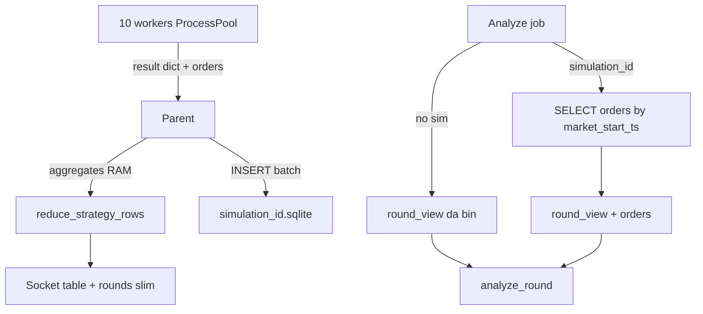

# Analyze strategy-aware via simulation (SQLite)

## Decisioni chiuse

- Strategy context in Analyze: **opzionale**, via **simulation salvata** (non riesecuzione).
- Prerequisito: i backtest persistono **aggregati + dettaglio ordini**.
- Persistenza simulation: **SQLite (un file per simulation)**, non JSON arricchito.
- Analyze senza simulation resta com’è (solo `round_view` sul DB round).
- Simulation JSON v1: restano listabili/caricabili in sola lettura per la tabella UI; **non** usabili da Analyze che richiede `orders` (errore esplicito). Nessuna migrazione automatica.

## Valutazione storage (JSON vs SQLite vs altro)

### Contesto numerico attuale

- Backtest tipico già salvato: **~2991 round**, **~2435 traded**, JSON aggregati-only **~0.9 MB**.
- Con `orders` completi (dict OrderEngine × N ordini/round) si sale facilmente a **diversi–decine di MB** per run.
- Oggi il server emette **tutto** `rounds` via Socket.IO alla UI: con gli ordini diventerebbe pesante e inutile (la tabella 24h usa solo aggregati).

### Parallelismo (10 worker)

Il bottleneck **non** è “10 processi che scrivono insieme sul DB”:

```text
ProcessPool (10) → pickle result dict → parent RoundBatchRunner
                                      → reduce tabella
                                      → UNA scrittura persistenza
```

I worker restano **stateless rispetto allo storage**. La scelta del formato riguarda:

1. Dimensione / parsing al reload
2. Accesso selettivo (Analyze: ordini di un round senza caricare tutto)
3. Peak RAM nel parent se si accumulano tutti i result in lista prima di scrivere
4. Payload Socket.IO verso il browser

### Confronto

| Formato | Pro | Contro | Verdetto |
|---------|-----|--------|----------|
| JSON monolitico (oggi) | Semplice, già in produzione | Cresce male con orders; parse intero file; Socket gonfio | No per v2 |
| **SQLite 1 file/sim** | stdlib; delete/list come oggi; query per `market_start_ts`; INSERT batch in 1 transaction; WAL inutile se single-writer | Schema da mantenere | **Scelto** |
| SQLite unico `simulations.db` | Una sola connessione | Delete/list più goffi; file unico cresce; lock tra job | No |
| DuckDB / Parquet | Ottimi per analytics colonnari | Dipendenza extra; overkill single-user; meno comodi per CRUD “per id” | No ora |
| Worker che scrivono SQLite in parallelo | Meno peak RAM | Serve WAL, retry lock, design più complesso; poco guadagno | No |

### Scelta concreta

**Un file** `history/simulations/simulation_{id}.sqlite` per ogni backtest.

- Parent (dopo il pool, o streaming `as_completed`): apre il DB, `BEGIN`, inserisce meta + rounds + orders, `COMMIT`.
- Opzionale utile: **insert streaming** mentre arrivano i future (riduce peak RAM della lista `results`); reduce tabella può girare su query SQL o su aggregati già in memoria. Preferenza piano: **streaming insert + keep aggregati in RAM per reduce/Socket** (orders solo su disco).
- UI / `stats.job.done`: emette `table` + `summary` + `rounds` **senza** campo `orders` (aggregati only). Gli ordini si leggono da SQLite solo in Analyze / API dedicate.

---

## Flusso target



---

## Fase 0 — Persistenza backtest SQLite + dettaglio ordini

### 0a Schema SQLite

File: `dashv2/history/simulations/simulation_{id}.sqlite`

Tabelle minime:

- `meta` — id, schema_version=2, strategy_*, day_from/to, created_at, summary JSON, table JSON (o table in tabella `hour_buckets` — preferenza: **summary + table come JSON text in meta** per non riscrivere il reduce)
- `rounds` — `market_start_ts` PK, hour_utc, ok, error, pnl_usd, n_orders, n_wins, n_losses, traded, action_errors_json
- `orders` — id TEXT, market_start_ts FK, seq INTEGER (ordine di chiusura), campi scalari utili (`side`, `entry_sec`, `exit_sec`, `size_usd`, `shares`, `avg_entry_price`, `pnl_usd`, `result`, `close_type`, `reason`, `close_reason`, fees, btc entry/exit, …). Niente blob JSON opaco se i campi sono noti: colonne tipizzate + eventuale `extra_json` solo se serve.

Indice: `orders(market_start_ts, seq)`.

### 0b API [`dashv2/simulations.py`](dashv2/simulations.py)

- `create_simulation(...)` scrive `.sqlite` (non più `.json`).
- `list_simulations` / `simulation_summary`: legge solo `meta` (veloce).
- `load_simulation`: meta + rounds aggregati (per UI drill) — **senza** hydratare tutti gli orders in RAM.
- `iter_round_orders(sim_id, market_start_ts)` / `load_orders_for_rounds(...)` per Analyze.
- JSON v1: se esiste ancora `simulation_*.json`, list/load compat per tabella; flag `has_orders=False`.

### 0c Job strategy

[`dashv2/batch/strategy_job.py`](dashv2/batch/strategy_job.py): nel return includere `orders` (lista closed) + `action_errors`.

[`dashv2/server.py`](dashv2/server.py) / runner:

- Non mandare `orders` nel payload Socket `stats.job.done`.
- Persistenza: transaction SQLite; preferenza **streaming** da `as_completed` (estendere runner con callback `on_result` o scrivere dal thread stats).

### Test Fase 0

- `test_strategy_job`: assert `orders` (len, side, entry_sec, result).
- `test_simulations`: create → list → load slim → query orders per ts; delete file sqlite.
- Verificare che reload UI backtest non richieda orders in memoria.

---

## Fase 1 — Analyze opzionale su simulation

### Contratto modulo Analyze

Aggiornare [`dashv2/agents/stats_system_prompt.md`](dashv2/agents/stats_system_prompt.md) e `_CONTRACT` in [`dashv2/agents/stats_codegen.py`](dashv2/agents/stats_codegen.py):

- Analyze puro: `round_view` come oggi.
- Con simulation: `round_view["orders"]` + opzionale `round_view["strategy"]` `{id,name,version}`.
- Modulo non esegue strategy.

### Worker / server

- `build_round_view(loaded, *, orders=None, strategy=None)`.
- `stats.analyze.start` / `stats.rules.apply`: `simulation_id` opzionale.
- Con sim: set round = round della simulation; per ciascuno load bin + orders da SQLite → `analyze_round`.
- Sim JSON v1 o sqlite senza tabella orders → errore chiaro.

### UI Analyze

- Dropdown **Simulation** opzionale (lista già emessa).
- Vuoto = Analyze DB + day range.
- Selezionata = Analyze su quella traccia; day range disabilitato.
- Niente dropdown strategy separata.

### Docs

Spec Stats + [`docs/dashv2-architecture.md`](docs/dashv2-architecture.md): simulation SQLite, Socket slim, `simulation_id` su analyze.

---

## Fuori scope

- Rieseguire strategy dentro Analyze.
- Migrare JSON v1 → SQLite.
- Worker multi-writer su SQLite.
- DuckDB/Parquet.
- Event log place/cancel tick-by-tick (solo `closed_orders`; cancel restano fuori finché non servono).
- Storico risultati Analyze su disco.
