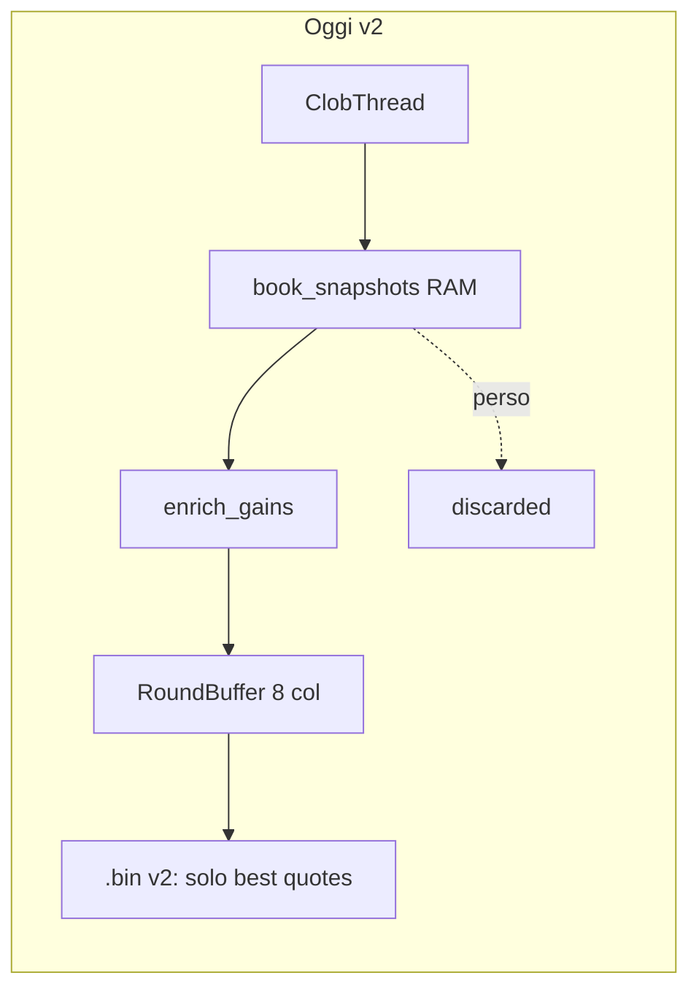
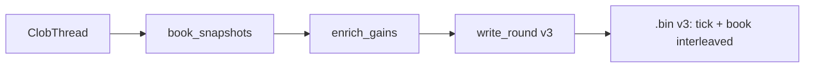
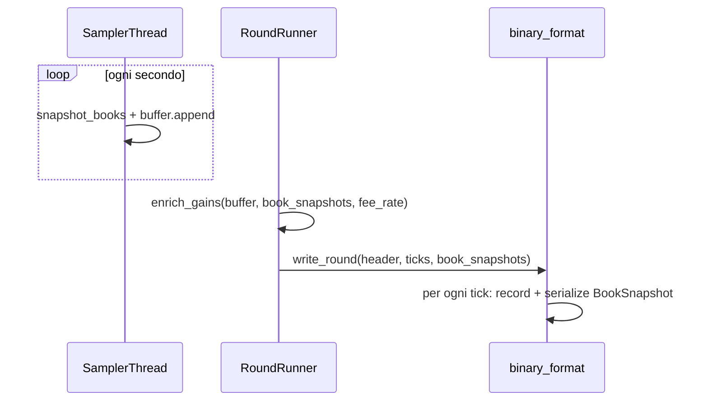

# Bin v3 con orderbook completo

## Contesto attuale

Ogni secondo il sampler già crea un `BookSnapshot` completo in RAM ([`src/round_runner.py`](f:/btc5min/src/round_runner.py) righe 66–72), parallelo al `RoundBuffer`. A fine round `enrich_gains` usa i book in memoria, poi `write_round` salva **solo** le 8 colonne scalari ([`src/binary_format.py`](f:/btc5min/src/binary_format.py)) e `book_snapshots` viene scartato.



## Obiettivo v3



- **1 snapshot book al secondo**, allineato 1:1 ai tick (stesso criterio countdown del sampler).
- **Nessuna retrocompatibilità v2**: `VERSION = 3`, `read_round` e `verify` rifiutano file v2. I `.bin` già raccolti restano sul disco ma non saranno più leggibili dal tooling aggiornato (accettabile: dati incompleti).

---

## Specifica formato v3

### Header — 64 byte (invariato nella struttura)

Stesso layout di v2 (`<4sHII d B x d I 28x`), con `version = 3`.

**Aggiunta consigliata** nei 28 byte `reserved`: salvare `fee_rate` (float64, offset 35) usato da `enrich_gains`. Permette di ricalcolare il gain offline con puntate diverse senza ri-fetch Gamma. I restanti 20 byte restano zero.

| Campo | Tipo | Note |
|-------|------|------|
| magic | 4s | `BTC5` |
| version | H | `3` |
| market_start_ts | I | |
| market_end_ts | I | |
| price_to_beat | d | |
| outcome | B | 1=Up, 2=Down |
| final_chainlink | d | |
| tick_count | I | |
| fee_rate | d | nuovo, offset 35 |
| reserved | 20x | zero |

### Record tick — 32 byte (invariato)

`<Q f 6f>` — stesse 8 colonne di oggi: `recv_ts_ms`, `secs_to_expiry`, `up_bid`, `up_ask`, `down_bid`, `down_ask`, `chainlink_btc`, `majority_gain`.

I best quote restano **duplicati** nel record tick per accesso rapido; il blocco book sotto è la fonte completa.

### Blocco book — variabile, subito dopo ogni record tick

```
BOOK_COUNTS: <4H>   # n_up_bids, n_up_asks, n_down_bids, n_down_asks (uint16 ciascuno)
LEVELS:      n livelli × <dd>  # price float64, size float64
```

Ordine livelli per tick:
1. `up_bids` (prezzi decrescenti, come in [`OrderBook.replace_side`](f:/btc5min/src/book.py))
2. `up_asks` (prezzi crescenti)
3. `down_bids`
4. `down_asks`

**Dimensione per tick:** `32 + 8 + (n_up_bids + n_up_asks + n_down_bids + n_down_asks) × 16` byte.

**Stima round tipico** (~20 livelli/lato × 4 lati × 300 tick): ~400 KB/round (~115 MB/giorno sul container poly). Accettabile.

**Layout file:**
```
[header 64B]
repeat tick_count:
  [record 32B]
  [book_counts 8B]
  [levels ...]
```

---

## Modifiche codice

### 1. [`src/binary_format.py`](f:/btc5min/src/binary_format.py) — cuore del cambiamento

- `VERSION = 3`
- Costanti: `BOOK_COUNTS_FMT = "<4H"`, `LEVEL_FMT = "<dd"`
- Helper serializzazione in [`src/book.py`](f:/btc5min/src/book.py) (minimo):
  - `book_side_to_bytes(levels: BookSide) -> bytes`
  - `book_side_from_bytes(data, offset, count) -> BookSide`
  - `BookSnapshot.to_bytes() / from_counts_and_bytes(...)`
- Nuova firma:

```python
def write_round(path: str, header: dict, ticks: np.ndarray,
                book_snapshots: list[BookSnapshot]) -> None

def read_round(path: str) -> tuple[dict, np.ndarray, list[BookSnapshot]]
```

- `write_round`: valida `len(ticks) == len(book_snapshots) == header["tick_count"]`, scrive header con `fee_rate`, poi per ogni `i` record + book block.
- `read_round`: legge header, se `version != 3` → eccezione; loop sequenziale tick + book; verifica EOF esatto.
- Rimuovere il check dimensione fissa `HEADER + tick_count * RECORD_SIZE`.

### 2. [`src/round_runner.py`](f:/btc5min/src/round_runner.py)

Dopo `enrich_gains`, passare i book al writer:

```python
header = build_round_header(..., fee_rate=state.fee_rate)  # vedi settlement
write_round(str(path), header, ticks, state.book_snapshots)
```

### 3. [`src/settlement.py`](f:/btc5min/src/settlement.py)

Aggiungere `fee_rate` al dict header restituito da `build_round_header`.

### 4. [`src/verify.py`](f:/btc5min/src/verify.py)

- Usare `read_round` v3 (non più size fissa).
- Nuovi check **V15–V18**:
  - `len(book_snapshots) == tick_count`
  - per ogni tick: best bid/ask nel record == primo livello del book (tolleranza `1e-6`)
  - prezzi livelli in `[0, 1]`, size `>= 0`
  - bids ordinati decrescenti, asks crescenti per ogni lato
  - almeno 1 livello bid e 1 ask per lato (o coerente con `quote_ask` a mercato risolto)
- Ricalcolo spot-check `majority_gain` su 1–2 tick random con `market_buy_gain` dal book salvato + `fee_rate` header (opzionale ma utile).

### 5. [`src/reader.py`](f:/btc5min/src/reader.py)

- Adattare a `read_round` a 3 valori.
- Stampa statistiche book: livelli medi per lato, range size, totale byte book.
- Flag opzionale `--book-sec N` per dump testuale dei livelli a un countdown dato (debug analisi).

### 6. [`src/convert.py`](f:/btc5min/src/convert.py)

- **Invariato** nella tabella `.txt` (resta leggibile e compatta).
- Opzionale: riga in header `fee_rate: ...` se presente.

### 7. [`src/clob_api.py`](f:/btc5min/src/clob_api.py)

Nessun cambiamento logico; `enrich_gains` resta identico (usa RAM prima del flush).

---

## Flusso round aggiornato



---

## Cosa NON fare (scope minimo)

- Nessun file `.book` separato.
- Nessun migratore v2→v3 (i vecchi file restano ma non sono più supportati, come richiesto).
- Nessun dump orderbook completo nel `.txt` (troppo verboso).
- Nessun cambiamento al campionamento WS/CLOB: i dati ci sono già.

---

## Verifica manuale post-implementazione

1. Avviare `collect.bat` per 1–2 round.
2. `python -m src.verify data/*.bin` → OK.
3. `python -m src.reader data/btc5m_*.bin` → livelli book > 0, best quote coerenti.
4. Confronto spot: `market_buy_gain` da book letto da disco == colonna `gain` nel tick.
5. Controllo dimensione file: sensibilmente > 9.6 KB (v2 con 300 tick) ma << 5 MB.
