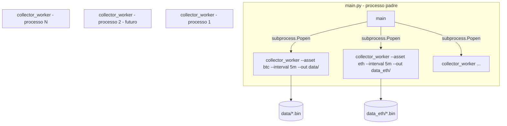
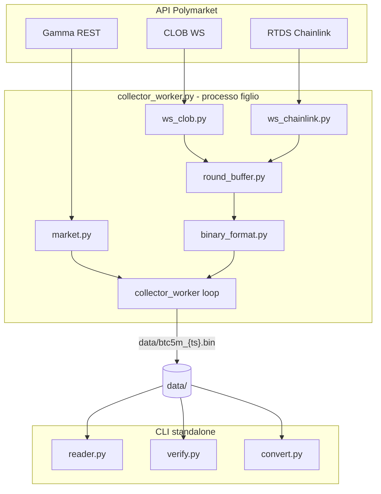
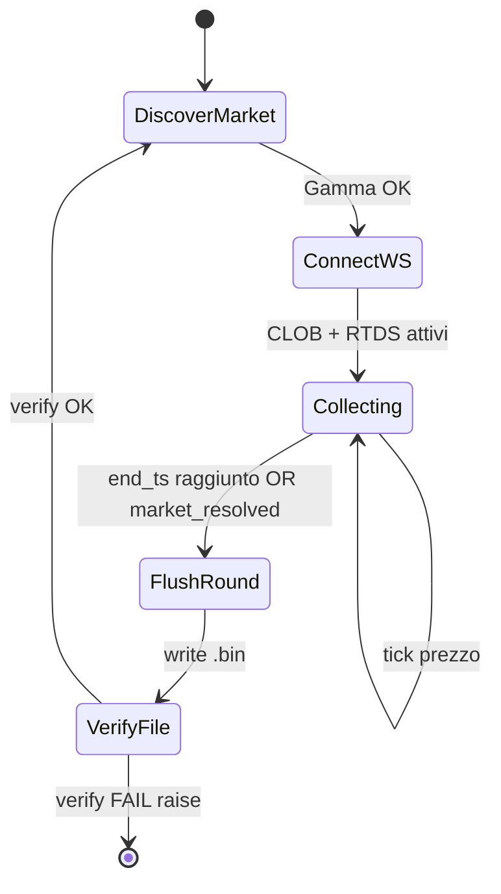

# Piano 2 — Collector binario BTC5MIN

## Obiettivo

Implementare un sistema che, per **ogni round** del mercato ricorrente [BTC Up or Down 5m](https://polymarket.com/event/btc-updown-5m-1783238400):

1. Si connette alle API Polymarket
2. Tiene in memoria ask/bid con **timestamp** e **secondi mancanti alla scadenza**
3. Allo scadere del round scrive un **file binario rileggibile**
4. Verifica che il file contenga **tutte** le informazioni richieste da [`AGENTS.md`](f:\btc5min\AGENTS.md)

**Fuori scope:** strategie, backtest, trading live, mercati 15m/1h.

**Vincoli confermati:** Python, Windows locale, solo BTC 5m, codice POC minimale (regole D1/D2 in [`AGENTS.global.md`](C:\Users\savea\.cursor\AGENTS.global.md)).

**Architettura processi:** il collector binario gira in un **processo separato** dal `main`, così da poter lanciare **più collector contemporaneamente** in futuro (con `--out` diversi). Per ora tutti i file vanno in **`data/`**.

**Directory output (sprint 1):** `data/` — nessuna sottocartella. File: `data/btc5m_{market_start_ts}.bin`.

---

## Architettura processi (main vs collector worker)



### Ruoli

| Componente | Processo | Responsabilità |
|------------|----------|----------------|
| [`src/main.py`](f:\btc5min\src\main.py) | padre (futuro orchestratore app) | Avvia/ferma uno o più collector worker; in sprint 1 può limitarsi a spawn di un solo worker BTC 5m |
| [`src/collector_worker.py`](f:\btc5min\src\collector_worker.py) | figlio (uno per istanza) | Loop WS + buffer + flush `.bin` + verify; **nessuna logica strategica** |
| [`src/reader.py`](f:\btc5min\src\reader.py) / [`src/verify.py`](f:\btc5min\src\verify.py) | CLI standalone | Ispezione file; invocabili da qualsiasi processo |

### Perché processo separato

- **Isolamento:** crash WS o eccezione in un round non termina il main né gli altri collector
- **Parallelismo:** più mercati/timeframe in parallelo senza asyncio complesso nel main
- **Estensibilità:** il main in futuro ospiterà analisi, backtest, trading — il collector resta un worker dedicato
- **Riavvio selettivo:** il main può riavviare un solo worker senza toccare gli altri

### Avvio worker (CLI obbligatoria, niente default)

```bash
# Worker singolo BTC 5m (sprint 1) — output in data/
python -m src.collector_worker --asset btc --interval 5m --out data/

# Via main (stesso output)
python -m src.main

# Due collector contemporanei (futuro: --out diversi per evitare conflitti)
python -m src.collector_worker --asset btc --interval 5m --out data/
python -m src.collector_worker --asset eth --interval 5m --out data_eth/
```

**Parametri worker** (tutti obbligatori, eccezione se mancanti):
- `--asset` → prefisso slug (`btc` → `btc-updown-5m-{ts}`)
- `--interval` → `5m` (sprint 1); in futuro `15m`, `1h`
- `--out` → directory output `.bin`; **per ora sempre `data/`** nel setup singolo BTC 5m

**Isolamento file:** nome `data/btc5m_{market_start_ts}.bin`. Se in futuro si lanciano più worker in parallelo sullo stesso mercato, usare `--out` distinti (es. `data/`, `data_eth/`).

**Main in sprint 1:** implementazione minimale che fa `subprocess.Popen` di un solo `collector_worker` con `--out data/` e propaga SIGINT per shutdown pulito.

---

## Informazioni da salvare (requisiti AGENTS.md)

| Campo | Obbligatorio | Dove nel file | Fonte |
|-------|--------------|---------------|-------|
| ask Up | sì | ogni tick | CLOB WS `best_bid_ask` |
| bid Up | sì | ogni tick | CLOB WS `best_bid_ask` |
| ask Down | sì | ogni tick | CLOB WS `best_bid_ask` |
| bid Down | sì | ogni tick | CLOB WS `best_bid_ask` |
| timestamp tick | sì | `recv_ts_ms` | wall clock al ricevimento |
| sec mancanti a scadenza | sì | `secs_to_expiry` | `end_ts - now` |
| identificativo round | sì | header `market_start_ts` | slug `btc-updown-5m-{ts}` |
| price to beat | sì (header) | `price_to_beat` | Gamma `eventMetadata` o Chainlink al bordo finestra |
| outcome finale | sì (header) | `outcome` | Gamma post-risoluzione |
| prezzo Chainlink | sì (contesto) | ogni tick + `final_chainlink` | RTDS `crypto_prices_chainlink` |

---

## API Polymarket — dettaglio implementativo

### 1. Gamma API (REST) — discovery mercato

**Endpoint:** `GET https://gamma-api.polymarket.com/events?slug=btc-updown-5m-{start_ts}`

**Calcolo slug:**
```python
start_ts = int(time.time()) // 300 * 300   # UTC, arrotondato a 5 min
slug = f"btc-updown-5m-{start_ts}"
```

**Campi da estrarre** (eccezione se assenti):
- `markets[0].clobTokenIds` → JSON parse → `[up_token_id, down_token_id]`
- `markets[0].outcomes` → verificare ordine `["Up","Down"]`
- `eventStartTime` / `startTime` → inizio finestra
- `endDate` → scadenza (per `secs_to_expiry`)
- `eventMetadata.priceToBeat` → strike (disponibile dopo apertura; retry se mancante)
- Post-chiusura: `eventMetadata.finalPrice`, `outcomePrices`, `closed`

**Quando chiamare Gamma:**
- All'inizio round (token IDs + expiry)
- A fine round (outcome + finalPrice per header)
- Opzionale: ogni 30s se `priceToBeat` ancora assente

### 2. CLOB WebSocket — ask/bid live

**Endpoint:** `wss://ws-subscriptions-clob.polymarket.com/ws/market`

**Subscribe:**
```json
{
  "assets_ids": ["<up_token_id>", "<down_token_id>"],
  "type": "market",
  "custom_feature_enabled": true
}
```

**Eventi da gestire:**

| event_type | Azione |
|------------|--------|
| `book` | Snapshot iniziale: best bid/ask da primo livello |
| `best_bid_ask` | Aggiorna prezzi lato corrispondente (`asset_id`) |
| `price_change` | Fallback se `best_bid_ask` assente: usa `best_bid`/`best_ask` nel change |
| `market_resolved` | Trigger flush anticipato |

**Mapping asset_id → lato:** confronto con `up_token_id` / `down_token_id` da Gamma.

**Regola tick:** append record quando **almeno un** prezzo Up o Down cambia; includere sempre tutti e 4 i valori (ultimo noto per ciascuno). Se un lato non ha ancora prezzo → eccezione, non scrivere tick incompleto.

**Ping:** inviare ping ogni ~10s per tenere viva la connessione (doc CLOB).

### 3. RTDS WebSocket — prezzo Chainlink (risoluzione)

**Endpoint:** `wss://ws-live-data.polymarket.com`

**Subscribe:**
```json
{
  "action": "subscribe",
  "subscriptions": [{
    "topic": "crypto_prices_chainlink",
    "type": "*",
    "filters": "{\"symbol\":\"btc/usd\"}"
  }]
}
```

**Uso:** aggiornare `chainlink_btc` globale; ogni tick CLOB include l'ultimo valore oracle. Catturare `price_to_beat` = primo tick Chainlink con `payload.timestamp >= market_start_ts * 1000`.

**Ping:** ogni 5s (doc RTDS).

### 4. Fallback REST (solo bootstrap, non polling continuo)

Se WS non ancora connesso all'avvio round:
- `GET https://clob.polymarket.com/book?token_id={id}` → best bid/ask

Non usare REST come sostituto del WS in produzione POC.

---

## Architettura moduli (interno al worker)



### File da creare

| File | Processo | Responsabilità |
|------|----------|----------------|
| [`src/main.py`](f:\btc5min\src\main.py) | padre | spawn/gestione subprocess collector_worker |
| [`src/collector_worker.py`](f:\btc5min\src\collector_worker.py) | figlio | entrypoint worker: parse CLI, loop 5 min, flush |
| [`src/market.py`](f:\btc5min\src\market.py) | libreria | slug da asset+interval, fetch Gamma |
| [`src/ws_clob.py`](f:\btc5min\src\ws_clob.py) | libreria | connessione + callback prezzi Up/Down |
| [`src/ws_chainlink.py`](f:\btc5min\src\ws_chainlink.py) | libreria | connessione + ultimo prezzo oracle |
| [`src/round_buffer.py`](f:\btc5min\src\round_buffer.py) | libreria | tick in memoria per round corrente |
| [`src/binary_format.py`](f:\btc5min\src\binary_format.py) | libreria | `write_round()`, `read_round()` |
| [`src/reader.py`](f:\btc5min\src\reader.py) | CLI | dump raw tick, statistiche |
| [`src/convert.py`](f:\btc5min\src\convert.py) | CLI | bin → testo leggibile 300 righe/sec |
| [`src/verify.py`](f:\btc5min\src\verify.py) | CLI | validazione automatica |
| [`requirements.txt`](f:\btc5min\requirements.txt) | — | httpx, websockets, numpy |
| [`data/`](f:\btc5min\data\) | — | output `.bin` (gitignored) |

---

## Specifica formato binario v1

**Nome file:** `data/btc5m_{market_start_ts}.bin` — pattern generico `{out}/{asset}{interval}_{market_start_ts}.bin` con `--out data` nello sprint 1.

### Header — 64 byte (`struct`: `<4sHII d B d I 18x`)

| Offset | Tipo | Campo | Note |
|--------|------|-------|------|
| 0 | 4s | magic | `b"BTC5"` |
| 4 | H | version | `1` |
| 6 | I | market_start_ts | unix sec da slug |
| 10 | I | market_end_ts | unix sec da Gamma `endDate` |
| 14 | d | price_to_beat | USD Chainlink strike |
| 22 | B | outcome | 0=unknown, 1=Up, 2=Down |
| 23 | d | final_chainlink | prezzo Chainlink a chiusura |
| 31 | I | tick_count | numero record |
| 35 | 18x | reserved | zero |

### Record — 32 byte ciascuno (`struct`: `<Q f 4f 4x`)

| Campo | Tipo | Descrizione |
|-------|------|-------------|
| recv_ts_ms | Q uint64 | millisecondi epoch locale |
| secs_to_expiry | f float32 | secondi a `market_end_ts` |
| up_bid | f float32 | 0.0–1.0 |
| up_ask | f float32 | 0.0–1.0 |
| down_bid | f float32 | 0.0–1.0 |
| down_ask | f float32 | 0.0–1.0 |
| chainlink_btc | f float32 | ultimo oracle noto |
| _pad | 4x | allineamento |

**Dimensione file:** `64 + tick_count * 32` byte.

**API Python:**
```python
write_round(path, header_dict, ticks_ndarray)  # ticks shape (N, 7)
read_round(path) -> (header_dict, ticks_ndarray)
```

---

## Loop collector (`collector_worker.py`)



**Passi per round:**

1. Calcola `start_ts`, fetch Gamma → `up_id`, `down_id`, `end_ts`
2. Reset `RoundBuffer`; connetti/ri-subscribe WS
3. Attendi `price_to_beat` (Chainlink al bordo o Gamma metadata)
4. Loop async: su update prezzi → `buffer.append(...)` con `secs_to_expiry = end_ts - time.time()`
5. Quando `time.time() >= end_ts + 5` (buffer 5s post-scadenza per ultimi tick):
   - Fetch Gamma chiuso → `outcome`, `final_chainlink`
   - `write_round(f"data/btc5m_{start_ts}.bin", ...)`  (con `--out data`)
   - `verify_round(path)` — se fallisce, eccezione e **non** passare al round successivo
6. Passa a `start_ts + 300`

**Log (inglese):** `"round {start_ts} flushed, {n} ticks, outcome={outcome}"`

---

## Verifica salvataggio (`verify.py`)

### Controlli automatici (obbligatori, eccezione su fail)

| # | Controllo | Criterio |
|---|-----------|----------|
| V1 | File esiste e dimensione | `size == 64 + tick_count * 32` |
| V2 | Magic e version | `BTC5`, version `1` |
| V3 | tick_count > 0 | almeno 1 tick nel round |
| V4 | Coerenza timestamp round | `market_start_ts` == nome file |
| V5 | Durata round | `market_end_ts - market_start_ts == 300` |
| V6 | secs_to_expiry decrescente | `ticks[i].secs_to_expiry >= ticks[i+1].secs_to_expiry` (tolleranza 0.5s per jitter) |
| V7 | Range prezzi | ogni bid/ask in `[0.0, 1.0]` |
| V8 | Spread sensato | `up_ask >= up_bid`, `down_ask >= down_bid` per ogni tick |
| V9 | price_to_beat > 0 | strike valorizzato |
| V10 | outcome valorizzato | `outcome in (1, 2)` dopo chiusura |
| V11 | final_chainlink > 0 | prezzo finale presente |
| V12 | Copertura temporale | primo tick con `secs_to_expiry <= 295`; ultimo con `secs_to_expiry <= 10` (round interamente coperto) |
| V13 | Cross-check Gamma | `outcome` coerente: Up se `final_chainlink >= price_to_beat` |

### CLI verifica

```bash
python -m src.verify data/btc5m_1783238400.bin
python -m src.verify data/          # verifica tutti i .bin
```

Output: `OK` o elenco check falliti + raise exit code 1.

### CLI reader (ispezione umana)

```bash
python -m src.reader data/btc5m_1783238400.bin
python -m src.reader data/btc5m_1783238400.bin --csv out.csv
```

Stampa: header, primi/ultimi 5 tick, statistiche (min/max ask, tick rate, durata effettiva).

---

## Converter bin → testo leggibile (`convert.py`)

Trasforma un file `.bin` in output **umano-leggibile**: una riga per ogni secondo del round (**300 righe**, da `secs_to_expiry=300` a `secs_to_expiry=1`).

### CLI

```bash
python -m src.convert data/btc5m_1783238400.bin
python -m src.convert data/btc5m_1783238400.bin -o data/btc5m_1783238400.txt
python -m src.convert data/          # converte tutti i .bin in .txt nella stessa cartella
```

Senza `-o`: stampa su stdout. Con `-o`: scrive file testo.

### Formato output

```
header:
  market_start_ts: 1783238400
  market_end_ts: 1783238700
  price_to_beat: 62962.34
  outcome: Up
  final_chainlink: 62967.83
  tick_count: 1842

data:
300   UP 50c  DOWN 50c  -2$
299   DOWN 52c  -4$
298   UP 51c  -3$
...
2     UP 78c  +12$
1     UP 95c  +8$
```

**Sezione `header:`** — tutti i campi dell'header binario, una riga per campo, indentati con 2 spazi.

**Sezione `data:`** — esattamente **300 righe**, ordine decrescente per secondi mancanti (300 → 1).

### Colonne riga `data`

| Colonna | Formato | Calcolo |
|---------|---------|---------|
| secondi mancanti | intero, allineato a sinistra | `300, 299, …, 1` (bucket fisso) |
| probabilità UP | `UP {N}c` | solo se UP ≥ DOWN |
| probabilità DOWN | `DOWN {N}c` | solo se DOWN ≥ UP |
| delta prezzo | `{sign}{N}$` | `round(chainlink - price_to_beat)` intero |

**Probabilità implicita** (per lato):
```python
up_prob  = round((up_bid + up_ask) / 2 * 100)    # mid price in centesimi
down_prob = round((down_bid + down_ask) / 2 * 100)
```

**Regole visualizzazione lato dominante:**
- se `up_prob > down_prob` → riga mostra solo `UP {N}c`
- se `down_prob > up_prob` → riga mostra solo `DOWN {N}c`
- se `up_prob == down_prob` → riga mostra **entrambi**: `UP {N}c  DOWN {N}c`

**Delta dollari:**
```python
delta = round(chainlink_btc - price_to_beat)   # intero, arrotondamento standard
# positivo: +12$   negativo: -4$   zero: 0$
```

### Resampling 1 tick → 1 secondo

I tick binari arrivano a frequenza variabile (ogni cambio `best_bid_ask`). Il converter **ricampiona** su 300 bucket da 1 secondo:

1. Per ogni `sec` in `range(300, 0, -1)` (300 … 1)
2. Seleziona tutti i tick con `floor(secs_to_expiry) == sec` oppure `sec - 0.5 < secs_to_expiry <= sec + 0.5`
3. Usa l'**ultimo tick** del bucket (forward-fill dello stato book più recente in quel secondo)
4. Se **nessun tick** nel bucket → usa l'ultimo tick dei secondi precedenti già risolti (forward-fill); se ancora assente all'inizio round → eccezione

Questo garantisce sempre 300 righe anche con buchi nella raccolta.

### Esempio riga formattata (spacing)

Allineamento fisso per leggibilità in editor monospace:
```
{sec:>3}   {sides}  {delta}$
```
dove `{sides}` è la parte UP/DOWN secondo le regole sopra (es. `UP 50c  DOWN 50c` o `DOWN 52c`).

### Verifica converter (check C1–C4)

| # | Controllo | Criterio |
|---|-----------|----------|
| C1 | Righe data | esattamente 300 righe |
| C2 | Sequenza sec | prima riga `300`, ultima `1`, decremento di 1 |
| C3 | Coerenza prob | ogni `Nc` in `[0, 100]` |
| C4 | Round-trip logico | delta e prob derivati dai tick resampled, non inventati |

Opzionale: `convert.py` esegue C1–C4 prima di scrivere output; eccezione su fail.

### Spot-check manuale converter

1. Apri `.txt` e verifica 300 righe sotto `data:`
2. Confronta riga `300` e riga `1` con UI Polymarket agli istanti corrispondenti (se disponibile)
3. Verifica che `delta` al secondo 1 sia coerente con distanza finale BTC vs price to beat

---

### Spot-check manuale collector (dopo 1 round)

1. Apri URL Polymarket del round su browser
2. Confronta `price_to_beat` con UI "Price to Beat"
3. Confronta `outcome` con risultato mostrato
4. Verifica che ask/bid nell'ultimo tick siano plausibili (vicini a 0.99/0.01 sul lato vincente)

---

## Piano implementazione (ordine)

1. **Scaffold** — `requirements.txt`, `data/` in `.gitignore`, package `src/`
2. **`binary_format.py`** — write/read + test round-trip con dati fake in memoria
3. **`market.py`** — fetch Gamma per slug noto (`btc-updown-5m-1783238400` chiuso) come test
4. **`ws_chainlink.py`** — connessione, stampa 5 tick BTC
5. **`ws_clob.py`** — connessione su token del round corrente, stampa best_bid_ask
6. **`round_buffer.py`** — append + export numpy array
7. **`collector_worker.py`** — loop completo 1 round, CLI `--asset --interval --out`
8. **`main.py`** — spawn subprocess worker; test avvio/terminazione
9. **`verify.py`** + **`reader.py`** + **`convert.py`**
10. **Test live** — worker via `main.py` e via CLI diretta; 3 round consecutivi, tutti `verify` OK
11. **Test convert** — ogni `.bin` produce `.txt` con 300 righe, spot-check formato
12. **Test multi-worker** (opzionale sprint 1): due worker su `--out` diversi, nessun conflitto file

---

## Rischi specifici collector

| Rischio | Mitigazione |
|---------|-------------|
| Gamma non ha ancora il mercato | loop retry ogni 2s fino a 60s prima dello start |
| WS disconnette | reconnect + re-subscribe stesso round |
| `price_to_beat` mancante a inizio | usare primo tick Chainlink post-`start_ts` |
| Round con pochi tick | V12 fallisce → log warning, non scartare silenziosamente |
| Clock locale skew | usare `secs_to_expiry` da `end_ts` Gamma, non da durata fissa |
| Due worker stessa `--out` | eccezione a startup se file `.bin` in scrittura; usare dir separate |
| Bucket senza tick a inizio round | forward-fill dal primo tick disponibile; eccezione se sec 300 ancora vuoto |
| Zombie subprocess su Windows | `main` gestisce SIGINT → `terminate()` + `wait()` su tutti i worker |

## Criteri di completamento

Il piano 2 è **completato** quando:

- [ ] `collector_worker` gira come **processo separato** (via `main.py` o CLI diretta)
- [ ] Worker produce `data/*.bin` per ogni round osservato
- [ ] Ogni file passa tutti i check V1–V13 in `verify.py`
- [ ] `reader.py` mostra ask/bid, timestamp e secs_to_expiry come richiesto da AGENTS.md
- [ ] 3 round consecutivi validati senza intervento manuale
- [ ] `main.py` avvia/ferma il worker senza lasciare subprocess zombie
- [ ] Architettura pronta per **N worker paralleli** (parametri CLI + `--out` distinti)
- [ ] `convert.py` produce output leggibile con header + **300 righe** (1/sec), prob UP/DOWN e delta `$`
- [ ] README con comandi `pip install`, `python -m src.main`, `python -m src.collector_worker --asset btc --interval 5m --out data/`, `python -m src.verify data/`, `python -m src.convert data/btc5m_*.bin`

**Relazione con piano 1:** questo piano è il dettaglio operativo dello sprint collector del [piano generale](f:\btc5min\.cursor\plans\btc5min_collector_e_strategie_fcd7201c.plan.md). La fase strategie resta nel piano 1, da affrontare solo dopo completamento di questo.
