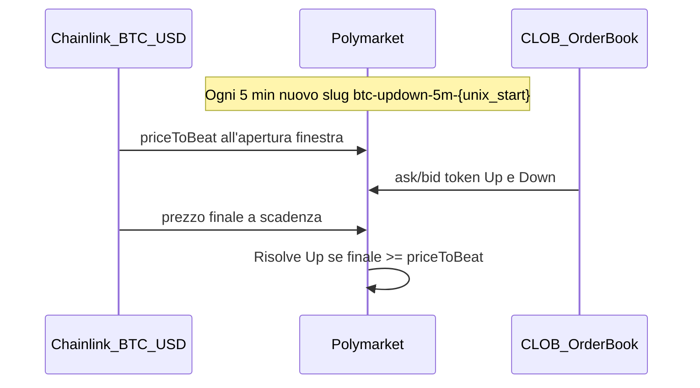
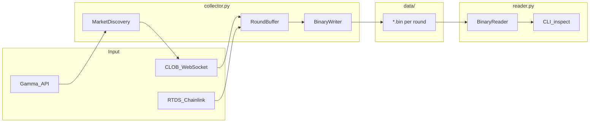

# Piano BTC5MIN: raccolta dati e ricerca edge

## Obiettivo

Studiare la dinamica di ask/bid del mercato ricorrente [BTC Up or Down 5m](https://polymarket.com/event/btc-updown-5m-1783238400), accumulare log strutturati per round, e — sui dati — cercare regole di entrata con bilancio positivo oltre il pareggio statistico 50/50.

**Stato attuale:** repository greenfield ([`AGENTS.md`](f:\btc5min\AGENTS.md) + [`.gitignore`](f:\btc5min\.gitignore) soltanto). Nessun codice.

**Scelte confermate:**
- Sprint 1: collector + formato binario + reader
- Runtime: PC Windows locale
- Timeframe: solo BTC 5m
- Stack: Python

---

## Contesto tecnico Polymarket

### Come funziona il mercato



- **Slug deterministico:** `btc-updown-5m-{timestamp}` dove `timestamp` = inizio finestra UTC arrotondato a 5 min (es. `1783238400` → `eventStartTime` 08:00 UTC).
- **Discovery:** `GET https://gamma-api.polymarket.com/events?slug=btc-updown-5m-{ts}`
- **Token:** `clobTokenIds[0]` = Up, `[1]` = Down (verificare campo `outcomes`).
- **Risoluzione:** Chainlink BTC/USD (`eventMetadata.priceToBeat` / `finalPrice` nell'evento chiuso).
- **Order book:** WebSocket CLOB `wss://ws-subscriptions-clob.polymarket.com/ws/market` con `best_bid_ask` (preferito) o REST `https://clob.polymarket.com/book?token_id=...`.
- **Prezzo sottostante live:** RTDS `wss://ws-live-data.polymarket.com` topic `crypto_prices_chainlink` filtro `btc/usd` (stessa fonte di risoluzione).

### Fee e realtà del profitto (onesto)

Polymarket ha introdotto **fee dinamiche sui mercati crypto brevi** per eliminare l'arbitraggio taker a bassa latenza:

| Strategia | Meccanismo | Probabilità edge netto | Nota |
|-----------|------------|------------------------|------|
| Arb YES+NO < 1 | Comprare entrambi i lati | **Bassa** | Fee taker crypto picco ~1.8% a 50¢; spread tipico < fee; bot Rust già competono |
| Latency arb Binance→PM | Taker su movimento spot | **Molto bassa** | Fee + rimozione delay 500ms; vantaggio HFT |
| Maker rebate | Limit order che fornisce liquidità | **Media** | Zero fee maker + rebate 20%; rischio adverse selection |
| Segnale oracle vs book | Entrare quando prezzo Chainlink implica probabilità ≠ prezzo mercato | **Media-alta (da validare)** | Richiede modellare distanza da strike e tempo residuo |
| Timing intra-round | Pattern ask/bid vs `secs_to_expiry` | **Sconosciuta** | È l'ipotesi centrale del progetto — serve dataset |
| Cross-timeframe 5m/15m/1h | Hedge o conferma segnale | **Media (fase 2)** | Non nello sprint 1; utile dopo dati 5m |

**Conclusione strategica:** il progetto ha senso come **ricerca data-driven**, non come arbitraggio taker ovvio. L'edge più plausibile dopo la raccolta dati è:
1. **Mispricing temporale** — il book non aggiorna istantaneamente rispetto a Chainlink, specialmente vicino a scadenza.
2. **Pattern ricorrenti** — curve ask/bid vs secondi mancanti (es. overreaction early, compressione verso 0.99/0.01 in finale).
3. **Maker selettivo** — solo quando il modello indica alta probabilità e il prezzo offre margine > rischio fill avverso.

Non promettere profitto prima di almeno **centinaia di round** loggati e backtest fee-aware.

---

## Architettura sprint 1



### File previsti

```
f:\btc5min\
├── requirements.txt          # httpx, websockets, numpy
├── README.md                 # setup e uso collector
├── src/
│   ├── market.py             # slug, gamma fetch, token ids, expiry
│   ├── ws_clob.py            # subscribe best_bid_ask Up/Down
│   ├── ws_chainlink.py       # prezzo BTC oracle
│   ├── round_buffer.py       # accumulo tick in memoria
│   ├── binary_format.py      # write/read struct pack
│   ├── collector.py          # loop principale: rotate ogni 5 min
│   └── reader.py             # dump round, export CSV opzionale
└── data/                     # gitignored, file .bin
```

Codice **minimale POC** secondo [`AGENTS.global.md`](C:\Users\savea\.cursor\AGENTS.global.md): pochi metodi, niente default/fallback, eccezione se manca dato.

---

## Formato binario proposto

Header fisso + array di record a frequenza variabile (ogni tick WS o campionamento 1 Hz — raccomandato **ogni evento `best_bid_ask`** per massima risoluzione, con dedup se stesso prezzo).

**Header (64 byte, little-endian):**
- magic `b"BTC5"` (4)
- version `uint16` = 1
- market_start_ts `uint32` (unix sec, da slug)
- market_end_ts `uint32`
- price_to_beat `float64` (da gamma `eventMetadata` o catturato al primo tick Chainlink post-start)
- outcome `uint8` (0=unknown, 1=Up, 2=Down) — scritto al flush finale
- final_chainlink `float64` — al flush
- tick_count `uint32`
- reserved

**Record (32 byte ciascuno):**
- `recv_ts_ms` uint64 — wall clock locale
- `secs_to_expiry` float32 — `(end_ts - now)`
- `up_bid`, `up_ask`, `down_bid`, `down_ask` float32
- `chainlink_btc` float32 — ultimo prezzo oracle noto

Reader espone: `load_round(path) -> header, ndarray ticks` per analisi numpy future.

---

## Collector: logica operativa

1. **Calcola slug corrente:** `ts = (now_utc // 300) * 300` → `btc-updown-5m-{ts}`.
2. **Fetch Gamma** → token IDs, `eventStartTime`, `endDate`; se mercato non ancora live, attendi.
3. **Connetti WS CLOB** (Up+Down) e **RTDS Chainlink**.
4. **Su ogni `best_bid_ask`:** append record con `secs_to_expiry` calcolato da `endDate`.
5. **A scadenza** (o su `market_resolved`): fetch outcome da Gamma, scrivi `data/btc5m_{ts}.bin`, svuota buffer.
6. **Rotazione:** passa al prossimo slug; riconnetti WS con nuovi token.
7. **Resilienza minima:** reconnect WS; se PC spento, buco nei dati (accettabile in fase POC).

**Nota Windows:** eseguire come processo long-running (`python -m src.collector`). Opzionale Task Scheduler all'avvio.

---

## Fase 2 (dopo raccolta dati — non sprint 1)

### Analisi esplorative
- Heatmap `up_ask` / `down_ask` vs `secs_to_expiry`
- Spread medio e volatilità per bucket temporali (300-240s, 240-60s, 60-10s, 10-0s)
- Lag book vs Chainlink: correlazione movimento oracle → movimento ask entro N ms
- Distribuzione outcome Up vs distanza % da strike a vari `secs_to_expiry`

### Strategie da testare (backtester minimale)
Ogni strategia simula **taker** con fee `C * 0.07 * p * (1-p)` (crypto) o maker senza fee:

| ID | Regola ingresso | Exit | Edge atteso |
|----|-----------------|------|-------------|
| S1 | Chainlink > strike + δ e `up_ask < fair_model` | hold to expiry | Medio se lag misurato |
| S2 | `up_ask + down_ask < 1 - fee_buffer` | arb istantaneo | Basso |
| S3 | Ultimi 30s: lato vincente a prezzo < 0.95 | hold | Medio-basso, competizione |
| S4 | Pattern storico: bucket T con win-rate Up > 55% e ask < soglia | hold | Da validare su OOS |
| S5 | Maker: bid su lato favorito a 0.90-0.95 ultimi 15s | settlement | Medio, serve simulazione fill |

### Cross-timeframe (fase 3, opzionale)
- Loggare anche `btc-updown-15m-{ts}` e `btc-updown-1h-{ts}` con stesso formato
- Segnale: direzione 5m confermata da trend 15m/1h; hedge se 5m e 15m divergono
- **Non prioritario** finché non si ha baseline solida su 5m

### Alternative di raccolta dati (se WS locale insufficiente)
- **REST polling 1s** — più semplice, meno tick; accettabile per pattern grossolani
- **Scraping storico** — Gamma/CLOB non offrono storico order book completo; i `.bin` propri sono l'unica fonte affidabile
- **Browser automation** — scartato: fragile, lento, inutile per dati numerici

---

## Dipendenze

```
httpx>=0.27
websockets>=12
numpy>=1.26
```

Niente `py-clob-client` nello sprint 1 (serve solo per trading live in fase futura).

---

## Rischi

| Rischio | Mitigazione |
|---------|-------------|
| PC spento → gap dati | Accettato in POC; valutare VPS in fase 2 |
| Mercato non indicizzato subito su Gamma | Retry + calcolo slug deterministico |
| Rate limit API | WS push, non REST flood |
| Edge inesistente dopo fee | Obiettivo è **dimostrarlo con dati**, non assumere profitto |
| `restricted: true` su mercati crypto | Verificare accesso account Polymarket dall'Italia/UE |
| Tick size change sotto 0.04/0.96 | Loggare evento `tick_size_change` se abilitato |

---

## Validazione sprint 1

1. Collector gira ≥ 3 round consecutivi senza crash
2. Ogni `.bin` leggibile da `reader.py` con tick_count > 0
3. `secs_to_expiry` decresce monotonicamente (a parità di clock)
4. `price_to_beat` coerente con `eventMetadata` Gamma post-chiusura
5. ask/bid Up + Down coerenti con UI Polymarket su spot-check manuale

**Soglia dati per fase strategie:** minimo ~200 round (~17 ore continue) prima di conclusioni; ideale 1000+ round.

---

## Raccomandazione finale

Il percorso più sensato è quello che hai scelto: **prima dati, poi strategie**. L'ipotesi del progetto (pattern ask/bid vs tempo residuo → edge) è **plausibile ma non dimostrata**; le strade a profitto facile (arb taker, latency) sono state in gran parte chiuse dalle fee. Il valore reale del dataset sarà misurare:
- quanto il book **lagga** Chainlink
- se esistono **finestre temporali** con ask sistematicamente sotto la probabilità implicita
- se certi profili di curva ask/bid **predicono** outcome meglio del prezzo spot

Sprint 1 implementa il collector; sprint 2 (dopo approvazione e dati) aggiunge `analyze.py` + backtester fee-aware.
