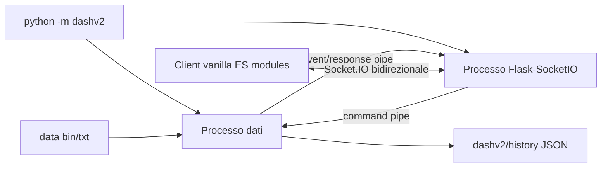

# Dashboard V2 replay

## Obiettivo e vincoli confermati
- Creare tutto il nuovo runtime in [`dashv2/`](dashv2/), senza import da [`dash/`](dash/) o [`dash-api/`](dash-api/); sono solo riferimenti comportamentali.
- Riutilizzare i moduli canonici [`src/binary_format.py`](src/binary_format.py), [`src/book.py`](src/book.py) e la semantica fee di [`src/clob_api.py`](src/clob_api.py).
- Primo milestone completo: replay, autoplay, play/pausa/seek, chart 5m, ordini BUY, mark-to-market, chiusura manuale, settlement, history JSON e export CSV.
- Riprodurre layout, misure, palette, font e responsive behavior di [`docs/dash-v38.html`](docs/dash-v38.html) e [`docs/dash-v38-screenshot.png`](docs/dash-v38-screenshot.png); sono ammesse solo le aggiunte concordate: banner disconnessione, badge outcome e controlli/valori degli ordini.
- Una sola sessione/controller, server su `127.0.0.1:8780`, nessun saldo persistente tra replay.

## Architettura

- [`dashv2/__main__.py`](dashv2/__main__.py): crea due `multiprocessing.Pipe(duplex=False)`, avvia i due processi con `spawn`, monitora i figli e applica fail-fast; Ctrl+C arresta entrambi senza lasciare processi orfani.
- [`dashv2/engine.py`](dashv2/engine.py): unica fonte di verità per round, clock, tick, preview, ordini, settlement e history; loop sincrono con clock monotonic a 1 Hz.
- [`dashv2/server.py`](dashv2/server.py): serve solo pagina/asset e fa da bridge Socket.IO↔pipe; nessuna business logic e nessuna REST API per i comandi runtime.
- [`dashv2/ipc.py`](dashv2/ipc.py): envelope dict incorniciati nativamente da `multiprocessing.Connection`; `request_id` per correlare ack/errore e distinzione esplicita tra `response` ed `event`.
- Socket.IO è scelto al posto di SSE perché serve full-duplex; rispetto al WebSocket puro aggiunge heartbeat, reconnect, ack con timeout e fallback. WebTransport è rinviato perché imporrebbe HTTPS, HTTP/3/aioquic e un server separato da Flask senza vantaggi misurabili a 1 tick/s.

## Configurazione e avvio
- [`dashv2/setup.json`](dashv2/setup.json), con JSON a 4 spazi e chiavi tutte obbligatorie: `data_dir`, `history_dir`, `host`, `port`, `chart_previous_candles: 24`, `default_order_size_usd: 100`.
- [`dashv2/config.py`](dashv2/config.py) risolve i percorsi rispetto a `dashv2/` e fallisce esplicitamente per chiavi o directory mancanti; nessun fallback implicito.
- [`dashv2/requirements.txt`](dashv2/requirements.txt) contiene Flask-SocketIO e dipendenze server; [`dashv2.bat`](dashv2.bat) avvia `python -m dashv2` e stampa l’URL senza aprire il browser.
- Asset locali in [`dashv2/static/vendor/`](dashv2/static/vendor/): Bootstrap 5.3.3, Bootstrap Icons 1.11.3, Inter, client Socket.IO compatibile e Lightweight Charts 5.2.0, con relativi file licenza. Nessun CDN e nessuna build frontend.

## Round repository e anti-spoiler
- [`dashv2/rounds.py`](dashv2/rounds.py) indicizza all’avvio tutti i `.bin`; conserva internamente header e path, ma verso il client espone solo timestamp UTC, label e stato validità.
- Il picker mostra ricerca e gruppi per giorno UTC, più recenti prima; coppie `.bin/.txt` mancanti o incoerenti restano visibili ma disabilitate, senza outcome o filename.
- Alla selezione carica integralmente solo il round scelto, unendo `.bin` e `.txt` per `sec`; tick interamente assente produce un evento `gap`, valori `---` e trading disabilitato, senza riuso silenzioso dell’ultimo valore.
- Prima di sec 0 non devono attraversare pipe/Socket.IO: `outcome`, prezzi finali, path, header completi o history pregresse dello stesso `market_start_ts`.
- A sec 0 il processo dati usa l’outcome canonico del `.bin`, chiude il round, emette `round_end`, mostra il badge `OUTCOME UP/DOWN` e blocca ulteriori seek/trade.

## Replay e seek
- `round.load` parte automaticamente da sec 300; il cursore visuale usa `progress = 300 - sec`, quindi si muove da sinistra (300) a destra (0).
- Header: timestamp UTC di inizio round fisso; `240 | 4:00` mostra lo stesso countdown in secondi e `M:SS`.
- Durante lo scrub il replay va in pausa; al rilascio esegue un solo seek e riprende soltanto se prima era in Play.
- Seek indietro mantiene una timeline coerente: elimina placement futuri e riapre ordini la cui chiusura manuale è ora nel futuro; seek avanti conserva gli eventi già avvenuti.
- Alla disconnessione del controller il server ordina una pausa immediata; al reconnect richiede uno snapshot completo a `dati` e riallinea UI, chart e ordini.

## Chart 5m senza dati futuri
- [`dashv2/static/js/chart.js`](dashv2/static/js/chart.js) usa l’API v5 verificata (`createChart`, `CandlestickSeries`, `chart.addSeries`).
- Al load, `dati` calcola le 24 candele 5m locali precedenti più vicine usando i `.bin`; eventuali buchi restano buchi temporali.
- La candela del round corrente è ricostruita solo con PTB e tick già raggiunti dal replay; seek indietro la ricalcola senza lasciare high/low/close futuri nel client.
- A ogni tick si usa `series.update()`; `setData()` solo al cambio round. I controlli 1m e gear vengono rimossi e il volume non viene inventato.

## Motore ordini
- Estendere in modo additivo [`src/clob_api.py`](src/clob_api.py) con due walk canonici e simmetrici: BUY a budget fee-included e SELL di share con fee dedotta; mantenere invariato il contratto di `market_buy_gain` e coprirlo con regressione.
- [`dashv2/orders.py`](dashv2/orders.py) salva per ordine: lato, size, share, entry sec/BTC, best ask e prezzo medio, fee, profitto potenziale a settlement, MTM corrente, eventuale exit sec/BTC/prezzo/fee e PnL realizzato.
- I pulsanti mostrano best ask eseguibile e profitto potenziale per la size del lato; size UP e DOWN sono indipendenti e sincronizzate al processo dati.
- BUY all-or-nothing: se il book ask non riempie tutta la size, il comando fallisce con ack esplicito. Tick partial/gap non sono tradabili.
- Ogni tick rivaluta l’ordine camminando i bid: la riga mostra sia `MTM` sia `WIN`; se tutte le share non sono liquidabili, MTM è indisponibile e `Close` è disabilitato.
- `Close` vende l’intera posizione al book corrente. Gli ordini rimasti aperti a sec 0 vengono risolti contro l’outcome; nessun balance viene trascinato al replay successivo.

## History
- [`dashv2/history.py`](dashv2/history.py) scrive atomicamente un JSON immutabile per ogni replay arrivato a sec 0, anche ripetendo lo stesso round; il nome contiene `market_start_ts` e `run_id`, mai l’outcome.
- Il JSON contiene metadati della run, outcome/finale rivelati, tutti gli ordini manualmente chiusi o settled e PnL; [`dashv2/history/`](dashv2/history/) viene aggiunta a [`.gitignore`](.gitignore).
- La tabella mostra tutte le run storiche, ma filtra le precedenti del round attivo fino al suo settlement; gli ordini chiusi della run corrente sono visibili subito senza outcome futuro.
- Export CSV serializza esattamente le righe attualmente visibili e usa sempre date/orari UTC.

## Client e fedeltà visiva
- [`dashv2/static/index.html`](dashv2/static/index.html) conserva la gerarchia del template; [`dashv2/static/css/dashboard.css`](dashv2/static/css/dashboard.css) trasferisce senza reinterpretazioni i token e le misure v38.
- [`dashv2/static/js/app.js`](dashv2/static/js/app.js) gestisce stato e Socket.IO; [`dashv2/static/js/render.js`](dashv2/static/js/render.js) aggiorna DOM, picker, ladder, modelli, quote, preview e tabelle senza framework.
- DWinA/B vengono orientati dal segno del delta, come definito in [`docs/indicator_delta_win.md`](docs/indicator_delta_win.md): il lato opposto mostra il complemento; Rq/Rs restano quelli del tick.
- Banner persistente solo durante disconnessione/errore; in stato normale il layout coincide col mockup. Un secondo controller riceve un rifiuto esplicito.

## Protocollo Socket.IO
- Client→server con ack end-to-end: `round.load`, `replay.play`, `replay.pause`, `replay.seek`, `order.size`, `order.place`, `order.close`, `session.sync`.
- Server→client: `bootstrap`, `session`, `tick`, `orders`, `history`, `round_end`, `error`.
- Il bridge server è l’unico lettore della pipe `dati→server`; risolve le response in attesa e inoltra gli eventi al solo controller. Gli handler Socket.IO serializzano le scritture sulla pipe `server→dati`.

## Verifica
- Unit test in [`dashv2/tests/`](dashv2/tests/): indice/invalid pair, merge bin+txt, gap, candele precedenti/candela causale, state machine replay, seek timeline-consistent, redazione anti-spoiler, BUY/SELL e fee, liquidità insufficiente, close, settlement e history atomica.
- Test IPC/Socket.IO: correlazione ack, reconnect+sync, pausa su disconnect, rifiuto secondo controller e fail-fast dei processi.
- Regressione core per i nuovi walk CLOB e suite esistente `python -m unittest discover -s tests`.
- Smoke end-to-end: `dashv2.bat` → picker → autoplay → pause/seek → BUY → MTM/Close → sec 0 → outcome/history/CSV.
- Confronto screenshot a viewport desktop con il riferimento v38, verifica breakpoint sotto 1200px, focus da tastiera e console browser senza errori.