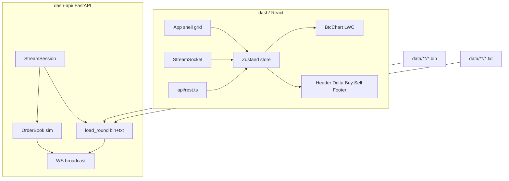

# Piano layout dashboard replay v1

## Contesto

- **Spec funzionale:** [docs/dash-description.md](docs/dash-description.md) + mockup [docs/dash-draft.png](docs/dash-draft.png)
- **Infrastruttura pronta:** [dash/](dash/) (React/Vite/Tailwind/shadcn base, client REST+WS), [dash-api/](dash-api/) (replay da `.bin` + `.txt`, WS 1 tick/sec)
- **Fuori scope v1:** live mode, bot, round Lighter, deploy, P&L mark-to-market ordini aperti (bid/sell OB tick-by-tick — v2)

## Principi di design (iterazione utente)

I colori del draft (verde/arancio/rosso espliciti) sono **solo indicativi**. La v1 deve avere uno **stile proprio**, coerente e moderno:

- Tema base già in [dash/src/index.css](dash/src/index.css): **shadcn + zinc dark** + CSS variables
- **Semantica colore** via token (`primary`, `destructive`, `muted`, `accent`), non hex copiati dal PNG
- Delta positivo/negativo: toni distinti ma sobri (non box neon); gauge con fill graduato
- Tipografia, spacing, border-radius uniformi su tutti i pannelli
- Installare solo i componenti shadcn necessari (`button`, `select`, `switch`, `slider`, `input`, `card`, `separator`, `scroll-area`, `badge`)
- Aggiungere [dash/src/lib/utils.ts](dash/src/lib/utils.ts) (`cn()`) — mancante rispetto all'init shadcn

## Scelte confermate

| Tema | Scelta |
|------|--------|
| Chart LEFT | **Lightweight Charts** (già in package.json) |
| Indicatori DWin/vol/R | **Parse `.txt`** — già calcolati da `convert`; merge con `.bin` al load |
| Ordini simulati | **Backend dash-api** — `market_buy_gain` su dati `.bin` (book + fee); **non** `gain%` del `.txt` |
| Storico candele | **Solo round corrente** — OHLC 5m dall'unica finestra 300s |

## Architettura



---

## Fase 1 — Estendere dash-api (dati + ordini)

### 1.1 Load round: `.bin` + `.txt` in memoria, merge per `sec`

Al `POST /session/replay`, [dash-api/rounds.py](dash-api/rounds.py) carica **entrambi** i file del round e costruisce in RAM:

- `ticks_by_sec` — merge bin + txt (vedi sotto)
- `books_by_sec` — snapshot order book per `sec`, da `read_round()` → `list[BookSnapshot]` indicizzata per secondo (serve a ordini e `market_buy_gain`)

Nessun ricalcolo di vol/risk/delta_win — quei valori arrivano dal `.txt` già prodotto da `convert`.

**Percorsi** (stesso schema del collector):

- `.bin` → `data/<YYYY-MM-DD>/bin/btc5m_<ts>_<HHMM>.bin` via `find_bin_path()`
- `.txt` → `data/<YYYY-MM-DD>/txt/btc5m_<ts>_<HHMM>.txt` via [src/binary_format.txt_path_for_bin](src/binary_format.py)

Se il `.txt` manca o non ha la riga per un `sec` presente nel `.bin` → eccezione esplicita (regola D2).

#### Da `.bin` (`read_round` → ticks + book snapshots)

Per ogni tick, chiave `sec`:

- `recv_ts_ms`, `chainlink_btc`, `chainlink_stale` (da recv vs chainlink_recv_ms + `stall_reconnect_sec`)
- quote raw: `up_bid`, `up_ask`, `down_bid`, `down_ask`, `partial`
- `delta_usd` (round chainlink − ptb, o `None` se stale)
- derivati leggeri: `up_mid_c`, `down_mid_c`, `majority_side` (`majority_side` da [src/clob_api.py](src/clob_api.py))
- **non** esporre `majority_gain` del bin nel tick WS per ordini/display gain — si ricalcola on-demand (§1.3)

Header round esteso: `fee_rate` dal `.bin` (obbligatorio per ordini).

Parallelo: `books_by_sec[sec]` = snapshot CLOB (up/down bids e asks) per walk book preciso.

#### Da `.txt` (parse righe `data:`)

Nuovo modulo `dash-api/txt_rows.py` — parser dedicato alla tabella round reali (riuso helper esistenti: `parse_delta_txt`, `parse_vol_txt`, `parse_quote_side` da [src/delta_win.py](src/delta_win.py); logica righe simile a [src/listats.py](src/listats.py) `_parse_data_row_line`).

Per ogni riga, chiave `sec`:

- `vol`: `{30: 18, 60: 22, 90: …, 120: …}` da token `V30 18`
- `rq`, `rs`: interi da token `Rq 7` / `Rs 5` (o `None` se `-`)
- `dwin_a`: `{ p_win: float|None, n: int }` da cella `87% [n=39]` o sparse `[n=29*]`
- `dwin_b_pct`: intero da cella `93%` o `None`

#### Merge

```python
ticks_by_sec[sec] = { **bin_fields, **txt_fields }
```

Un solo dict per secondo → `StreamSession` emette il tick WS senza ulteriori lookup.

#### `TickPayload` esteso ([dash-api/protocol.py](dash-api/protocol.py))

```python
class DeltaWinA(BaseModel):
    p_win: float | None
    n: int

class TickPayload(BaseModel):
    # da .bin
    seq: int
    sec: int
    recv_ts_ms: int
    chainlink_btc: float | None
    chainlink_stale: bool
    up_bid: float | None
    up_ask: float | None
    down_bid: float | None
    down_ask: float | None
    delta_usd: int | None
    partial: bool
    up_mid_c: int | None
    down_mid_c: int | None
    majority_side: Literal["Up", "Down"] | None
    # da .txt (parse)
    vol: dict[int, int | None]
    rq: int | None
    rs: int | None
    dwin_a: DeltaWinA | None
    dwin_b_pct: int | None
    # gain% ordini: NON nel tick — calcolato da orders.py / preview API (§1.3)
```

Allineare [dash/src/protocol/stream.ts](dash/src/protocol/stream.ts).

**Calcoli residui al load** (solo dove il `.txt` non basta): OHLC candele (§1.2), ROI/gain ordini da book `.bin` (§1.3).

### 1.2 Candele chart (endpoint dedicato)

`GET /rounds/{market_start_ts}/candles` → serie OHLC 5m **intra-round**:

- Una candela principale (round = 300s = 5m): OHLC da tick `chainlink_btc` non-stale, timestamp = `market_start_ts`
- Opzionale: punti linea prezzo per crosshair (array `{time, value}` per LWC)

Aggregazione OHLC in `rounds.py` sui prezzi `chainlink_btc` già in `ticks_by_sec` (solo tick non-stale).

### 1.3 Simulazione ordini (backend)

Nuovo modulo `dash-api/orders.py` + rotte in [dash-api/main.py](dash-api/main.py).

**Regola dati:** tutto il calcolo economico ordini usa **solo `.bin`** (`books_by_sec`, quote ask, `fee_rate` header). Il `gain%` del `.txt` / `majority_gain` del bin sono la stessa metrica (fee già incluse in `market_buy_gain`) ma su **$100** e **lato maggioritario** — **non** vanno riusati per place, preview o settlement ordini utente.

#### Calcolo preciso (fee una sola volta)

Stessa funzione del collector: [market_buy_gain](src/clob_api.py) — walk sugli ask del lato scelto, fee `fee_rate × p × (1−p)` già dedotte nell’acquisto. **Mai** applicare fee un seconda volta a settlement.

```python
roi_if_win = market_buy_gain(
    asks=books_by_sec[sec].up_asks | down_asks,  # side ordine
    amount_usd=size_usd,
    fee_rate=header.fee_rate,
    quote_ask=entry_ask,
)
# roi_if_win = (payout_share_$1_ciascuna / size_usd) - 1, netto fee
```

#### Endpoint

| Endpoint | Azione |
|----------|--------|
| `POST /orders` | `{ side: "Up"\|"Down", size_usd: number }` — calcola `roi_if_win` al `sec` attivo, salva ordine aperto |
| `GET /orders/open` | Lista ordini aperti |
| `GET /orders/closed` | Ordini risolti a `round_end` |
| `GET /account` | Balance iniziale + realized P&L |
| `GET /orders/preview?side=&size_usd=` | (opz.) ROI/gain% per label BUY — sempre da `.bin`, mai da `.txt` |

#### Modello ordine (in memoria, legato a `StreamSession`)

Campi salvati al place:

- `id`, `side`, `entry_sec`, `size_usd`, `entry_price` (best ask), `roi_if_win` (frazionario, fee incluse)
- `pnl_if_win_usd` = `round(size_usd * roi_if_win)` — **fisso** per tutta la vita dell’ordine aperto in v1
- `pnl_if_lose_usd` = `-size_usd`

#### P&L lista ordini aperti (v1)

Colonna `$` nel mockup (`13$`): mostra **`pnl_if_win_usd`** — potenziale a settlement se la scommessa vince, **non si aggiorna** tick per tick.

**v2 (fuori scope ora):** P&L realtime mark-to-market con **bid/sell** dall’order book secondo per secondo (simulazione uscita anticipata sul CLOB).

#### Settlement a fine round

A `round_end` (`reason=round_end`), per ogni ordine aperto:

- se `outcome == side` → `pnl = pnl_if_win_usd` (= `size_usd × roi_if_win`)
- altrimenti → `pnl = -size_usd`

Spostare in `closed`, aggiornare balance. Nessuna simulazione operazioni interne Polymarket oltre al modello share a $1 se vinci (già dentro `market_buy_gain`).

v1: **solo BUY** + auto-settle; vendita manuale / sell early in v2 con bid OB.

Config in [dash-api/config.py](dash-api/config.py): `INITIAL_BALANCE_USD` (es. 10000).

### 1.4 Broadcast WS ordini

Messaggio `orders` (snapshot open + closed + account):

- dopo `POST /orders`
- dopo `round_end` / settlement
- **non** ogni tick in v1 (P&L aperti è fisso); in v2 anche ogni tick se mark-to-market attivo

---

## Fase 2 — Foundation frontend

### 2.1 shadcn + layout shell

```
dash/src/
  lib/utils.ts
  components/ui/          # shadcn
  components/layout/
    DashboardShell.tsx    # CSS grid: header | main | footer
    HeaderBar.tsx
    FooterBar.tsx
  store/
    dashStore.ts          # Zustand: session, tick, orders, account, ui
  hooks/
    useDashSession.ts     # WS + REST orchestration
```

**Grid layout** (viewport intero, no scroll pagina):

```
┌─────────────────────────────────────────────────────────┐
│ HeaderBar (dropdown | countdown | play | slider | BTC) │
├──────────────────────────┬────┬─────────────────────────┤
│ LEFT chart (~55%)        │Δ  │ RIGHT Buy | Sell (~30%) │
│                          │   │                         │
├──────────────────────────┴────┴─────────────────────────┤
│ Footer: closed orders (wide) │ account (narrow)         │
└─────────────────────────────────────────────────────────┘
```

Proporzioni flessibili con `grid-template-columns` / `minmax`; DELTA colonna stretta (~80–100px).

### 2.2 Store e wiring

[useDashSession.ts](dash/src/hooks/useDashSession.ts):

1. Mount → `StreamSocket.subscribe` + `listRounds()` via TanStack Query
2. Selezione round → `startReplay(ts)` + fetch candles + `GET /account`
3. Tick WS → aggiorna `lastTick`; chart aggiornato via ref (non re-render chart)
4. Play/pause/seek → REST; seek anche da slider drag (`onValueCommit`)
5. Selector Zustand granulari per evitare re-render globali

---

## Fase 3 — Componenti per sezione

### Header ([HeaderBar.tsx](dash/src/components/layout/HeaderBar.tsx))

| Elemento | Comportamento |
|----------|---------------|
| Dropdown round | `Select` con label `DD-MM-YYYY HH:MM UTC` da `market_start_ts` |
| Countdown | `sec` grande; sotto `format_mmss(300 - sec)` tempo trascorso |
| Play/pause | `Switch` o toggle icon → `play()` / `pause()` |
| Timeline | `Slider` 300→1, step 1; labels 300,240,180,120,60,0; drag → `seek(sec)` |
| BTC | `BTC/USD` + prezzo da `tick.chainlink_btc` |

### LEFT — Chart ([BtcChart.tsx](dash/src/components/chart/BtcChart.tsx))

- `createChart` + `CandlestickSeries` (LWC v5 API)
- `setData()` al cambio round; `update()` su ogni tick (ultima candela + linea prezzo)
- Crosshair nativo LWC (linea verticale + prezzo a destra)
- Price scale a destra come TradingView
- Ref container, resize observer; **nessuno stato React sul chart object**

### DELTA — ([DeltaGauge.tsx](dash/src/components/delta/DeltaGauge.tsx))

- PTB fisso al centro (da `session.ptb_chainlink`)
- Barra verticale bidirezionale: fill verso l'alto se `delta_usd > 0`, verso il basso se `< 0`; scala ±120$ (o dinamica da max abs nel round)
- Label alto: delta positivo o `0$`; label basso: abs delta negativo o `0$` (simmetrico alla spec)
- Stale → `---` e barra neutra

### RIGHT BUY — ([BuyPanel.tsx](dash/src/components/trading/BuyPanel.tsx))

- Pulsanti `UP {c}c` / `DOWN {c}c` da mid quote corrente → `POST /orders`
- 4 celle info: `A {p}% [n=N]`, `B {p}%`, `Rq N`, `Rs N` (layout griglia 2×2 come mockup)
- Riga vol full-width: `V30 18  V60 22  V90 …` da `tick.vol`
- Input size `$` + label `gain%` prominente — da preview/`market_buy_gain` su `.bin` (lato e size selezionati), **non** da `gain%` txt
- Quick buttons 1/10/20/50/100 → impostano size

### RIGHT SELL — ([OpenOrdersList.tsx](dash/src/components/trading/OpenOrdersList.tsx))

- `ScrollArea` con righe: `{side} {entry_c}c · {size}$ · {entry_sec}s · {pnl_if_win}$`
- `pnl_if_win` **fisso** dal place (v1); aggiornamento lista su `POST /orders` e settlement, non ogni tick
- **v2:** colonna `$` aggiornata ogni secondo da bid/sell OB (mark-to-market)

### Footer — ([FooterBar.tsx](dash/src/components/layout/FooterBar.tsx))

- Sinistra: lista ordini chiusi (stesso formato compatto)
- Destra: balance, P&L sessione, outcome round (se finito)
- Dettagli account minimali v1; espandibili in v2

---

## Fase 4 — Polish e verifica

- Stati vuoti espliciti: nessun round selezionato, replay in pausa a sec 300
- Errori API/WS: toast o banner `destructive` (no swallow)
- `npm run build` senza errori TS
- Smoke manuale: `dash-api.bat` + `dash.bat` → scegli round → play → seek → buy → verifica indicatori vs `.txt` dello stesso round

---

## File principali toccati

| Area | File |
|------|------|
| Backend protocol | [dash-api/protocol.py](dash-api/protocol.py) |
| Load bin+txt + candles | [dash-api/rounds.py](dash-api/rounds.py), `dash-api/txt_rows.py` (nuovo) |
| Ordini | `dash-api/orders.py` (nuovo), [dash-api/main.py](dash-api/main.py), [dash-api/session.py](dash-api/session.py) |
| Frontend types/API | [dash/src/protocol/stream.ts](dash/src/protocol/stream.ts), [dash/src/api/rest.ts](dash/src/api/rest.ts) |
| UI | `dash/src/components/**`, [dash/src/App.tsx](dash/src/App.tsx) |
| Docs | aggiornare [docs/dash-description.md](docs/dash-description.md) con nota stile (opzionale, solo se richiesto) |

## Ordine di implementazione consigliato

1. Backend load round (bin + txt parse, merge) + sync types TS
2. Endpoint candles + orders + WS `orders`
3. shadcn init componenti + shell grid
4. Header + wiring session
5. Delta gauge + Buy panel (dati tick)
6. Chart LWC
7. Open/closed orders + footer account
8. Polish visivo e smoke test

## Fuori scope v1 (step successivi)

- **P&L ordini aperti realtime:** ogni tick, `market_sell` / walk sui **bid** del lato detenuto da `books_by_sec[sec]` per mark-to-market e uscita anticipata simulata
- Live mode, bot, vendita manuale (`POST /orders/{id}/sell`)

## Rischi / attenzioni

- **Performance:** chart e slider fuori dal render path pesante; un solo `update()` LWC per tick
- **Coerenza indicatori:** la dashboard mostra esattamente ciò che c’è nel `.txt`; se `.txt` stale rispetto al `.bin`, rigenerare con `convert` prima del replay
- **Prerequisito round:** `.txt` con colonne vol/risk/dwin (dopo `convert` / `backfill_real_delta_win.py` se necessario)
- **Ordini:** `fee_rate` + book snapshot per `sec` obbligatori nel load round; mai doppia fee; mai `gain%` txt per ordini
- **Seek:** non altera `pnl_if_win` ordini già piazzati (fissi al `entry_sec` originale); il replay può passare sopra quel secondo senza ricalcolo
