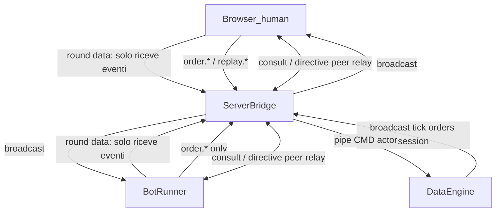
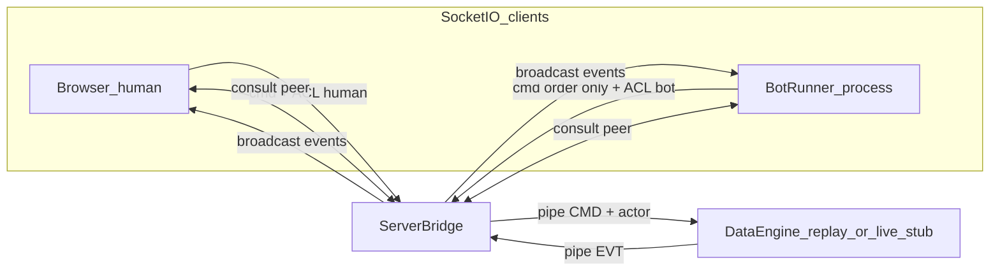

# Piano: bot collaborativo + predisposizione live

Riferimento vincolante: [docs/dashv2-architecture.md](docs/dashv2-architecture.md) (stato attuale). Questo piano è a parte; `dashv2-architecture.md` si aggiorna **solo dopo** che il codice funziona, come specchio del reale.

## Decisioni già chiuse (da te)


| Tema                  | Scelta                                                                                                                                                                   |
| --------------------- | ------------------------------------------------------------------------------------------------------------------------------------------------------------------------ |
| Collocazione bot      | Terzo processo client Socket.IO, co-controller con stessa priorità/latenza dell’umano (scelta confermata anche per consulto/direttive umano↔bot; vedi sezione dedicata)  |
| Replay                | Solo umano; bot **mai** load/play/seek/speed                                                                                                                             |
| Visibilità mutua      | Eventi push esistenti **+** `actor` su ogni mutazione rilevante                                                                                                          |
| Tag ordini            | `source: user | bot` obbligatorio                                                                                                                                        |
| Attach bot            | Solo a **inizio round** (hot-swap dropdown ok, non a round in corso)                                                                                                     |
| Crash bot             | Dash continua; log errore in console                                                                                                                                     |
| Formato bot           | Plugin `dashv2/bots/*.py` (code / config / AI-process); primo bot = random                                                                                               |
| Parametri bot         | Solo file di config del bot                                                                                                                                              |
| Live                  | Scelta solo a startup da setup; asse `sec` 300→0 sync Polymarket; market only; credenziali env; disconnect → pausa UI + errore + retry; ledger locale + sync + flag live |
| Scope implementazione | Architettura + bot random + **solo predisposizione** live (no trading/feed reali)                                                                                        |
| Bot+live              | Contratto nativo comune; implementazione live reale dopo                                                                                                                 |


## Perché il bot sta sul bridge (co-controller), non sul data process

Motivazione aggiornata (non solo “stessi comandi ordini”):

L’umano e il bot devono **parlare tra loro** sul terreno comune del round (stessi tick/quote/ordini), con scenari come:

1. **Direttiva**: l’umano dice al bot di fare X → il bot esegue `order.`*
2. **Consiglio**: l’umano chiede parere → il bot risponde → l’umano (o nessuno) esegue
3. **Consulto puro**: scambio di messaggi sui dati del round **senza** alcun ordine

Con questi requisiti, il co-controller Socket.IO dietro il **ServerBridge** è l’architettura corretta:


| Requisito                              | Come lo soddisfa A1 (bridge)                                                  | Perché non mettere il bot nel data process                                                          |
| -------------------------------------- | ----------------------------------------------------------------------------- | --------------------------------------------------------------------------------------------------- |
| Vista round condivisa                  | Entrambi ricevono lo stesso broadcast engine (`tick`, `orders`, `session`, …) | Anche il data process la avrebbe, ma non serve stare lì                                             |
| Stessa priorità/latenza comandi ordini | Stesso path Socket.IO → pipe CMD → engine                                     | Un bot “interno” avrebbe un vantaggio di latenza asimmetrico vs umano                               |
| Dialogo umano↔bot                      | Peer relay sul bridge **senza** inquinare il clock/trading del data process   | Ogni messaggio di consulto entrerebbe nel loop del motore dati (P2/P3 violati: chat ≠ verità round) |
| Crash bot soft                         | Process opzionale fuori dal fail-fast server+data                             | Bot nel data process: crash bot = rischio crash engine                                              |


Due piani di traffico distinti (entrambi sul bridge):




- **Piano round/trading**: unica fonte = DataEngine; bridge inoltra; entrambi vedono le stesse conseguenze.
- **Piano consulto/direttive**: relay peer human_sid ↔ bot_sid sul bridge; il data process **non** è obbligato a conoscere il testo del dialogo. Se una direttiva porta a un trade, il bot (o l’umano) emette comunque `order.`* verso l’engine — così il terreno comune resta il round, non una chat parallela nascosta.

**Nota:** un bot “più vicino” al data (IPC diretto o modulo interno) aiuterebbe solo latenza tick→decisione; peggiorerebbe il canale di consulto e spezzerebbe la simmetria umano/bot. Per questa dashboard collaborativa A1 resta la scelta giusta.

### Canale consulto (da predisporre nell’architettura; UI chat può arrivare dopo)

Nuovi eventi/comandi Socket.IO (relay bridge, ACL):


| Direzione   | Nome proposto                                           | Uso                                         |
| ----------- | ------------------------------------------------------- | ------------------------------------------- |
| human → bot | `consult.send`                                          | Domanda / direttiva / messaggio libero      |
| bot → human | `consult.reply` (o stesso `consult.message` con `from`) | Risposta consiglio / ack direttiva          |
| entrambi    | evento `consult.message`                                | Broadcast al peer (e opz. echo al mittente) |


Payload minimo: `{id, from: user|bot, kind: ask|advise|directive|note, text, ref_sec?, context?}`.

- `kind: directive`: il bot può interpretarla e poi fare `order.place/close` (esecuzione sul piano trading).
- `kind: ask/advise/note`: nessun ordine implicito.
- Scope implementazione V1 bot random: **predisporre** relay + hook plugin `on_consult`; UI chat e direttive reali possono seguire (random_bot può ignorare o loggare).

---

## Target architecture




- Fail-fast resta **solo** su server + data (`__main__.py`).
- Il bot-runner è processo **opzionale** supervisato: se muore, console error, UI torna a “nessun bot”, engine/server restano vivi.
- Stesso protocollo comandi/eventi per replay e live stub → bot e UI non cambiano contratto quando arriverà live reale.

---

## Fase 1 — Multi-controller nel bridge + actor nell’engine

### 1.1 [dashv2/server.py](dashv2/server.py)

Sostituire il singolo `_controller_sid` con due slot:

- `human_sid` — primo connect “human” (default browser)
- `bot_sid` — connect con auth/query `role=bot` (o handshake dedicato)

Regole:

- Broadcast eventi a **entrambi** i sid presenti (`socketio.emit(..., to=sid)` per ciascuno).
- Stessa coda IPC / stessi timeout: nessuna priorità diversa.
- ACL per ruolo:
  - **human**: tutti i comandi attuali + nuovi `bot.`* + `consult.send`
  - **bot**: solo `order.size`, `order.preview`, `order.place`, `order.close`, `order.cancel`, `session.sync`, `consult.send`/`consult.reply` (sync read-only + piano consulto)
- **Consult peer relay**: `consult.`* **non** passa dalla pipe verso il data process; il bridge inoltra al sid peer. Così il dialogo non entra nel clock del round.
- Ogni request **trading/replay** verso il data process porta `actor: "user" | "bot"` nel payload IPC (il bridge lo inietta; il client non può spoofare il ruolo).
- Disconnect bot: non pause replay; emit evento `bot.status` `{loaded:false, reason:"disconnected"}`; log console.
- Disconnect human: come oggi (pause best-effort); bot resta connesso ma senza umano (policy: bot può continuare sugli ordini finché il round gira — allineato a “bot alone / user watches”).

### 1.2 [dashv2/engine.py](dashv2/engine.py) + [dashv2/orders.py](dashv2/orders.py)

- `order.place` / `close` / `cancel` / `size`: leggono `actor` dal payload; ogni ordine aperto ha `source: "user"|"bot"`.
- Persistenza ledger: campo `source` nelle entry (`append_settled_orders` / row history).
- Su mutazioni da comando, eventi `orders` / `session` (e dove serve un piccolo evento `action`) includono `actor` così il bot distingue “l’ha fatto l’utente”.
- Gate attach bot (stato engine): `bot_attach_allowed` solo se `loaded` e (`sec == 300` e non ancora avanzato, oppure pre-play a inizio) — regola concreta: **permesso solo quando `sec == 300` e `not round_ended` e nessun tick già avanzato dalla sessione corrente** (dopo il primo `_advance_sec` o seek ≠ 300 → refuse). Hot-swap: unload + load solo in quella finestra.

### 1.3 UI minima actor

- [dashv2/static/js/render.js](dashv2/static/js/render.js): badge `user`/`bot` su open orders e history.
- Dropdown bot nella sezione Accounts (accanto all’account): `None` + lista bot disponibili.

---

## Fase 2 — Bot runner + plugin system

### 2.1 Layout

```
dashv2/bots/
  __init__.py          # discovery + load plugin
  protocol.py          # interfaccia BotPlugin + tipi
  runner.py            # processo Socket.IO client (co-controller)
  random_bot.py        # primo bot di test
  random_bot.json      # config (size, probabilità, ecc.)
```

### 2.2 Contratto plugin (`BotPlugin`)

Metodi minimi (docstring IT, nomi EN):

- `name` / `kind` ∈ `{code, config, ai}`
- `on_session` / `on_tick` / `on_orders` / `on_action(actor, cmd, payload)`
- `on_consult(message)` — domanda/direttiva/nota dall’umano (piano consulto)
- `on_round_start` / `on_round_end`
- Uscite verso il bridge: `order.*` e `consult.reply` / `consult.send`; il runner li emette via Socket.IO

Tre kind previsti nativamente:


| kind     | Comportamento                                                                           |
| -------- | --------------------------------------------------------------------------------------- |
| `code`   | Logica in `.py` + config file opzionale                                                 |
| `config` | Motore regole generico + file descrittivo (json/yaml); stub API ora, engine regole dopo |
| `ai`     | Plugin che può spawnare/subprocess modello; il co-controller resta `runner.py`          |


### 2.3 Lifecycle

1. Umano sceglie bot dalla dropdown → comando `bot.select {bot_id}` (solo se attach allowed).
2. Engine/server: se `bot_id` is None → stop runner / unload; else spawn o signal al bot-runner già vivo per caricare il plugin + path config.
3. Bot-runner si connette (`role=bot`), fa `session.sync`, resta idle fino a `on_round_start` (dopo `round.load` a sec 300).
4. Durante il round: reagisce a tick/orders/action; place/close come l’umano.
5. Fine round / nuovo load: plugin riceve end; nuovo attach solo a sec 300.

Spawn consigliato: processo bot-runner **lazy** al primo `bot.select` ≠ None; riutilizzato per hot-swap plugin; terminato su select None o exit app (senza fail-fast sul pair server/data).

Crash: parent o server osserva exitcode → log console + `bot.status` disconnected; nessun terminate di server/data.

### 2.4 Primo bot: `random_bot`

- kind `code`
- Config JSON: es. `size_usd`, `p_place_per_tick`, `p_close_per_tick`, `sides`
- Ogni tick (se tradable): con probabilità piazza o chiude a caso
- Solo per validare architettura collaborativa

---

## Fase 3 — Predisposizione live (senza implementazione Polymarket)

### 3.1 Startup mode

[dashv2/setup.json](dashv2/setup.json) + [dashv2/config.py](dashv2/config.py):

- Nuova chiave obbligatoria `engine_mode`: `"replay"` | `"live"`
- `__main__.py`: avvia `run_data_process` → factory che istanzia `ReplayEngine` oppure `LiveEngine` stub

### 3.2 Interfaccia comune data-engine

Estrarre (o documentare nel codice) il contratto IPC già usato da `ReplayEngine` come interfaccia implicita:

- stessi cmd (`round.*` in live potranno mappare al mercato corrente; in stub: not implemented / errore chiaro)
- stessi event (`tick`, `session`, `orders`, `history`, `accounts`, `round_end`, …)
- asse `sec` 300→0

`LiveEngine` (stub):

- Risponde a `session.sync` / `bootstrap` con flag `engine_mode: "live"`
- Comandi trading/replay: `raise Exception("live engine not implemented")` o emit `error` — UI mostra modalità live non pronta
- Nessuna connessione Polymarket, nessuna lettura env keys ancora (ma documentare nomi env previsti nel piano/commenti stub, es. `POLY_API_KEY`, …)

### 3.3 Account + history predisposti

- Evento `session` / `accounts`: campo `account_backend: "local" | "polymarket"`
- In replay: invariato (JSON locale)
- In live stub: `account_backend: "polymarket"`, lista vuota / placeholder
- Ledger entries: campo `round_source: "replay" | "live"` (in replay sempre `"replay"`; live reale lo settera dopo)
- Design nativo: stesso `OrderEngine` path per bot+user; in live futuro `place` chiamerà CLOB reale invece del walk sul book file — il bot non cambia

### 3.4 Disconnect live (contratto futuro, stub UI)

Prevedere nell’UI/evento `error` / `feed` payload shape `{state: "paused"|"retrying"|"ok"}` senza wiring reale; il LiveEngine stub può non emetterlo ancora, ma il client ignora campi sconosciuti (no break).

---

## Fase 4 — Test e doc

### Test

- Bridge: due sid, ACL bot rifiuta `replay.seek`, human ok
- Actor: place da bot → `source=bot`; place user → `source=user`; eventi con `actor`
- Attach: `bot.select` a sec 250 → error; a sec 300 → ok
- Crash bot: simulare disconnect → engine vivo
- random_bot: smoke unit (plugin decide place senza Socket.IO)
- `engine_mode=live` → parte LiveEngine stub senza crash

### Documentazione

- Piano: questo file (decisioni + fasi)
- [docs/dashv2-architecture.md](docs/dashv2-architecture.md): **non** toccare finché le fasi 1–3 non sono mergeate e funzionanti; poi aggiornare sezioni processi, controller, bot, `engine_mode`, campi `source`/`actor`/`round_source`

---

## Ordine di implementazione consigliato

1. Actor + `source` su ordini (engine/orders/history/UI badge) — funziona anche senza bot
2. Multi-controller bridge + ACL + broadcast
3. `bot.*` cmd + bot-runner + discovery plugin + random_bot
4. Dropdown UI attach/detach a inizio round
5. `engine_mode` + LiveEngine stub + flag account/history
6. Test
7. Solo a quel punto: refresh `dashv2-architecture.md`

## Fuori scope (esplicito)

- Feed/trading Polymarket reali
- Limit orders
- Motore regole config-driven completo e bot AI reali (solo slot `kind` + API plugin)
- UI chat consulto completa (V1: relay + hook plugin; pannello chat può arrivare dopo)
- Persistenza storico consulto nel ledger/engine (default: solo relay ephemeral; da confermare)
- Aggiornare architecture.md prima dell’implementazione

