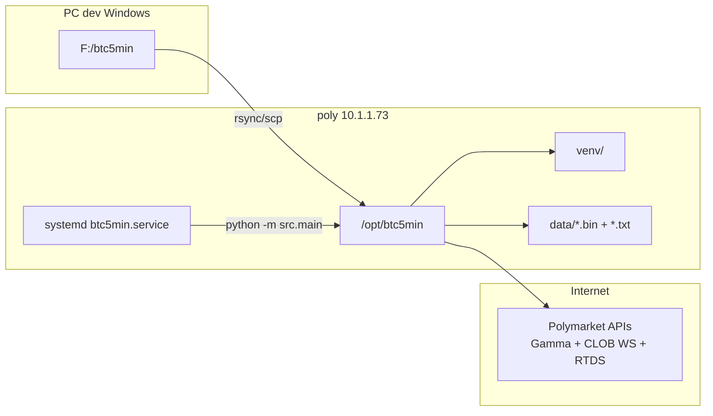

# Deploy operativo CT LAN Poly

## Obiettivo

Rendere operativa la sezione **CT LAN Poly** di [`AGENTS.md`](f:/btc5min/AGENTS.md): app `btc5min` in `/opt/btc5min` sul container **poly** (Proxmox CT 103, `10.1.1.73`), avvio automatico al boot, raccolta continua dei round in `data/` (`.bin` + `.txt`).

## Stato attuale (verificato via SSH)

| Elemento | Stato |
|----------|-------|
| Host SSH | Alias [`ticksaver`](C:/Users/savea/.ssh/config) → `root@10.1.1.73`, chiave `ticksaver` (funziona; hostname remoto = `poly`) |
| OS | Debian 12, kernel PVE, **UTC** |
| `/opt` | **Vuoto** — nessun deploy esistente |
| Python poly | **3.11.2** (sistema Debian bookworm) — **3.12 assente** in apt |
| Python dev | **3.12.10** nel venv locale (`.venv` gitignored); `collect.bat` usa `python` dal venv attivo |
| pip/venv poly | Non disponibili su 3.11 (`python3 -m pip` assente) |
| git | Presente |
| Rete | Ping OK; TCP 443 verso `gamma-api.polymarket.com` OK (IPv4) |
| RAM/disk | 2 GB RAM, ~100 GB liberi |
| systemd | Disponibile |
| Collector locale | Funzionante su Windows ([`data/collector.log`](f:/btc5min/data/collector.log) con round completati) |

**Riferimento deploy simile:** su `lobsaver` (10.1.1.77) esiste già `/opt/saver` + venv + [`lobsaver.service`](ssh://lobsaver/etc/systemd/system/lobsaver.service) — stesso pattern da replicare.

## Architettura target



## Scelte confermate

- **Deploy codice:** rsync/scp dal PC dev (no git clone)
- **Dati:** restano solo su poly in `/opt/btc5min/data`
- **Python:** **3.12** su entrambe le macchine (parità dev ↔ poly)

## Parità Python 3.12

### Verifica locale (PC dev)

| Comando | Risultato |
|---------|-----------|
| venv attivo + `python --version` | **Python 3.12.10** |
| `collect.bat` | Chiama `python -m src.main` → usa il Python del **venv attivo** (3.12) |

**Nessuna modifica a `collect.bat` necessaria.** Il pattern locale è: venv su 3.12 + `python` nel bat. Su poly replichiamo lo stesso schema: venv creato con `python3.12 -m venv`, systemd che punta a `venv/bin/python3`.

### Situazione su poly

Debian 12 bookworm espone solo `python3.11` nei repo ufficiali. `python3.12` **non è in apt** (né stable né backports standard).

**Approccio scelto:** compilare CPython **3.12.10** da sorgente con `make altinstall` → `/usr/local/bin/python3.12`, senza toccare il `python3` di sistema (3.11 resta per apt/systemd).

Alternativa scartata per ora: repo third-party [pascalroeleven python3.12-backport](https://github.com/pascallj/python3.12-backport) — più rapido ma dipendenza esterna non necessaria per un singolo servizio.

## Piano di esecuzione

### 1. Installare Python 3.12.10 su poly

SSH su `ticksaver`:

```bash
apt update
apt install -y build-essential libssl-dev zlib1g-dev libbz2-dev \
  libreadline-dev libsqlite3-dev wget curl libffi-dev liblzma-dev \
  libncursesw5-dev xz-utils tk-dev

cd /usr/local/src
wget https://www.python.org/ftp/python/3.12.10/Python-3.12.10.tgz
tar -xf Python-3.12.10.tgz
cd Python-3.12.10
./configure --enable-optimizations
make -j$(nproc)
make altinstall    # installa solo python3.12 + pip3.12, NON sovrascrive python3

python3.12 --version   # atteso: Python 3.12.10
python3.12 -m pip --version

mkdir -p /opt/btc5min/data
```

Tempo stimato: 5–15 min (compile su 2 GB RAM). La directory sorgente in `/usr/local/src` può restare per rebuild futuri.

### 2. Trasferire il progetto dal PC dev

Da PowerShell su `F:\btc5min`, escludere `data/`, `.venv`, `.git`, `__pycache__`:

```powershell
scp -r src requirements.txt README.md ticksaver:/opt/btc5min/
```

Alternativa se disponibile `rsync` (Git Bash/WSL):

```bash
rsync -avz --exclude data --exclude .venv --exclude .git --exclude __pycache__ \
  /f/btc5min/ ticksaver:/opt/btc5min/
```

### 3. Creare venv e dipendenze (Python 3.12)

```bash
ssh ticksaver
cd /opt/btc5min
python3.12 -m venv venv
venv/bin/pip install -r requirements.txt
venv/bin/python --version   # atteso: Python 3.12.10
```

Dipendenze da [`requirements.txt`](f:/btc5min/requirements.txt): `httpx`, `websocket-client`, `numpy`.

### 4. Creare unit systemd

File `/etc/systemd/system/btc5min.service` (modello da `lobsaver.service`):

```ini
[Unit]
Description=BTC5MIN Polymarket collector
After=network-online.target
Wants=network-online.target

[Service]
Type=simple
User=root
WorkingDirectory=/opt/btc5min
ExecStart=/opt/btc5min/venv/bin/python3 -m src.main
Restart=always
RestartSec=5
StandardOutput=append:/opt/btc5min/data/collector.log
StandardError=journal

[Install]
WantedBy=multi-user.target
```

Note:
- `WorkingDirectory=/opt/btc5min` fa sì che [`src/main.py`](f:/btc5min/src/main.py) scriva in `data/` relativo alla root progetto (default `--out`).
- `Restart=always` garantisce continuità 24h dopo drop WebSocket o riavvio container.
- stdout → `collector.log` (come `collect.bat` su Windows); stderr (righe `SAMPLE`) → journal.

Attivazione:

```bash
systemctl daemon-reload
systemctl enable --now btc5min
```

### 5. Validazione post-deploy

Subito dopo l'avvio:

```bash
systemctl status btc5min
journalctl -u btc5min -f          # errori / SAMPLE stderr
tail -f /opt/btc5min/data/collector.log
```

Dopo **10-15 minuti** (2-3 round):

```bash
ls -la /opt/btc5min/data/
ssh ticksaver "venv/bin/python3 -m src.verify /opt/btc5min/data/"
```

Criteri OK (allineati al collector Windows):
- Log con `orchestrator spawn round`, `sampling started`, `done ... file=btc5m_*.bin`
- Almeno 1 file `.bin` + `.txt` per round completato
- `verify` senza errori bloccanti (warning V12 su ultimo tick sono noti anche in locale)

### 6. (Opzionale) Alias SSH `poly`

Aggiungere in [`C:\Users\savea\.ssh\config`](C:/Users/savea/.ssh/config) un host `poly` identico a `ticksaver`, per allineamento con `AGENTS.md`. Non bloccante.

### 7. (Opzionale) Script deploy ripetibile

Aggiungere al repo un file minimale `deploy/btc5min.service` + `deploy/sync_poly.ps1` per aggiornamenti futuri (rsync + `systemctl restart btc5min`). Utile ma non necessario per il primo deploy.

## Aggiornamenti futuri

Con rsync come metodo scelto, per ogni modifica al codice:

1. `scp`/`rsync` dei file cambiati verso `/opt/btc5min/`
2. Se cambiano dipendenze: `venv/bin/pip install -r requirements.txt`
3. `systemctl restart btc5min`

## Rischi e mitigazioni

| Rischio | Mitigazione |
|---------|-------------|
| Python 3.12 assente in apt bookworm | Build da sorgente con `make altinstall` (step 1) |
| Compile lento su 2 GB RAM | `make -j2` se `nproc` satura la RAM |
| Drop WebSocket CLOB (già visti in log locale) | `Restart=always`; il collector riconnette per round successivo |
| IPv6 lento/bloccato su urllib | Il collector usa `httpx`/`websocket-client`; test TCP IPv4 OK |
| 2 GB RAM con overlap round | Pattern già validato su Windows; monitorare `free -h` nelle prime ore |
| Codice debug residuo in [`round_runner.py`](f:/btc5min/src/round_runner.py) (`debug-9c51e0.log`) | Non blocca il deploy; rimuovibile in un commit successivo |
| Container riavviato | `systemctl enable` garantisce autostart |

## File coinvolti

| Dove | Cosa |
|------|------|
| PC dev `F:\btc5min\` | Sorgente da sincronizzare (`src/`, `requirements.txt`) |
| poly `/opt/btc5min/` | App deployata + `venv/` + `data/` |
| poly `/etc/systemd/system/btc5min.service` | Servizio persistente |
| (opz.) `deploy/btc5min.service` | Template versionato nel repo |

## Cosa NON fare in questo task

- Sync dati verso PC dev (scelta utente: solo su poly)
- Modifiche al collector o fix verify V12
- Commit/push automatici
