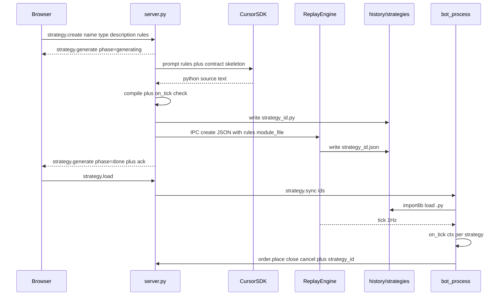

# Strategie deterministiche: rules → Python → bot runner

## Contesto attuale

- CRUD metadata in [`dashv2/strategies.py`](dashv2/strategies.py) + UI modal (name/description) funzionano.
- [`dashv2/bots/bot_process.py`](dashv2/bots/bot_process.py) è uno shell: sincronizza `strategy_ids`, ignora `tick`, non emette `order.*`.
- Generazione LLM: riusare il pattern di [`docs/cursor-SDK.md`](docs/cursor-SDK.md) (`cursor-sdk`, patch Windows, `Agent.create` + `send` + `wait`, prompt anti-tool).

## Architettura end-to-end



## 1. Schema e storage

Estendere JSON strategy ([`dashv2/strategies.py`](dashv2/strategies.py)):

- `rules: str` — testo utente
- `module_file: str` — es. `strategy_{id}.py` (solo per `deterministic`)
- File codice: `dashv2/history/strategies/strategy_{id}.py` (stesso root del JSON)

API:

- `create_strategy(..., rules, module_file)` — `rules` obbligatorio se `type=="deterministic"`
- `update_strategy(..., rules)` — se `rules` cambia, il server rigenera il `.py` prima dell’update
- `delete_strategy` — cancella anche il `.py`
- `strategy_summary` — include `rules` (o almeno un flag `has_module`) per il form edit

Bump `SCHEMA_VERSION` a `2` (niente migrazione soft: le strategy vecchie senza `rules`/`module_file` vanno ricreate o compilano in eccezione se caricate come deterministic).

## 2. Contratto del modulo generato (estendibile)

Scheletro fisso nel prompt (il LLM riempie la logica):

```python
def on_round_start(ctx: dict) -> list[dict]:
    return []

def on_tick(ctx: dict) -> list[dict]:
    return []

def on_round_end(ctx: dict) -> list[dict]:
    return []
```

Azioni ammesse (estendibili in seguito):

- `{"cmd": "order.place", "side": "Up"|"Down", "size_usd": float}`
- `{"cmd": "order.close", "order_id": str}`
- `{"cmd": "order.cancel", "order_id": str}`

`ctx` (primo taglio — tick pubblico + best bid/ask, niente book profondo):

- da tick: `sec`, `tradable`, `chainlink_btc`, `delta_usd`, `up_ask_c`, `down_ask_c`, **`up_bid_c`**, **`down_bid_c`**, mid, `majority_side`, `vol`, `risk`, `dwin_*`
- runtime: `open_orders`, `strategy_id`, `bot_active`

Estensione futura: nuovi campi in `ctx` / nuove azioni senza cambiare il meccanismo di load/`exec`.

Aggiungere `up_bid_c` / `down_bid_c` in [`_public_tick`](dashv2/engine/plugins/replay.py) (oggi espone solo ask).

## 3. Cursor client sul server

Nuovi file (minimali, stile POC):

| File | Ruolo |
|------|--------|
| [`dashv2/cursor_client.py`](dashv2/cursor_client.py) | Patch Windows (§8 docs), `call_model(prompt)`, retry 3×, validazione anti-meta |
| [`dashv2/strategy_codegen.py`](dashv2/strategy_codegen.py) | Prompt rules→Python, estrazione fence \`\`\`python, `compile()` + check `on_tick` |

Config in [`dashv2/setup.json`](dashv2/setup.json) + [`dashv2/config.py`](dashv2/config.py):

- `cursor_label`: stringa **esatta del `label`** del preset da usare per la codegen (es. `"Composer 2.5"` o `"Grok 4.5 High"`). Deve corrispondere a un `label` presente in `cursor_models` (non allo slug SDK `id`, che può ripetersi tra preset).
- `cursor_models`: lista dei modelli Cursor usabili su questo account. Ogni entry è un preset completo (`label` univoco + `id` SDK + `params`) così non si inventano slug/parametri:

```json
"cursor_label": "Composer 2.5",
"cursor_models": [
  {
    "id": "composer-2.5",
    "label": "Composer 2.5",
    "params": { "fast": "false" }
  },
  {
    "id": "composer-2.5",
    "label": "Composer 2.5 Fast",
    "params": { "fast": "true" }
  },
  {
    "id": "grok-4.5",
    "label": "Grok 4.5 High",
    "params": { "effort": "high", "fast": "false" }
  },
  {
    "id": "grok-4.5",
    "label": "Grok 4.5 Medium",
    "params": { "effort": "medium", "fast": "false" }
  }
]
```

Note operative:

- `label` = chiave univoca: è il valore da mettere in `cursor_label` (e, in futuro, nel selector UI).
- `id` = slug passato a `ModelSelection(id=...)` (come da catalogo Cursor / [`docs/cursor-SDK.md`](docs/cursor-SDK.md) §5); può ripetersi tra preset.
- `params` = mappa → lista di `ModelParameterValue` (obbligatori: senza `fast=false` Composer spesso fattura come fast).
- Risoluzione runtime: cerca in `cursor_models` l’entry con `label == cursor_label`; da lì prende `id` + `params` per `call_model`. Se manca → eccezione (D2).
- All’avvio `config.py` valida: `cursor_label` presente come `label` in `cursor_models`, lista non vuota, ogni entry ha `id`/`label`/`params`, `label` univoci.

Env: `load_dotenv()` all’avvio launcher ([`dashv2/__main__.py`](dashv2/__main__.py)); richiede `CURSOR_API_KEY`.

Deps: `cursor-sdk`, `python-dotenv` in [`dashv2/requirements.txt`](dashv2/requirements.txt).

`cwd` agent: directory temporanea vuota (non la root repo), `auto_review=False`, prompt “SOLO codice Python / no tool / no file”.

## 4. Flusso create/edit + progress (scelta B)

Handler dedicati in [`dashv2/server.py`](dashv2/server.py) per `strategy.create` / `strategy.update` (non il bind generico da 30s IPC):

1. Emit `strategy.generate` `{phase: "generating"}` verso human
2. Chiamata Cursor (bloccante ok: `async_mode="threading"`)
3. Emit `{phase: "validating"}` → compile
4. Allocare `id`, scrivere `.py`, emit `{phase: "saving"}`
5. IPC engine `strategy.create` / `update` con `rules` + `module_file` (timeout IPC corto, solo disco)
6. Emit `{phase: "done"}` + return ack

Su errore: `{phase: "error", message}` + ack `{error}`; nessun JSON/`.py` orfano (cleanup se scrittura parziale).

UI ([`index.html`](dashv2/static/index.html), [`app.js`](dashv2/static/js/app.js)):

- Textarea **Rules** nel modal
- Durante save: disabilita Save, mostra spinner/testo progress da eventi `strategy.generate`
- Edit: prefill `rules`; se invariato → update solo name/description senza Cursor

Solo `type === "deterministic"` passa da codegen; inferential/agentic restano create metadata-only (per ora).

## 5. Runner nel bot

Riscrivere [`dashv2/bots/bot_process.py`](dashv2/bots/bot_process.py):

- Su `strategy.sync`: per ogni id, `importlib` da `strategies_dir / strategy_{id}.py`, cache `(id → module)` invalidata se mtime cambia
- Handler `tick`, `orders`, `session`, `round_end` (e start se già emesso)
- Se `bot_active` e moduli caricati: fan-out `on_tick(ctx)` → emit comandi con `strategy_id`
- Eccezione in un modulo: log + **skip tick** per quella strategy (processo resta su)

Opzionale minimo: helper `dashv2/bots/runner.py` per load/cache/dispatch (evita gonfiare `bot_process`).

## 6. `strategy_id` sugli ordini

- [`dashv2/orders.py`](dashv2/orders.py): campo `strategy_id` su place (obbligatorio se `source=="bot"`, `None` se user)
- Engine `_cmd_order_place`: passa `payload["strategy_id"]` quando actor bot
- History/UI: mostrare `strategy_id` se presente (minimo: campo nell’oggetto ordine già serializzato)

## 7. Test e docs

- Unit: extract/compile codegen (fixture source, senza chiamare Cursor in CI)
- Bot: load modulo stub da temp dir → `on_tick` → azione `order.place`
- Aggiornare sezione 18bis in [`docs/dashv2-architecture.md`](docs/dashv2-architecture.md): deterministic = rules + `.py` + runner; `strategy.sync` (non più `bot.select` / `strategy.load` event)

## Fuori scope (esplicito)

- Provider OpenRouter / DeepSeek (chiavi già in `.env`, wiring dopo)
- Selector modello in UI (il catalogo `cursor_models` è già pronto per quando si vorrà; per ora si sceglie solo editando `cursor_label` in setup)
- Sandbox sicurezza / book LOB completo
- Strategy inferential / agentic runtime
