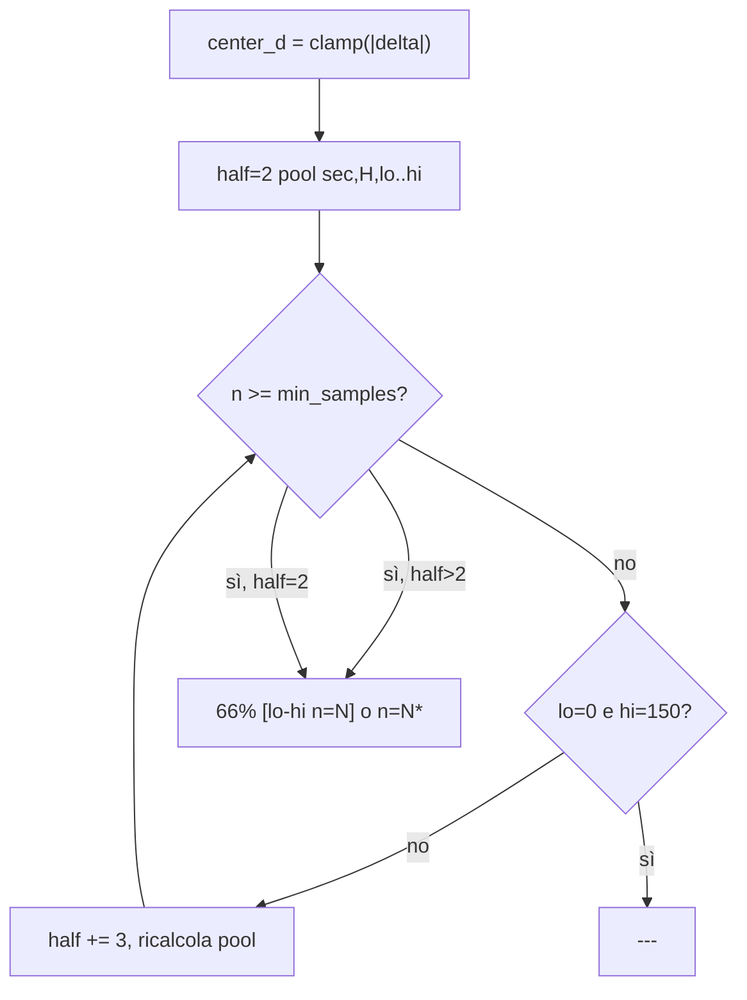

# DWinA: pool empirico, n reale ed espansione range

## Problema attuale

Oggi in [`src/delta_win_bands.py`](src/delta_win_bands.py):
- fit per **singolo** `d` con merge fino a `delta_win_band_min_samples: 500`
- runtime: **media** di 5 `p_win` e `n_min` tra slot → `n≈500` quasi costante, **non** il numero di round nella fascia `[lo, hi]`

## Semantica target (confermata)

Per `66% [19$-23$ n=535]` a sec=240, fascia H del round:

> 535 checkpoint (1 per round a quel sec) con `|delta| ∈ [19,23]`; win rate empirico del lato-delta = 66%.

Espansione se `n` basso:
- Partenza: half base **±2** → `[d-2, d+2]`
- Se `n < soglia`: allarga di **+3** per lato → half 5, 8, 11… finché `n ≥ soglia` o range clampato **0–150**
- Range allargato → `n=150*` (asterisco = pool su fascia più larga del ±2 nominale)
- Se anche al massimo `n < soglia` → **`---`** (scelta utente)



---

## 1. Nuova logica fit — [`src/delta_win_bands.py`](src/delta_win_bands.py)

Sostituire `fit_delta_p_for_sec` + `mean_p_window` con:

```python
def pool_in_range(sec_samples, lo, hi) -> list[dict]:
    return [s for s in sec_samples if lo <= s["abs_delta"] <= hi]

def fit_window_for_sec_h(samples, sec, intraday_h, min_samples, half_base=2, expand_step=3) -> dict[str, dict]:
    # per center_d in 0..150: espandi half fino a n>=min_samples o range max
    # slot sufficiente: {"p_win", "n", "lo", "hi", "half", "expanded": half > half_base}
    # slot insufficiente: assente (o sentinel) → runtime ---
```

- **Niente merge artificioso a 500**: `n = len(pool)` reale
- Un campione = una riga `(round, sec, H)` da [`li_collect_delta_win_dataset`](src/listats.py) (già univoca per round×sec)

Rimuovere `_pool_samples` orientato al merge per singolo `d` e `mean_p_window`.

---

## 2. Config — [`setup.json`](setup.json) + [`src/setup.py`](src/setup.py)

| Chiave | Ruolo |
|--------|--------|
| `delta_win_window_half_base` | `2` (finestra iniziale ±2) |
| `delta_win_window_expand_step` | `3` (+3 per lato a ogni step) |
| `delta_win_window_min_samples` | soglia minima `n` (valorizzata dallo study) |

**Rimuovere** `delta_win_band_min_samples` (non più usata; regola D3, no retrocompat).

---

## 3. Artifact — [`models/delta_win_v2.json`](models/delta_win_v2.json)

Rinominare sezione (breaking):

```json
{
  "delta_window_by_sec_h": {
    "2": {
      "240": {
        "21": {"p_win": 0.66, "n": 535, "lo": 19, "hi": 23, "half": 2, "expanded": false},
        "33": {"p_win": 0.64, "n": 150, "lo": 16, "hi": 26, "half": 5, "expanded": true}
      }
    }
  },
  "delta_win_window_min_samples": 50,
  "delta_win_window_half_base": 2,
  "delta_win_window_expand_step": 3
}
```

- Chiavi center `d`: `"0"`…`"150"` solo dove `n ≥ soglia`; slot mancanti → `---` al runtime
- Metadati soglia/parametri finestra nell’artifact + validazione in [`load_delta_win_artifact`](src/delta_win.py)
- Rimuovere `delta_p_by_sec_h`

---

## 4. Runtime e formato — [`src/delta_win.py`](src/delta_win.py)

- `predict_delta_win_a_window(sec, abs_delta, intraday_h, artifact)` → `(p, lo, hi, n, expanded)`; se slot assente → eccezione o tuple `None` → cella `---`
- `format_delta_win_a_cell(prob, lo, hi, n, expanded)`:
  - normale: `66% [19$-23$ n=535]`
  - allargato: `64% [16$-26$ n=150*]`
- Bump `_DW_A_COL_W` se serve per `n=12345*` (verificare su artifact post-fit)
- `delta_win_header_lines` / `delta_win_txt_matches_artifact`: nuovi campi finestra; bump idempotenza backfill

---

## 5. Calcolo soglia — [`scripts/study_delta_win_v2.py`](scripts/study_delta_win_v2.py)

Aggiungere fase **`_calibrate_min_samples(train, hold)`** prima del fit finale:

1. Candidati es. `[20, 30, 50, 75, 100, 150]`
2. Per ciascuno: fit window su train, valuta holdout (Brier A, % celle `---`, % con `*`, distribuzione `n` a half=2)
3. Scegli soglia con criterio documentato nel report (es. massimizzare copertura con Brier non peggiore del migliore + ε, oppure primo candidato con `---` < X% e `n` mediano ±2 > Y)
4. Scrivere scelta in `data/reports/delta_win_window_threshold_<ts>.json` e usare per artifact + `setup.json`

Fit finale invariato su **train weeks** (no leakage); logistic B invariato.

---

## 6. Test, docs, rigenerazione

**[`tests/test_delta_win.py`](tests/test_delta_win.py):**
- Pool unico: 10 campioni in `[19,23]` → `p=0.7`, `n=10`
- Espansione: pool ±2 insufficiente, ±5 ok → `expanded=True`, `*`
- Max range ancora sotto soglia → `---`
- Formato cella e column width

**Docs:** [`docs/indicator_delta_win.md`](docs/indicator_delta_win.md), [`AGENTS.md`](AGENTS.md) — definizione `n`, `*`, `---`, rimozione merge 500

**Post-implementazione:**
```bash
python scripts/study_delta_win_v2.py
python -m unittest tests.test_delta_win
python scripts/eval_delta_win_v2_compare.py data/
python scripts/backfill_real_delta_win.py data/ 4
```

---

## Fuori scope

- Metodo B (DWinB)
- Separare eleggibilità vol per A
- Espansione oltre ±2 con step diversi da 3 (fisso in config)
