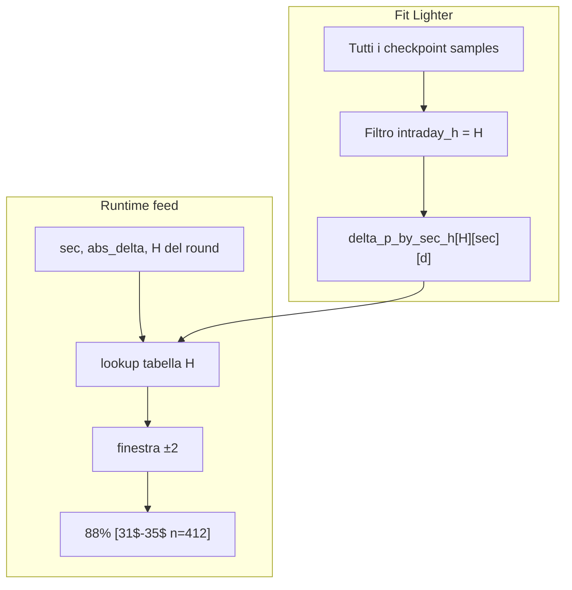

# DWinA stratificato per fascia H

## Contesto attuale

Il metodo A ([`src/delta_win_bands.py`](src/delta_win_bands.py)) fitta `p_win` per ogni `(sec, |delta|)` su **tutto** il dataset Lighter, con merge a vicini fino a `delta_win_band_min_samples: 500` ([`setup.json`](setup.json)). Al runtime ([`src/delta_win.py`](src/delta_win.py)) la percentuale è la media di 5 slot `p_win` nella finestra ±2; il range `[lo$-hi$]` è solo informativo.

DWinB usa già H tramite one-hot nella logistic ([`study_delta_win_v2.py`](scripts/study_delta_win_v2.py) righe 41–42). DWinA no.

`intraday_h` è già disponibile ovunque serve il rendering: [`parse_intraday_h`](src/delta_win.py), header `intraday: Hk` nei `.txt`.



---

## 0. Audit bug esistenti (prima di implementare)

Verifica read-only sul codice e sui dati attuali; eventuali bug confermati si correggono **nella stessa implementazione** (non PR separata). Se non si trova nulla, il report documenta comunque i controlli eseguiti.

### Sospetti da verificare

| # | Area | Sospetto | Come verificare | Fix se confermato |
|---|------|----------|-----------------|-------------------|
| 1 | [`study_delta_win_v2.py`](scripts/study_delta_win_v2.py) | **Holdout leakage metodo A**: il fit usa tutti i campioni Lighter (`fit_delta_p_for_sec(samples, sec)`), poi `_diagnostic_holdout` valuta sulle ultime 2 settimane — ma quelle settimane sono già nel fit. Il v1 ([`study_delta_win.py`](scripts/study_delta_win.py)) fa split train/holdout corretto. | Confrontare Brier “holdout” attuale vs refit solo su `week ∉ holdout_weeks` sullo stesso artifact globale. | Nel nuovo study: fit A (global e per-H) **solo su train weeks**; holdout diagnostico su settimane escluse. Allineare anche logistic B se stesso problema. |
| 2 | [`delta_win.py`](src/delta_win.py) `delta_win_row_part` | **H ignorato al runtime A**: `intraday_h` è passato ma `predict_delta_win_a_window` non lo usa — gap funzionale, non regression recente. | Ispezione codice + confronto predizioni stesso `(sec, delta)` tra H diversi (devono essere identiche oggi). | Risolto dalla stratificazione per H (sezione 2–3). |
| 3 | Header Lighter | **`intraday: Hk` incoerente** con `hour_band(market_start_ts)` su file backfillati. | Script spot-check su `H:/ticks/lighter-rounds5m` (o sample locale): per ogni `.txt`, confrontare header `intraday` vs `hour_band(start_ts)`. | Correggere backfill o rigenerare header; eccezione se mismatch in `parse_intraday_h` quando header presente (opzionale, solo se trovati casi). |
| 4 | Eleggibilità feed | **DWinA richiede vol/stale** come DWinB (`_row_eligible`, [`lighter_txt_format._delta_win_row_live`](src/lighter_txt_format.py)) anche se A non usa vol. | Contare checkpoint con delta valido ma vol `---` dove A sarebbe `---` e B idem. | Se eccessivo: separare `eligible_a` (solo delta non stale) da `eligible_b` (vol richiesta). Documentare scelta. |
| 5 | Artifact attuale | **Monotonicità** `p_win` vs `\|delta\|` non garantita (griglia empirica): `test_artifact_load_and_predict_ab` assume `pa_hi >= pa_lo` per tutti i sec. | Scan artifact: contare violazioni `p_win(d) < p_win(d-1)` per sec; verificare se il test è fragile. | Se violazioni frequenti: rilassare test o accettare come comportamento (no smoothing forzato). |
| 6 | Doppio smoothing | Fit merge ±radius **per slot**, runtime media su finestra ±2: la % non è il win rate empirico del pool `[lo,hi]` ma media di lookup già mergiati. | Confronto su holdout: `p_a` vs win rate osservato per `(sec, window)` ([`probe_delta_win_bands.py`](scripts/probe_delta_win_bands.py)). | Solo documentazione, salvo gap sistematico > soglia (es. 10pp). |
| 7 | Backfill idempotenza | `.txt` reali con header `delta_win_*` vecchio ma valori A calcolati con artifact precedente: `delta_win_txt_matches_artifact` non verifica `band_stratify` né coerenza celle. | Campionare `.txt` in `data/`, rigenerare con `convert` e diff. | Estendere `delta_win_txt_matches_artifact` con `delta_win_band_stratify` nel nuovo formato. |

### Output audit

File `data/reports/delta_win_bug_audit_<timestamp>.json` con:

- esito per ogni sospetto (`ok` / `confirmed` / `not_applicable`)
- evidenza numerica (conteggi, esempi `start_ts`)
- lista fix inclusi nel refactor vs “nessun bug, solo note”

### Ordine di esecuzione

L’audit è il **primo step operativo** (prima del refit per-H). I fix confermati (soprattutto #1 holdout leakage e #4 eleggibilità se necessario) entrano nel codice insieme alla stratificazione H, così il nuovo artifact e i report comparativi sono già su basi corrette.

---

## 1. Analisi comparativa (informativa, prima del refit)

Estendere [`scripts/study_delta_win_v2.py`](scripts/study_delta_win_v2.py) (o script dedicato `scripts/study_delta_win_a_by_h.py` se preferisci tenere lo study snello) con una sezione **global vs per-H** sulle ultime 2 settimane holdout (stessa logica di `_holdout_weeks`):

| Metrica | Global (attuale) | Per-H (proposto) |
|---------|------------------|------------------|
| Brier / log-loss holdout | su tutti i campioni | su tutti i campioni |
| Brier per `intraday_h` | 1…6 | 1…6 |
| `n_min` runtime | N/A | distribuzione p10/p50/p5 per (sec, H) |
| Slot con `merge_radius > 0` | per sec | per (sec, H) |
| Celle con `n < 500` dopo merge | conteggio | conteggio per H |

**Stima numerosità attesa:** ~48 checkpoint × ~21k round Lighter → ~1M righe totali; per H la quota è **non uniforme** (H1 weekend, H6 solo 3h feriali — vedi [`docs/indicatorH.md`](docs/indicatorH.md)). Con 6 fasce, la media è ~1/6 per H, ma H6/H5 saranno i più scarsi.

**Output:** `data/reports/delta_win_a_h_study_<timestamp>.json` con confronto esplicito. Nessun gate bloccante (scelta utente): l’analisi documenta il trade-off; la visibilità di `n` nel feed permette di ignorare celle con supporto basso.

---

## 2. Fit stratificato per H

**File:** [`src/delta_win_bands.py`](src/delta_win_bands.py)

- Aggiungere parametro obbligatorio `intraday_h: int` a `fit_delta_p_for_sec`: filtra `samples` con `s["intraday_h"] == intraday_h` prima del loop su `d`.
- Estendere `mean_p_window` → ritorna `(p_mean, n_min)` dove `n_min = min(table[str(i)]["n"] for i in lo..hi)`.

**File:** [`scripts/study_delta_win_v2.py`](scripts/study_delta_win_v2.py)

- Loop esterno `for h in range(1, 7)` → costruisce `delta_p_by_sec_h: dict[str, dict[str, dict]]`.
- Diagnostica per `(sec, h)`: `_delta_p_diag` come oggi.
- Holdout: `predict_delta_win_a(sec, abs_delta, intraday_h, artifact)`.
- **Fit solo su train weeks** (fix leakage da audit §0.1): escludere `holdout_weeks` dal pool di fit A; valutare holdout su settimane tenute fuori. Stessa logica per confronto global vs per-H.
- Rimuovere `delta_p_by_sec` dall’artifact (no retrocompat, regola D3).

**Nuova struttura artifact** in [`models/delta_win_v2.json`](models/delta_win_v2.json):

```json
{
  "delta_p_by_sec_h": {
    "1": { "90": { "33": {"p_win": 0.74, "n": 412, "merge_radius": 2}, ... } },
    "2": { ... },
    ...
    "6": { ... }
  },
  "delta_win_band_stratify": "intraday_h",
  "logistic_by_sec": { "...": "invariato" }
}
```

6 chiavi H × 48 checkpoint × 151 delta = struttura validata in `load_delta_win_artifact`.

---

## 3. Runtime e formato feed

**File:** [`src/delta_win.py`](src/delta_win.py)

- `predict_delta_win_a_window(sec, abs_delta, intraday_h, artifact)` → `(p, lo, hi, n_min)`.
- `predict_delta_win_a(...)` → delega, ignora `n` se serve solo la probabilità.
- `format_delta_win_a_cell(prob, lo, hi, n_min)` → `88% [31$-35$ n=412]` (scelta utente).
- `delta_win_row_part`: passa `intraday_h` già ricevuto a `predict_delta_win_a_window`.
- `_DW_A_COL_W`: da 17 a **24** (worst case `99% [148$-150$ n=99999]` ≈ 23 char + margine).
- `load_delta_win_artifact`: validare `delta_p_by_sec_h` (chiavi `"1"`…`"6"`, 151 delta per sec/checkpoint); eccezione se manca `delta_p_by_sec` vecchio o nuova struttura incompleta.
- `delta_win_header_lines`: aggiungere `delta_win_band_stratify: intraday_h`.

**Chiamanti da aggiornare** (firma con `intraday_h` obbligatorio):

- [`scripts/eval_delta_win_v2_compare.py`](scripts/eval_delta_win_v2_compare.py) — già ha `intraday_h` nel sample
- [`scripts/study_delta_win_v2.py`](scripts/study_delta_win_v2.py) — holdout loop
- [`tests/test_delta_win.py`](tests/test_delta_win.py) — passare `intraday_h=2` nei test predict/format/width

**Feed invariati strutturalmente** (già passano `intraday_h`):

- [`src/txt_format.py`](src/txt_format.py)
- [`src/lighter_txt_format.py`](src/lighter_txt_format.py)
- [`scripts/backfill_lighter_delta_win.py`](scripts/backfill_lighter_delta_win.py), [`scripts/backfill_real_delta_win.py`](scripts/backfill_real_delta_win.py) — idempotenti, da rieseguire dopo refit

---

## 4. Test e documentazione

**[`tests/test_delta_win.py`](tests/test_delta_win.py):**

- `mean_p_window` ritorna `n_min` corretto su tabella sintetica.
- `fit_delta_p_for_sec` con filtro H: campioni H2 non influenzano fit H6.
- `format_delta_win_a_cell(0.88, 31, 35, 412)` → stringa attesa.
- `test_format_cells` / width: verificare tutte le celle artifact ≤ 24 char.
- `test_artifact_load_and_predict_ab`: `predict_delta_win_a(sec, d, h, art)`.

**Docs:**

- [`docs/indicator_delta_win.md`](docs/indicator_delta_win.md) — metodo A stratificato per H, formato con `n`.
- [`AGENTS.md`](AGENTS.md) — colonna `DWinA`: `88% [31$-35$ n=412]`, significato di `n` (= minimo tra i 5 slot delta della finestra, conservativo).

---

## 5. Esecuzione post-implementazione

```bash
# Audit (può essere uno script dedicato o prima fase di study_delta_win_v2)
python scripts/study_delta_win_v2.py --audit-only   # oppure scripts/audit_delta_win.py

python scripts/study_delta_win_v2.py          # refit + report comparativo
python -m unittest tests.test_delta_win
python scripts/eval_delta_win_v2_compare.py data/   # confronto A vs B su reali
python scripts/backfill_real_delta_win.py data/ 4    # rigenera .txt reali
```

---

## Rischi noti e mitigazioni

| Rischio | Mitigazione |
|---------|-------------|
| H6/H5 con pochi round → `n` basso e merge ampio | `n` visibile in feed; report con distribuzione `n_min` per H |
| `min_samples=500` troppo alto per alcune (sec,H,delta) | Il merge ±radius resta; se ancora insufficiente → eccezione al fit (D2, niente fallback cross-H) |
| Colonna più larga rompe allineamento tabella | Bump `_DW_A_COL_W` + aggiornare `test_dw_block_width_and_alignment` |
| DWinB invariato ma confronto A/B cambia | `eval_delta_win_v2_compare` riflette il nuovo A |

**Fuori scope:** metodo B, formato `.bin` v6, fallback a statistiche globali se `n` basso, scelta automatica A vs B.
