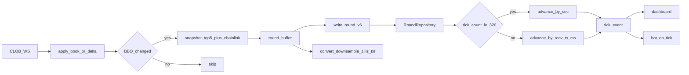

# Campionamento event-driven BBO (depth 5) + replay event-time

## Decisioni fissate

- **Trigger tick:** solo quando cambia il **best bid o best ask** su Up **oppure** Down (dopo `book` / `price_change` / `best_bid_ask`).
- **Book salvato:** top **5** livelli per lato (4 lati × 5 = max 20 livelli).
- **Replay:** **event-time** — avanza tick-per-tick secondo `recv_ts_ms`, con speed ×1/×2/×5 sul tempo evento; file 1 Hz restano supportati.
- **Formato:** stesso layout binario **v6** (già a profondità variabile e `tick_count` libero) — nessuna migrazione dei file esistenti.

## Situazione attuale (baseline)

| Pezzo | Comportamento oggi |
|-------|-------------------|
| Collector | [`SamplerThread`](src/round_runner.py): 1 tick per nuovo `countdown_sec` (1 Hz), `deepcopy` book intero |
| Feed | [`ClobThread`](src/feed_clob.py) aggiorna book in RAM via WS; il sampler **non** è event-driven |
| `.bin` | header 76 B + record 44 B + counts 8 B + livelli × 16 B; ~**45 livelli/lato**, ~**850 KB/round**, sempre **300 tick** |
| Replay | [`replay.py`](dashv2/engine/plugins/replay.py): clock su `sec` 300→1; [`rounds.py`](dashv2/rounds.py) bucketizza `ticks_by_sec` / `books_by_sec` (last-wins) |
| Bot | un `on_tick` per emissione engine = 1 Hz logico |
| `.txt` / vol / DWin / R | asse **sec** intero; una riga/sec |

## Architettura target

## Compatibilità formato (vecchi + nuovi)

Il layout v6 **già** supporta N tick e profondità arbitraria: i file 1 Hz full-depth restano leggibili senza conversione.

| Aspetto | Vecchi (1 Hz) | Nuovi (BBO) |
|---------|---------------|-------------|
| Magic/version | `BTC5` / 6 | uguale |
| Record tick | identico | identico |
| Book | full depth (~45/lato) | truncato a 5/lato |
| `tick_count` | ~300 | tipicamente migliaia |
| Replay | modalità **legacy** (passo su `sec`) | modalità **event** (passo su tick index / Δ`recv_ts_ms`) |

**Rilevamento modalità** (senza bump di versione): `legacy_1hz = header["tick_count"] <= 320`. I round storici sono sempre 300; i nuovi supereranno largamente quella soglia. Documentare in [`docs/round-format.md`](docs/round-format.md).

`read_round` / `write_round` in [`src/binary_format.py`](src/binary_format.py): nessuna rottura strutturale; solo validazione che accetti `tick_count` alto.

## Collector — modifiche

File principali: [`src/feed_clob.py`](src/feed_clob.py), [`src/round_runner.py`](src/round_runner.py), [`src/book.py`](src/book.py), [`src/round_state.py`](src/round_state.py).

1. **`OrderBook` / snapshot:** helper `truncate_side(levels, 5)`; `snapshot_books(..., depth=5)` salva solo top-5.
2. **Detect BBO change:** prima/dopo `_apply_book` / `_apply_best` / `_apply_changes` confrontare `(up_bb, up_ba, down_bb, down_ba)`; se diversi → append tick.
3. **Sostituire `SamplerThread` 1 Hz** con campionamento **inline** sul path WS (sotto lock, dopo apply): niente più dedup su `last_countdown_sec`.
4. **Campi tick invariati:** `recv_ts_ms=now_ms`, `secs_to_expiry=market_end_ts-now`, quote da BBO, `chainlink_btc` = ultimo valore cache (come oggi), `majority_gain` riempito a fine round da `enrich_gains`.
5. **Partial:** se book non quotabile (`books_ready()` false) **non** scrivere tick BBO; opzionale: tenere un heartbeat 1 Hz solo-chainlink per non lasciare buchi nel `.txt` (stesso meccanismo partial attuale). Raccomandato: **sì**, 1 Hz partial/chainlink solo se in quel secondo non c’è stato alcun tick completo — così vol/delta restano continui.
6. **Fine round:** `enrich_gains` su **tutti** i tick completi (con depth 5 il walk $100 può liquidità-limitare — accettato; documentare).

Config: costante `BOOK_DEPTH = 5` (o chiave in `setup.json`); niente `sample_hz`.

## Spazio disco — previsione

Misura locale attuale (~50 file): **~850 KB/round**, ~45 livelli/lato, 300 tick → ~2890 B/tick.

Con depth=5: **372 B/tick** (44+8+20×16).

| Rate medio BBO change | Size/round | vs oggi (~850 KB) | 2450 round |
|----------------------|------------|-------------------|------------|
| 1/s (pari a oggi) | ~109 KB | **−87%** | ~0.27 GB |
| 5/s | ~545 KB | **−36%** | ~1.3 GB |
| 10/s | ~1.1 MB | **+28%** | ~2.6 GB |
| 20/s | ~2.2 MB | **~2.6×** | ~5.3 GB |
| 50/s (picco caldo) | ~5.5 MB | **~6.5×** | — |

**Verdetto:** a rate tipici “ogni poche centinaia di ms” (≈2–5/s) i file **restano simili o più piccoli** di oggi; oltre ~10/s medi crescono. Il filtro BBO (scelta B) evita di salvare `price_change` su livelli profondi inutili — è il controllo principale dello spazio.

**Azione obbligatoria in implementazione:** contatore log `bbo_ticks/round` per 1–2 giorni sul collector `poly` prima di dichiarare la footprint definitiva.

Altri costi: RAM buffer in-round ≈ size file (pochi MB); I/O write a fine round invariato; più tick → `enrich_gains` / `verify` / `convert` più lenti (lineari in N, tipicamente ancora secondi).

## `.txt` e indicatori (restano 1 Hz)

Il `.txt` resta **una riga per `sec` intero** (analisi umana + DWin/vol/risk UI).

In [`src/convert`](src/convert.py) / pipeline post-round:

1. Dai tick densi, per ogni `sec ∈ [1..300]` prendi l’**ultimo tick completo** con `floor(secs_to_expiry+0.5)==sec` (o partial se solo quello).
2. Calcola vol / DWin / risk / gain% su quella griglia 1 Hz come oggi.
3. Header `.txt`: aggiungere `sample_mode: bbo_depth5` (o `legacy_1hz`) e `bin_tick_count`.

Così i round nuovi e vecchi condividono lo stesso contratto `.txt`; la densità vive solo nel `.bin`.

## Dashboard replay — event-time

File: [`dashv2/rounds.py`](dashv2/rounds.py), [`dashv2/engine/plugins/replay.py`](dashv2/engine/plugins/replay.py), UI slider in [`dashv2/static/js/app.js`](dashv2/static/js/app.js).

### `LoadedRound`

- Aggiungere liste ordinate: `tick_rows: list[dict]`, `tick_books: list[BookSnapshot]`, `tick_recv_ms: list[int]`.
- Tenere `ticks_by_sec` / `books_by_sec` come **vista 1 Hz** (last tick per sec) per chart candle, scrub grossolano, merge `.txt` (vol/DWin).
- Flag `event_mode: bool`.

### Clock engine

- **Legacy:** comportamento attuale (`_advance_sec`, 300 passi).
- **Event:** stato = indice `i` nel vettore tick; wall sleep = `max(0, (recv_ms[i]-recv_ms[i-1]) / speed)`; emettere `tick` ad ogni passo.
- Payload tick: aggiungere `tick_i`, `tick_count`, `secs_to_expiry` float, `sec` = round countdown (per UI/strategie che usano `sec`).
- **Seek/preview:** mappare posizione slider `progress∈[0,300]` → `secs_to_expiry` target → primo tick con `secs_to_expiry <= target` (o last con `sec` corrispondente). Seek resta sull’asse countdown; in event-mode il play riprende dall’indice trovato.
- Fine round: dopo ultimo tick (o quando `secs_to_expiry` esaurito) → settlement come oggi.

### UI

- Countdown / timeline restano su `sec` (300→0).
- In event-mode il play “scorre più veloce” nei secondi con tanti BBO change (più `on_tick` nello stesso secondo di countdown) — è l’effetto desiderato.
- Opzionale badge `event | 1Hz` e `tick i/N` (utile debug; minimo indispensabile).

## Bot e strategie — conseguenze

| Aspetto | Impatto |
|---------|---------|
| Frequenza `on_tick` | Su file nuovi: **N× più chiamate** (ogni BBO change). Strategie lente o con side-effect per tick devono essere **idempotenti / rate-aware**. |
| `ctx["sec"]` | Resta countdown intero; può ripetersi per molti tick nello stesso secondo. |
| Nuovo contesto | Esporre `tick_i`, `secs_to_expiry`, eventualmente `event_mode` per filtrare (es. agire solo se `sec` cambiato). |
| Strategie attuali su `sec==N` | Continuano a funzionare ma possono sparare **più volte** nello stesso `sec` se non guardano un edge `sec` changed — **breaking behavior** da documentare; fix tipico: `if ctx["sec"] == last_sec: return`. |
| File vecchi 1 Hz | Comportamento identico a oggi. |
| Ordini / walk | Liquidity limitata a **5 livelli**: size grandi (`>$100` o book magro) → più `insufficient ask liquidity`. `default_order_size_usd` e size bot da tenere piccole o accettare fail. |
| `majority_gain` / preview BUY | Stesso vincolo depth 5. |
| Live plugin | Fuori scope salvo allineare il contratto tick se condivide codice path. |

**Raccomandazione strategie:** aggiornare il contract in [`dashv2/strategy_codegen.py`](dashv2/strategy_codegen.py) + prompt codegen: “in event-mode `on_tick` è per BBO change; usa `sec` edge se vuoi logica 1 Hz”.

## Verify / tool / docs

- [`src/verify.py`](src/verify.py): rimuovere assunzione implicita `tick_count≈300` dove presente; V6 (secs non crescente) ok; V12 first/last ok; aggiungere check `levels_per_side <= 5` **solo** se `tick_count > 320` (nuovi), non sui legacy.
- [`docs/round-format.md`](docs/round-format.md), sezione Dashboard in `AGENTS.md`: campionamento BBO, depth 5, dual-mode replay.
- Test: collector unit (BBO detect + truncate); `read_round` round sintetico denso; replay legacy vs event; bot riceve N tick.

## Conseguenze positive / negative (sintesi)

**Pro**

- Cattura microstruttura quote (spike BBO intra-secondo) utile a edge oltre la statistica 1 Hz.
- Book più piccolo per tick; a rate moderati **meno disco** di oggi.
- Replay/bot vedono lo stesso flusso che un trader live vedrebbe sul top-of-book.
- Retrocompatibilità file storici senza riconversione.

**Contro / rischi**

- Rate BBO alto → file più grandi e replay più “chiacchierone” (CPU Socket.IO / bot).
- Depth 5 → walk ordini grandi degradato vs full book storico.
- Strategie scritte pensando a 1 `on_tick`/sec possono over-trade se non aggiornate.
- Vol/DWin/R restano 1 Hz nel `.txt`: la densità **non** arricchisce quegli indicatori finché non si ridefiniscono.
- Deploy collector su `poly`: cutover netto (da quel momento solo file nuovi); i vecchi restano replayabili in legacy mode.

## Ordine di implementazione consigliato

1. Truncate depth 5 + trigger BBO nel collector (ancora senza togliere 1 Hz? oppure switch completo) + log rate.
2. Dual-mode `LoadedRound` + clock event-time in replay (legacy invariato).
3. Downsample `.txt` / convert / verify / docs.
4. Contract bot/strategie + test.
5. Deploy su `poly` dopo smoke locale su 1 round vivo.
