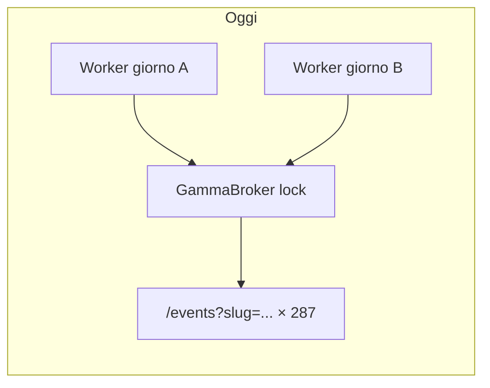
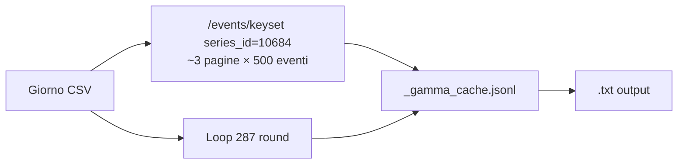
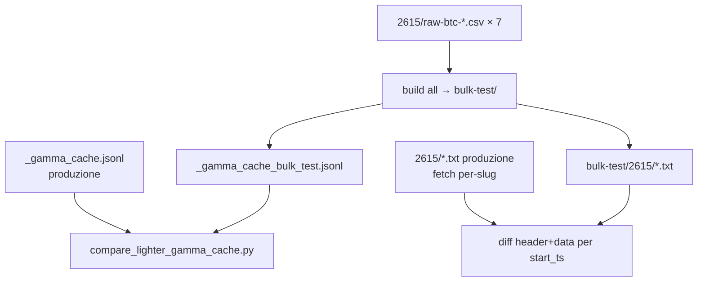

# Piano: Gamma bulk per round sintetici Lighter

## Problema attuale

Il build in `[scripts/build_lighter_rounds.py](scripts/build_lighter_rounds.py)` chiama `fetch_gamma(t)` **per ogni round** (~287/giorno). `[src/lighter_gamma.py](src/lighter_gamma.py)` usa `fetch_market_by_slug` → `GET /events?slug=btc-updown-5m-{ts}` con lock globale e spacing 125 ms tra richieste.

**Costo stimato su 77 giorni CSV (apr–giu 2026):**

- ~22.000 richieste HTTP
- ~46 minuti solo di sleep serializzato (287 × 0,125 s × 77)
- Il pool parallelo resta bloccato sul broker Gamma anche con 12 worker




## Soluzione (confermata: `/events/keyset` + `series_id`)

Prefetch **una volta per giorno CSV** prima del loop round:




**Benchmark misurato (giorno 2026-04-06):**


| Approccio                            | Richieste/giorno | Tempo HTTP       | Metadata PTB/final                    |
| ------------------------------------ | ---------------- | ---------------- | ------------------------------------- |
| Per-slug attuale                     | ~287             | ~36 s solo sleep | Sì                                    |
| `/markets/keyset` (doc)              | ~90 pagine       | ~38 s            | In `events[0].eventMetadata` annidato |
| `**/events/keyset?series_id=10684**` | **~3**           | **~1,8 s**       | **Sì, su `eventMetadata`**            |


Ogni evento restituito ha la stessa forma usata oggi da `[parse_market](src/market.py)`: `slug`, `eventMetadata.priceToBeat`, `eventMetadata.finalPrice`, `markets[0].outcomePrices`.

Filtro `series_id=10684` (serie `btc-up-or-down-5m`) evita filtri testuali e funziona su tutto l’archivio Lighter (apr–giu 2026 verificato).

## Modifiche previste

### 1. `[src/lighter_gamma.py](src/lighter_gamma.py)` — core bulk

Aggiungere (~60–80 righe, POC asciutto):

- `BTC5M_SERIES_ID = "10684"` — costante esplicita (serie stabile Polymarket)
- `GAMMA_EVENTS_KEYSET = "https://gamma-api.polymarket.com/events/keyset"`
- `_parse_gamma_event(ev: dict) -> dict` — estrae la riga cache:
  - `start_ts` da `slug` (`btc-updown-5m-{ts}`)
  - `ptb` / `final` da `eventMetadata`
  - `outcome` da `outcomePrices` (stessa logica di `parse_market` righe 57–68)
- `_fetch_day_events(day_start_ts: int) -> dict[int, dict]` — pagina con `closed=true`, `series_id`, `start_date_min/max` del giorno UTC, `limit=500`, `after_cursor` fino a esaurimento; verifica slug `btc-updown-5m-*`
- `ensure_gamma_day(day_start_ts: int) -> int` sul broker:
  - calcola i `start_ts` attesi del giorno (stessa griglia di `_day_round_starts`)
  - se **tutti** già in `shared_cache` → ritorna 0 (nessuna HTTP)
  - altrimenti bulk fetch, merge in cache, append righe nuove su `_gamma_cache.jsonl` sotto lock
  - ritorna numero righe aggiunte

**Rimuovere / semplificare:**

- `_http_fetch` + import `fetch_market_by_slug`
- `GAMMA_SLEEP_SEC` tra round (opzionale: piccolo sleep tra pagine keyset, es. 50 ms, solo se serve rate-limit)
- `fetch(start_ts)` diventa lookup cache; se `start_ts` assente dopo `ensure_gamma_day` → riga errore come oggi (`ptb/final/outcome: None`, `error: "gamma day bulk missing start_ts ..."`) — nessun fallback per-slug

**Broker multiprocesso:** il lock resta solo per scrittura cache + prefetch giornaliero (un worker per giorno, giorni diversi in parallelo → quasi zero contesa). Si può eliminare `last_fetch_at` / spacing per-round.

### 2. `[scripts/build_lighter_rounds.py](scripts/build_lighter_rounds.py)`

In `build_day_csv`, **prima** di caricare il CSV e del loop round:

```python
gamma_added = broker.ensure_gamma_day(day_start)
```

Poi il loop esistente chiama `fetch_gamma(t)` come oggi — sempre da cache.

Log aggiuntivo per giorno: `gamma_prefetch=3` (righe nuove in cache).

In `cmd_all` con pool parallelo: aggiornare il messaggio iniziale (niente più “gamma fetch serializzato” come collo di bottiglia principale).

### 3. `[AGENTS.md](AGENTS.md)` — sezione round Lighter

Aggiornare la riga sulla cache Gamma:

- da “fetch serializzato slug per round”
- a “prefetch giornaliero `/events/keyset?series_id=10684`, ~3 richieste/giorno, cache `_gamma_cache.jsonl` invariata”

### 4. Nota in `[docs/polymarket_gamma_btc_5m_storico.md](docs/polymarket_gamma_btc_5m_storico.md)`

Aggiungere un paragrafo “Uso nel progetto btc5min” che documenta la scelta `events/keyset + series_id` rispetto a `markets/keyset` quando servono PTB/final/outcome per tutti i round di un giorno.

## Comportamento invariato

- Formato riga cache jsonl: `{start_ts, ptb, final, outcome, fetched_at}` (+ `error` se mancante)
- Header `.txt` e warning in `_build_header` — nessun cambio
- Build incrementale: giorni con tutti i `.txt` già presenti non leggono CSV **né** fanno prefetch Gamma
- Round con metadata Gamma incompleto → stessi warning di oggi

## Stima guadagno


| Fase               | Prima                     | Dopo                    |
| ------------------ | ------------------------- | ----------------------- |
| Gamma per 1 giorno | ~287 HTTP, ~36+ s         | ~3 HTTP, ~2 s           |
| Gamma su 77 giorni | ~22k HTTP, ~46+ min sleep | ~230 HTTP, ~2–3 min     |
| Worker paralleli   | serializzati su Gamma     | indipendenti per giorno |


Il tempo totale resterà dominato dal campionamento CSV Lighter, ma il collo di bottiglia Gamma sparisce e si possono usare più worker senza serializzazione.

## Verifica post-implementazione

### A. Smoke test singolo giorno

1. `python scripts/build_lighter_rounds.py test-day H:\ticks\lighter-fullrawticks\btc\2615\raw-btc-2026-04-06.csv H:\ticks\lighter-rounds5m-test`
  - Log: `gamma_prefetch` ≈ 287 al primo run, 0 al secondo
  - Confronto header di 2–3 `.txt` con build precedente: stessi `ptb_gamma`, `final_gamma`, `outcome`, `outcome_agreement`
2. Cancellare cache e rilanciare: tempi prefetch ~2 s vs minuti con approccio vecchio
3. `build_lighter_rounds.bat 12` su 2–3 giorni mancanti: nessun deadlock, worker in parallelo

### B. Test regressione vs scaricamento singolo (settimana 2615)

Baseline già presente in produzione:
- Round `.txt`: `H:\ticks\lighter-rounds5m\2615\` (~2003 file, build con fetch per-slug)
- Cache Gamma per-slug: `H:\ticks\lighter-rounds5m\_gamma_cache.jsonl` (~17k righe totali)
- CSV input: `H:\ticks\lighter-fullrawticks\btc\2615\raw-btc-*.csv` (7 giorni)

**Obiettivo:** ricostruire l’intera settimana 2615 col nuovo prefetch bulk e dimostrare parità con la baseline, senza toccare cache né output di produzione.

**Directory temporanee (non in conflitto con produzione):**

| Percorso | Ruolo |
|----------|-------|
| `H:\ticks\lighter-rounds5m-bulk-test\` | Output `.txt` del rebuild bulk |
| `H:\ticks\lighter-rounds5m-bulk-test\_gamma_cache_bulk_test.jsonl` | Cache scritta solo dal nuovo sistema |

Il broker deve accettare un `cache_path` esplicito (già previsto); il build usa la dir di output scelta, quindi la cache di produzione resta intatta.

**Esecuzione rebuild bulk (7 giorni settimana 2615):**

```bat
python scripts\build_lighter_rounds.py all H:\ticks\lighter-fullrawticks\btc\2615 H:\ticks\lighter-rounds5m-bulk-test 1
```

(`workers=1` per semplicità nel test; il confronto dati non dipende dal parallelismo.)

**Confronto 1 — cache Gamma (`ptb`, `final`, `outcome`)**

Script minimale `scripts/compare_lighter_gamma_cache.py` (o blocco in unittest):

1. Carica `H:\ticks\lighter-rounds5m\_gamma_cache.jsonl` → dict per `start_ts` (baseline per-slug)
2. Carica `H:\ticks\lighter-rounds5m-bulk-test\_gamma_cache_bulk_test.jsonl` → dict bulk
3. Per ogni `start_ts` presente nei `.txt` di `2615` (estratto dal nome file `btc5m_<start_ts>_*.txt`):
   - entrambe le cache devono avere la riga
   - confronto campi: `ptb`, `final`, `outcome` (ignorare `fetched_at`)
   - tolleranza float: uguaglianza esatta sui valori arrotondati usati nel build (2 decimali in header) oppure `abs(a-b) < 1e-6` sui raw
4. Report: `matched`, `missing_in_bulk`, `missing_in_baseline`, `field_mismatch` — atteso **0 mismatch**

**Confronto 2 — round `.txt` completi**

Per ogni file in `H:\ticks\lighter-rounds5m\2615\btc5m_*.txt`:

1. Leggi il corrispondente in `H:\ticks\lighter-rounds5m-bulk-test\2615\`
2. Confronto byte-a-byte, oppure sezione `header:` + sezione `data:` (escludere eventuali righe che dipendono solo da timestamp di fetch — non ce ne sono nei `.txt` attuali)
3. Atteso: **identici** su tutti i round della settimana (campi Lighter da CSV + campi Gamma dal prefetch devono coincidere)

**Criterio di successo del test B:**

- Tutti i `start_ts` della settimana 2615 presenti in entrambe le cache con stessi `ptb`/`final`/`outcome`
- Tutti i `.txt` bulk-test identici ai `.txt` produzione in `2615\`
- Nessuna modifica a `H:\ticks\lighter-rounds5m\_gamma_cache.jsonl` né ai `.txt` produzione

**Pulizia post-test:** eliminare `H:\ticks\lighter-rounds5m-bulk-test\` (opzionale, tenere finché l’utente non valida).



## File toccati


| File                                                                                 | Azione                                |
| ------------------------------------------------------------------------------------ | ------------------------------------- |
| `[src/lighter_gamma.py](src/lighter_gamma.py)`                                       | Bulk fetch + semplificazione broker   |
| `[scripts/build_lighter_rounds.py](scripts/build_lighter_rounds.py)`                 | `ensure_gamma_day` in `build_day_csv` |
| `[AGENTS.md](AGENTS.md)`                                                             | Documentazione prefetch               |
| `[docs/polymarket_gamma_btc_5m_storico.md](docs/polymarket_gamma_btc_5m_storico.md)` | Nota uso progetto (opzionale)         |
| `[scripts/compare_lighter_gamma_cache.py](scripts/compare_lighter_gamma_cache.py)` | Test regressione cache settimana 2615 |


**Non toccare:** `[src/market.py](src/market.py)` (collector live), `[src/lighter_sampling.py](src/lighter_sampling.py)`, `[src/lighter_txt_format.py](src/lighter_txt_format.py)`.