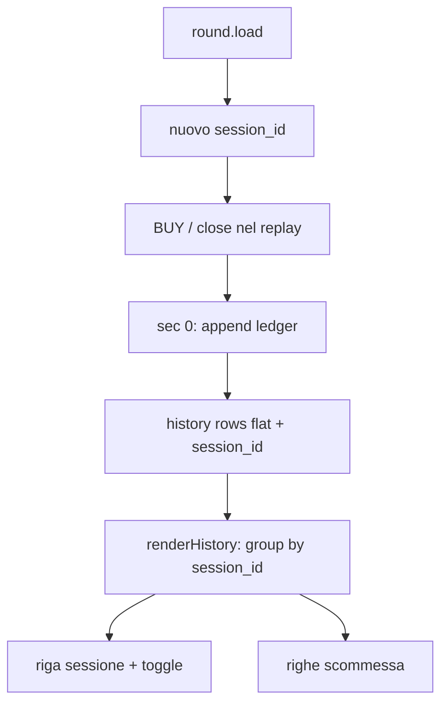

# History: raggruppamento per sessione

## Contesto

Oggi la tabella Closed Orders è una lista piatta ([`renderHistory`](dashv2/static/js/render.js)). Il concetto di sessione esiste già: a ogni `round.load` / restart l’engine crea un `run_id` e lo salva su ogni ordine al settlement in [`append_settled_orders`](dashv2/history.py). Stesso round in momenti diversi → `run_id` diversi → sessioni diverse.

## Decisioni

- **Chiave sessione:** rinominare `run_id` → `session_id` (no retrocompatibilità su codice/API; i JSON account già salvati con `run_id` vanno aggiornati in lettura una sola volta in `order_rows_from_ledger` mappando `run_id` legacy → `session_id`, oppure si accettano file esistenti solo se si rinomina il campo a persistenza futura e in lettura si usa `o.get("session_id") or o.get("run_id")` — preferito: chiave unica `session_id` in codice nuovo + lettura legacy `run_id` senza migrazione batch).
- **UI:** stessa tabella Bootstrap, righe padre/figlio e toggle `+`/`−` (niente librerie nuove).
- **Riga sessione:** Date + Time del round, Outcome una volta, Size / Final / PnL = somme; Direction / Entry / Exit = `—`; colonna toggle a sinistra. Anche le sessioni con 1 sola scommessa restano padre collassabile (default collapsed).
- **CSV:** flat (una riga per scommessa) + colonna `session_id`.

## Valutazione tabella (scelta)

| Approccio | Pro | Contro |
|-----------|-----|--------|
| Bootstrap + nested rows (scelto) | Zero dipendenze, allineato allo stile attuale, poche righe di JS | Toggle/accessibilità da gestire a mano |
| Libreria tree/datatable | Expand nativo | Peso, CDN/vendor, overkill per poche centinaia di ordini |

## Backend

File principali: [`dashv2/engine.py`](dashv2/engine.py), [`dashv2/history.py`](dashv2/history.py).

1. Rinominare campo engine `run_id` → `session_id` (generazione invariata su `round.load` / restart).
2. In `append_settled_orders` salvare `session_id` invece di `run_id`.
3. In `order_rows_from_ledger` / `order_rows_for_run`: esporre `session_id` (fallback lettura `run_id` sui ledger esistenti).
4. Aggiungere `group_history_rows(rows) -> list[session]` lato server **oppure** raggruppare solo in JS. Preferenza: **raggruppamento in JS** da `state.historyRows` flat (il payload `history` resta flat; meno churn IPC/test). Aggregati calcolati in `renderHistory`.

Nessun cambiamento al momento di persistenza (sempre solo a sec 0).

## Frontend

File: [`dashv2/static/js/render.js`](dashv2/static/js/render.js), [`dashv2/static/index.html`](dashv2/static/index.html), [`dashv2/static/css/dashboard.css`](dashv2/static/css/dashboard.css), [`dashv2/static/js/app.js`](dashv2/static/js/app.js).

1. `thead`: colonna vuota (o `#`) per il toggle.
2. `renderHistory(rows)`:
   - raggruppa per `session_id` (sessioni senza id → gruppo singleton per ordine);
   - ordina sessioni per `(market_start_ts, session_id)` desc come oggi;
   - emette riga padre + N figlie `hidden` di default;
   - click su `+`/`−` togglea solo le figlie di quella sessione (stato espanso in memoria locale del render / `Map`, non persistito).
3. Riga padre: badge outcome, size somma, Final/PnL somme con stessi colori `history-val-pos/neg`.
4. Riga figlia: layout attuale delle colonne scommessa (indent o classe CSS leggera).
5. CSV in `app.js`: flat + header `SessionId`; nessuna riga aggregate.

## Test

Aggiornare [`dashv2/tests/test_seek_history.py`](dashv2/tests/test_seek_history.py): assert su `session_id` in rows / append; eventuale helper di raggruppamento se estratto in Python (altrimenti solo rename campo).

Smoke: load round → più BUY → settlement → tabella con 1 sessione collassata → expand → Export CSV con `session_id` condiviso.

