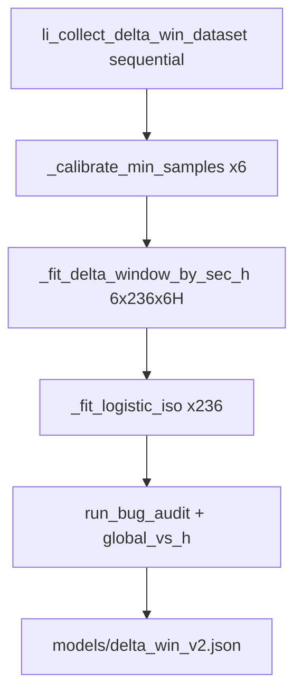
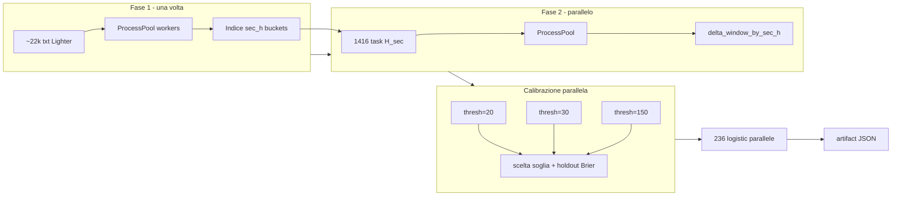

# Piano: parallelizzare study delta_win v2 (per-secondo)

## Contesto

Il passaggio da checkpoint ogni 5s a **ogni secondo** (236 sec, `delta_win_sec_start=240` → `delta_win_sec_end=5`) è già impostato in [`setup.json`](f:/btc5min/setup.json) e nel runtime ([`src/delta_win.py`](f:/btc5min/src/delta_win.py), renderer, eval). L’ultimo run si è bloccato su `calibrating delta_win_window_min_samples...` con **5.16M campioni** (train 4.2M).



## Diagnosi del collo di bottiglia

Il problema non è sklearn né la logistica B, ma il **metodo A** in [`src/delta_win_bands.py`](f:/btc5min/src/delta_win_bands.py):

```45:46:f:/btc5min/src/delta_win_bands.py
    sec_samples = [s for s in samples if s["sec"] == sec and s["intraday_h"] == intraday_h]
```

Chiamato da [`_fit_delta_window_by_sec_h`](f:/btc5min/scripts/study_delta_win_v2.py) per ogni `(H, sec)`:

| Fase | Chiamate fit A | Scan su train (4.2M) |
|------|----------------|----------------------|
| Calibrazione (6 soglie) | 6 × 1416 = **8496** | ~35 miliardi di confronti |
| Fit finale | 1416 | ~6 miliardi |
| `run_bug_audit` (global per sec) | 236 × 2 | altri scan completi |
| `global_vs_h` | 236 | altri scan |

Ogni `fit_window_for_sec_h` fa poi 151 iterazioni `pool_in_range` su liste Python — accettabile **solo se** `sec_samples` è già ristretto (~3–4k righe), non su tutto il train.

**Stima ordine di grandezza**: con indexing + 8 worker, calibrazione + fit finale dovrebbero scendere da **ore** a **minuti** (dipende da CPU/RAM).

## Architettura proposta



### 1. Indice campioni (fix algoritmico, prerequisito)

Nuovo modulo leggero, es. [`src/delta_win_index.py`](f:/btc5min/src/delta_win_index.py):

- **`build_delta_win_index(samples) -> dict[tuple[int,int], list[dict]]`** con chiave `(sec, intraday_h)`
- **`sec_buckets(samples) -> dict[int, list[dict]]`** per audit globali
- Costruzione **una sola volta** dopo collect/split train-holdout
- Aggiornare `fit_window_for_sec_h` per accettare `sec_samples` già filtrati (o `(index, sec, h)`), evitando scan su tutto `train`

Opzionale ma utile: dentro `fit_window_for_sec_h`, usare **numpy** (`abs_delta` array + maschere `(lo <= d) & (d <= hi)`) per i 151 slot — stesso output, meno overhead Python.

### 2. Parallelizzare il fit metodo A

In [`scripts/study_delta_win_v2.py`](f:/btc5min/scripts/study_delta_win_v2.py):

- Estrarre worker top-level (picklable su Windows):

```python
def _fit_one_sec_h(args):
    sec, h, min_samples, bucket = args
    return str(h), str(sec), fit_window_for_sec_h(bucket, sec, h, min_samples)
```

- `_fit_delta_window_by_sec_h(train, min_samples, index, workers)`:
  - prepara 1416 task con bucket pre-estratti dall’indice
  - `ProcessPool(workers)` come in [`scripts/backfill_lighter_delta_win.py`](f:/btc5min/scripts/backfill_lighter_delta_win.py)
  - ricostruisce `delta_window_by_sec_h` dal risultato
- Log progress: `fit A: 1416 tasks, workers=N` + timer per fase

### 3. Calibrazione: 6 candidati in parallelo (scelta utente)

`_calibrate_min_samples` diventa:

- **6 job indipendenti** (uno per `thresh` in `[20,30,50,75,100,150]`), ciascuno:
  1. fit A parallelo con quella soglia
  2. holdout metrics metodo A (`_holdout_metrics` senza logistic)
- `ProcessPool(max_workers=min(6, workers))` — attenzione RAM: ogni worker tiene l’indice train (~4M dict leggeri); monitorare memoria
- Al termine: stessa regola di scelta attuale (`dash_max`, `n_half2_p50`, `brier_eps`)

### 4. Parallelizzare collect campioni

[`li_collect_delta_win_dataset`](f:/btc5min/src/listats.py) oggi è sequenziale su ~22k file.

- Aggiungere `li_collect_delta_win_dataset_parallel(root, workers)` che mappa `li_delta_win_samples(path)` con `ProcessPool`
- `study_delta_win_v2.py` usa la versione parallela quando `workers > 1`
- L’audit iniziale (`li_delta_win_audit`) può restare sequenziale o condividere lo stesso pool — secondario rispetto al fit

### 5. Parallelizzare metodo B (236 logistic)

Dopo il fit A finale:

- Pre-indice `train_by_sec: dict[int, list]`
- 236 task `_fit_logistic_iso(bucket, sec)` in `ProcessPool`
- Costo atteso: modesto vs metodo A, ma coerente con il modello per-secondo

### 6. Ottimizzare audit secondari

[`run_bug_audit`](f:/btc5min/scripts/study_delta_win_v2.py) e [`_compare_global_vs_h`](f:/btc5min/scripts/study_delta_win_v2.py):

- Usare `sec_buckets` invece di `[s for s in samples if s["sec"] == sec]`
- Parallelizzare i 236 fit globali (leaky/clean) se restano lenti
- `_audit_intraday_header`: lasciare sequenziale (I/O bound, non critico)

### 7. CLI e osservabilità

Estendere `study_delta_win_v2.py`:

```
python scripts/study_delta_win_v2.py [workers] [--audit-only]
```

- `workers` default **8** (allineato a [`backfill_lighter_delta_win.py`](f:/btc5min/scripts/backfill_lighter_delta_win.py))
- Stampa tempi per fase: `collect`, `index`, `calibrate`, `fit_a`, `fit_b`, `audit`, `write`
- `--audit-only` invariato (nessun fit)

Parametro opzionale in `setup.json`: `delta_win_study_workers` — solo se serve centralizzare; altrimenti CLI basta.

### 8. Artifact e downstream

- Artifact atteso: **~5× più grande** (236 sec vs 48) — stimare **50–150 MB** JSON
- Metadati già migrati a `sec_start` / `sec_end` (no lista checkpoint)
- Dopo il fit: `python -m unittest tests.test_delta_win`
- Backfill feed: `python scripts/backfill_real_delta_win.py data 8` e/o `backfill_lighter_delta_win.py` — già parallelizzati; il collo di bottiglia post-fit è I/O + lookup O(1) per riga

### 9. Validazione

| Check | Comando / criterio |
|-------|-------------------|
| Stessa soglia o migliore | confronto `delta_win_window_threshold_*.json` prima/dopo |
| Brier holdout A/B | report `delta_win_study_v2_*.json` |
| Runtime feed | riga sec=241 → spazi; sec=239 → valori DWin; sec=90 invariato nel formato |
| Test unitari | `tests/test_delta_win.py` (incluso `test_secs_from_setup`) |
| Artifact load | `load_delta_win_artifact()` senza mismatch `sec_start`/`sec_end` |

## File da toccare

| File | Modifica |
|------|----------|
| [`src/delta_win_index.py`](f:/btc5min/src/delta_win_index.py) | **nuovo** — indexing + helper bucket |
| [`src/delta_win_bands.py`](f:/btc5min/src/delta_win_bands.py) | fit su bucket pre-filtrato; opz. numpy masks |
| [`scripts/study_delta_win_v2.py`](f:/btc5min/scripts/study_delta_win_v2.py) | parallel collect, fit A/B, calibrazione 6-way, timing |
| [`src/listats.py`](f:/btc5min/src/listats.py) | collect parallelo (o delega a index module) |
| [`tests/test_delta_win.py`](f:/btc5min/tests/test_delta_win.py) | test su indexing + fit parallelo con bucket piccolo sintetico |
| [`docs/indicator_delta_win.md`](f:/btc5min/docs/indicator_delta_win.md) | nota su `workers` e tempi attesi |
| [`AGENTS.md`](f:/btc5min/AGENTS.md) | aggiornare comando study con `[workers]` |

## Rischi e mitigazioni

- **RAM**: 6 worker calibrazione × indice train — se OOM, limitare calibrazione a `min(6, workers)` sequenziale interno o condividere indice read-only (pickle una volta nel parent)
- **Windows spawn**: funzioni worker devono essere top-level (pattern già usato nei backfill)
- **Processo precedente**: terminare l’istanza `study_delta_win_v2.py` ancora in esecuzione prima del nuovo run
- **Artifact vecchio**: `models/delta_win_v2.json` con `checkpoints` non è compatibile — il nuovo fit lo sostituisce

## Ordine di implementazione consigliato

1. Indice + refactor `fit_window_for_sec_h` (misurare speedup su 1 soglia senza parallelismo)
2. Parallel fit A (1416 task)
3. Calibrazione 6 candidati in parallelo
4. Collect + logistic B paralleli
5. Audit con sec_buckets
6. Run completo + test + backfill campione
