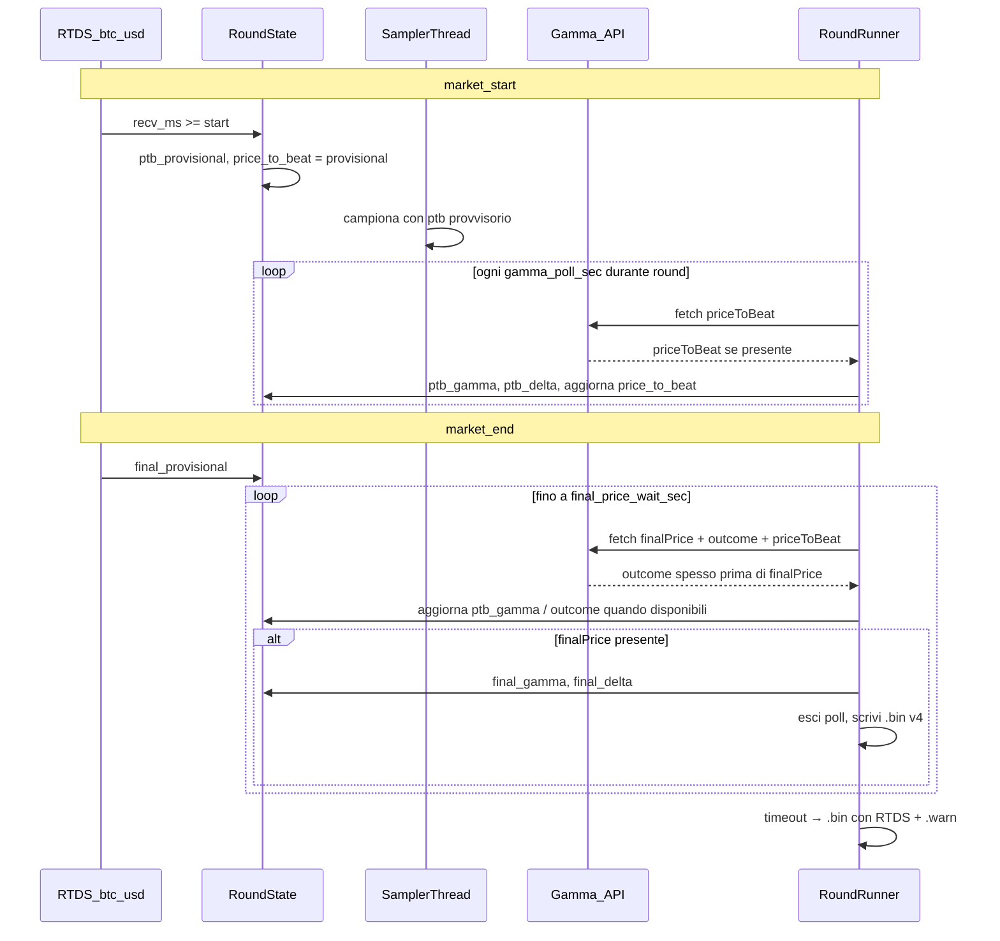

# PTB provvisorio + Gamma settlement + setup.json + bin v4

## Obiettivo

Eliminare i fallimenti round per `price_to_beat not captured` / `final not captured` quando il valore RTDS è disponibile ma il timestamp oracle Chainlink non è ancora valido (o resta in stasi notturna).

**Strategia settlement:** allinearsi al sito Polymarket — non aspettare tick Chainlink con `oracle_ts >= boundary`, ma **pollare Gamma API** (`priceToBeat`, `finalPrice`, `outcome`) ogni `gamma_poll_sec` (default 10 s).

**Post-chiusura:** il thread del round resta attivo e continua il poll fino a `eventMetadata.finalPrice` (non basta l'outcome da `outcomePrices`). Timeout dedicato `final_price_wait_sec` (default 1200 s = 20 min). Solo allora si scrive il `.bin`.

Salvare nel `.bin`:
- prezzi **effettivi** usati per outcome (Gamma se disponibile, altrimenti provvisori RTDS)
- provvisori RTDS e **delta** = `gamma - provisional` per analisi statistica RTDS vs settlement reale

**Policy confermata:** se dopo `final_price_wait_sec` Gamma non espone `finalPrice`, final da provvisori RTDS, flag `final_gamma` = 0, warning in `.warn`. Stessa logica per PTB con `ptb_gamma` se `priceToBeat` mancante.

## Perché Gamma espone outcome prima di finalPrice

Polymarket **ha già** il prezzo finale internamente quando risolve Up/Down, ma l'API Gamma pubblica i campi in sequenza:

1. `outcomePrices` → `0.9995/0.0005` poi `1/0` (mercato risolto lato CLOB)
2. `closed: true`, `umaResolutionStatus: resolved`
3. `eventMetadata.finalPrice` — spesso **1–3 minuti dopo** l'outcome

Il collector v4 iniziale usciva dal poll all'outcome → `final_gamma=False` sistematico. **Fix (lug 2026):** attendere esplicitamente `finalPrice` fino a `final_price_wait_sec`.

## Perché Gamma e non Chainlink oracle timestamp

Il sito mostra l'outcome in ~10–15 s perché il backend Polymarket scrive su Gamma, non perché attende un nuovo round on-chain. In stasi BTC (nessun movimento ≥ 0,5%), Chainlink può non postare un nuovo round per molti minuti, ma il settlement usa comunque l'ultimo prezzo Chainlink valido — esposto da Gamma come `priceToBeat` / `finalPrice`.

Il collector oggi è **più restrittivo** del sito (`ts_ms < market_start` → skip). Gamma è la fonte di verità per il confronto con l'UI.

## Flusso dati



## 1. `setup.json` + loader

Creare [`setup.json`](f:\btc5min\setup.json) alla root progetto (JSON indent 4 spazi):

```json
{
    "settlement_wait_sec": 1200,
    "final_price_wait_sec": 1200,
    "gamma_poll_sec": 10,
    "prep_ahead_sec": 10,
    "stall_reconnect_sec": 45,
    "ping_interval_sec": 5
}
```

| Chiave | Default | Uso |
|--------|---------|-----|
| `settlement_wait_sec` | 1200 (20 min) | Riservato / finestra generale settlement (legacy nel piano) |
| `final_price_wait_sec` | 1200 (20 min) | **Timeout attesa `finalPrice` Gamma** post-`market_end`; il round non scrive il `.bin` prima |
| `gamma_poll_sec` | 10 | Intervallo tra richieste HTTP Gamma (gentile sui server) |
| `prep_ahead_sec` | 10 | Spawn round (da `main.py`) |
| `stall_reconnect_sec` | 45 | Feed Chainlink |
| `ping_interval_sec` | 5 | Feed Chainlink |

Nuovo modulo [`src/setup.py`](f:\btc5min\src\setup.py):
- legge `Path(__file__).parent.parent / "setup.json"` una volta all'avvio
- Nessun default in codice (D2): chiave mancante → eccezione esplicita
- Espone: `SETTLEMENT_WAIT_SEC`, `FINAL_PRICE_WAIT_SEC`, `GAMMA_POLL_SEC`, `PREP_AHEAD_SEC`, `STALL_RECONNECT_SEC`, `PING_INTERVAL_SEC`

Wire-up:
- [`src/main.py`](f:\btc5min\src\main.py): `PREP_AHEAD_SEC` da setup
- [`src/feed_chainlink.py`](f:\btc5min\src\feed_chainlink.py): `STALL_RECONNECT_SEC`, `PING_INTERVAL_SEC` da setup
- [`src/round_runner.py`](f:\btc5min\src\round_runner.py): `FINAL_PRICE_WAIT_SEC`, `GAMMA_POLL_SEC`

## 2. Provisorio RTDS in `RoundState`

File: [`src/round_state.py`](f:\btc5min\src\round_state.py)

Nuovi campi:
- `ptb_provisional`, `final_provisional` (float)
- `ptb_gamma`, `final_gamma` (float | None) — da Gamma API
- `ptb_delta`, `final_delta` (float | None) — `gamma - provisional`
- `ptb_gamma_flag`, `final_gamma_flag` (bool)
- `_ptb_source`, `_final_source`: `"rtds"` | `"gamma"`

**`apply_chainlink`** — semplificato rispetto al piano precedente:
- aggiorna `chainlink_price` / `chainlink_ts_ms` (serie tick `chainlink_btc`)
- al primo tick con `recv_ms >= _ptb_start_ms`: imposta `ptb_provisional` e `price_to_beat` se non ancora da Gamma
- al primo tick con `recv_ms >= _final_end_ms`: imposta `final_provisional`
- **non** usa più `oracle_ts >= boundary` per settlement (rimuovere guard ptb-oracle e logica final oracle/recv come gate obbligatorio)

Metodi aggiuntivi:
- `apply_gamma_ptb(value)` / `apply_gamma_final(value, outcome)` / `apply_gamma_outcome(outcome)` — chiamati dal round runner dopo poll
- `ensure_ptb_provisional()` / `ensure_final_provisional()` — fallback se al boundary non arriva un nuovo tick RTDS ma `chainlink_price` è già valorizzato
- `effective_ptb()` / `effective_final()` — gamma se flag, altrimenti provisional

`chainlink_ready()`: invariato (`chainlink_price is not None`).

## 3. Polling Gamma

File: [`src/market.py`](f:\btc5min\src\market.py)

Riutilizzare `fetch_market_by_slug(asset, interval, start_ts)` — già espone:
- `price_to_beat` da `eventMetadata.priceToBeat`
- `final_chainlink` da `eventMetadata.finalPrice`
- `outcome` da `outcomePrices` / `closed`

Nuova funzione (nome indicativo):

```python
def poll_gamma_settlement(asset, interval, start_ts, state, deadline) -> dict | None:
    # loop: fetch_market_by_slug; sleep GAMMA_POLL_SEC
    # esci solo quando final_gamma_flag (finalPrice in eventMetadata)
    # oppure deadline = market_end_ts + FINAL_PRICE_WAIT_SEC
```

Comportamento:
- **PTB:** poll da `market_start_ts` in parallelo al sampler (check nel loop round runner ogni `gamma_poll_sec` via `_try_gamma_ptb`)
- **Final:** poll da `market_end_ts` fino a `market_end_ts + FINAL_PRICE_WAIT_SEC`
- Aggiorna `outcome` e `priceToBeat` se arrivano durante l'attesa, ma **non termina** finché manca `finalPrice`
- Log: `outcome from gamma, waiting for finalPrice (timeout Ns)` quando outcome noto ma final assente
- Il poll **non** controlla `state.stop` (il sampler è già fermo; `stop` non deve abbreviare l'attesa)
- 1 richiesta HTTP ogni `gamma_poll_sec` per round → trascurabile per Gamma
- Tipicamente `finalPrice` arriva 1–3 min dopo la chiusura; il `.bin` viene scritto solo allora

## 4. `RoundRunner`

File: [`src/round_runner.py`](f:\btc5min\src\round_runner.py)

**Durante il round (0–300 s):**
- Sampler parte con `price_to_beat` provvisorio RTDS
- Ogni `gamma_poll_sec`: se Gamma ha `priceToBeat`, sostituisci ptb, calcola `ptb_delta`, log `ptb gamma (delta=...)`

**Dopo `market_end_ts`:**
- Sampler fermato
- `ensure_final_provisional()` + fallback da ultimo `chainlink_price` se necessario
- Poll Gamma fino a **`finalPrice`** o `final_price_wait_sec`
- Durante l'attesa: aggiorna PTB/outcome Gamma se arrivano
- Solo dopo poll (successo o timeout) → `enrich_gains`, `write_round`, `verify_round`

**Non fallire** per ptb/final mancanti se esistono provvisori RTDS (eccezione solo se manca anche il provvisorio).

**Log atteso a salvataggio:**
```
round N final_chainlink=X ptb=Y (gamma ptb=True final=True)
```
`final=True` quando `eventMetadata.finalPrice` catturato; `final_delta` nel header v4 per analisi statistica chiusura round.

**Outcome:**
1. Preferire `outcome` da Gamma se `closed`/outcomePrices disponibile
2. Altrimenti `outcome_from_prices(effective_final, effective_ptb)`
3. Se solo provvisori: calcolo locale + `.warn`

**Eccezione** solo se manca anche il provvisorio (feed RTDS morto al boundary).

**Warnings** (`.warn`):
- `ptb not from gamma (rtds only)`
- `final not from gamma (rtds only)`
- `outcome from rtds provisional, not gamma`
- includere delta quando Gamma arriva in ritardo

## 5. Formato binario VERSION 4

File: [`src/binary_format.py`](f:\btc5min\src\binary_format.py)

- `VERSION = 4`
- Header 84 byte:

```
ptb_provisional    d
final_provisional  d
ptb_delta          d   # gamma - provisional; 0.0 se N/A (flag distingue)
final_delta        d
ptb_gamma          B   # 0=rtds only, 1=from Gamma
final_gamma        B
padding            6x
```

`HEADER_FMT = "<4sHII d B x d I d d d d d B B 6x>"`

Campi header:
- `price_to_beat` / `final_chainlink` = valori **effettivi** (Gamma se flag=1, altrimenti provisional)
- `outcome` = da Gamma preferito, altrimenti calcolato

**Incompatibilità totale con v2 e v3** (policy progetto, come già fatto v2→v3):
- `read_round`, `verify`, `convert`, `reader` accettano **solo** `VERSION = 4`
- header 84 byte vs 64 byte v3; campi aggiuntivi non interpretabili dai reader vecchi
- tentativo di leggere un `.bin` v3 con tooling aggiornato → eccezione `unsupported version`

### Migrazione: cancellare i `.bin` esistenti

Prima del primo deploy del collector v4, **eliminare tutti i file round v3** (e relativi `.txt`/`.warn` accoppiati). Non sono convertibili automaticamente; mescolarli con v4 in `data/` crea confusione in verify/convert e analisi.

**Dev (Windows)** — path effettivo del collector: `data/btc5m_*` (default `--out data`); se esistono copie in `data/bin/`, pulire anche quella cartella:
```text
f:\btc5min\data\btc5m_*.bin
f:\btc5min\data\btc5m_*.txt
f:\btc5min\data\btc5m_*.warn
f:\btc5min\data\bin\btc5m_*.*
```

**Produzione poly:**
```bash
ssh ticksaver "rm -f /opt/btc5min/data/btc5m_*.bin /opt/btc5min/data/btc5m_*.txt /opt/btc5min/data/btc5m_*.warn /opt/btc5min/data/bin/btc5m_*.*"
```

Opzionale: backup archivio dei v3 in cartella separata (es. `data/archive-v3/`) se servono per riferimento storico — il tooling nuovo non li leggerà più.

Dopo la pulizia, ogni nuovo round scritto dal collector sarà **solo v4**.

Aggiornare: [`settlement.py`](f:\btc5min\src\settlement.py), [`verify.py`](f:\btc5min\src\verify.py), [`convert.py`](f:\btc5min\src\convert.py), [`reader.py`](f:\btc5min\src\reader.py).

`verify` V13: outcome coerente con ptb/final effettivi; opzionale V19 log se outcome_gamma ≠ outcome_computed (warning, non hard fail).

## 6. Ruolo feed Chainlink WS

Il WebSocket RTDS resta per:
- colonna `chainlink_btc` nei 300 tick al secondo
- `chainlink_price` live per sampler / delta nel round

**Non** è più gate per salvare il round. Opzionale in NDJSON: confronto oracle_ts vs Gamma per ricerca futura.

## 7. NDJSON debug

Eventi in [`round_runner.py`](f:\btc5min\src\round_runner.py) / [`feed_chainlink.py`](f:\btc5min\src\feed_chainlink.py):
- `ptb_provisional_set`, `ptb_gamma_set` (con delta)
- `final_provisional_set`, `final_gamma_set` (con delta)
- `gamma_poll`, `final_price_timeout`, `settlement_timeout`
- `outcome_mismatch` se outcome_gamma ≠ outcome_computed

## 8. Validazione

0. **Pre-deploy:** `.bin` v3 cancellati (o archiviati fuori da `data/`); `data/` contiene solo v4 dopo i primi round
1. Run 2–3 round: `.bin` v4 con `ptb_gamma=1` e **`final_gamma=1`** quando Gamma risponde (attesa 1–3 min post-chiusura normale)
2. Round con solo RTDS (Gamma down o timeout `final_price_wait_sec`): `.warn`, round `done`, flag=0
3. `python -m src.verify data/*.bin` — OK
4. **Cross-check:** header `.bin` vs `fetch_market_by_slug` — `price_to_beat`, `final_chainlink`, `outcome` coincidono quando flag=1; `final_delta` per studio magnitudine Up/Down
5. `grep -c 'price_to_beat not captured'` su poly → atteso 0
6. Log: `gamma ptb=True final=True` nella maggioranza dei round chiusi

## File toccati (riepilogo)

| File | Modifica |
|------|----------|
| `setup.json` | **nuovo** |
| `src/setup.py` | **nuovo** loader |
| `src/round_state.py` | provvisorio RTDS; apply_gamma_*; ensure_* boundary |
| `src/market.py` | `poll_gamma_settlement` (exit su finalPrice) |
| `src/round_runner.py` | polling PTB intra-round; attesa finalPrice post-round |
| `src/binary_format.py` | v4 header, flag gamma |
| `src/settlement.py` | header esteso, outcome da Gamma |
| `src/verify.py`, `convert.py`, `reader.py` | v4 + campi gamma/delta |
| `src/main.py`, `feed_chainlink.py` | setup |
| `src/feed_chainlink.py` | apply_chainlink semplificato (solo live + provisional) |

## Fuori scope (per ora)

- Fix P0 stall in `_ping_loop` (meeting bug-poly-collector) — commit separato
- Script batch analisi distribuzione delta RTDS vs Gamma su N round

## Rischi

- **Gamma finalPrice in ritardo 1–3 min:** round thread resta aperto; accettabile per analisi statistica; `final_price_wait_sec` 20 min come rete di sicurezza
- **Outcome visibile prima di finalPrice in API:** gestito — non uscire dal poll sull'outcome alone
- **PTB su Gamma non al secondo 0:** provvisorio RTDS + `ensure_ptb_provisional()`; sostituzione appena Gamma risponde
- **Nessun tick RTDS al boundary:** `ensure_ptb_provisional()` usa ultimo prezzo live in memoria
- **Dipendenza HTTP settlement:** fallback provvisori + `.warn`; tick order book comunque salvati
- **Header 84 byte / incompatibilità v3:** purge `.bin` v3 prima del deploy; non mescolare versioni in `data/`

## Implementato (stato deploy poly, lug 2026)

- v4 deployato su CT poly (`/opt/btc5min`); servizio `btc5min.service` attivo
- Purge `.bin` v3 eseguito
- Fix deploy: poll non bloccato da `state.stop`; exit su outcome rimosso; aggiunto `final_price_wait_sec`
- Round di test salvati con `ptb_gamma=1`; con attesa finalPrice → `final_gamma=1` atteso sui round successivi al fix
