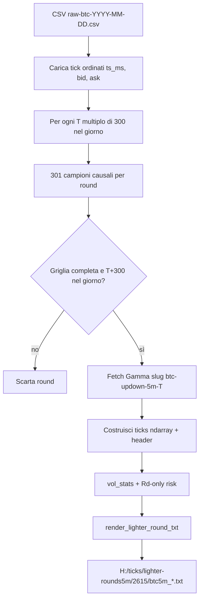

# Round sintetici Lighter → feed `.txt`

## Decisioni utente (vincolanti)

| Tema | Scelta |
|------|--------|
| Label | Ibrido Gamma: fetch per ogni `start_ts`; se manca → scrivi comunque con **warning**, outcome proxy Lighter |
| Output | `H:\ticks\lighter-rounds5m\<2615\|2616\|…>\btc5m_<start_ts>_<HHMM>.txt` |
| Colonne data | **Senza** `gain%` e **senza** colonna `Rq`; solo `Rd` |
| quote | Lato da delta Lighter corrente: `"UP      "` / `"DOWN    "` (9 char, padding) |
| Rd | Calcolato su mid Lighter + vol Lighter; lato = segno delta vs PTB Lighter |
| Filtro round | Griglia causale **completa** (301 confini → 300 righe sec 300→1, zero gap) |
| Mezzanotte | **Scarta** round che escono dal giorno CSV (es. 23:55 UTC) |
| Header | Valori Lighter in campi esistenti (`ptb_chainlink`, `btc`, …); `outcome` da Gamma se c'è |
| Outcome audit | Sempre in header: `outcome_lighter` + `outcome_agreement: TRUE` / `outcome_agreement: FALSE` |
| Delta audit | Sempre in header: `delta_lighter`, `delta_chainlink`, `move_error` (movimento 5m; `move_error = delta_lighter - delta_chainlink`) |
| Stale | `sample_age_ms > 1000` → `delta: ---`, vol `---` |
| Marker | `source: lighter_synthetic` in header |
| fee_rate | `nan` |
| risk header | `risk_variants: [Rd]` (solo Rd) |
| Test iniziale | **Giorno intero** `raw-btc-2026-04-06.csv` → cartella `2615\` |

## Problema tecnico centrale

[`load_day_mid_by_sec()`](src/lighter_ticks.py) e [`iter_day_windows()`](src/lighter_ticks.py) **non sono adatti** (ultimo mid per secondo UTC ≠ campionamento causale ai confini). Il doc [GPT56 §7](docs/[GPT56]analisi-round-sintetici-lighter.md) impone:

```text
k = 0 … 300
sample(k) = ultimo mid con timestamp <= (T + k) secondi
sec_to_expiry = 300 - k
```



## Architettura codice (POC minimale, file nuovi)

Non toccare [`render_round_txt()`](src/txt_format.py) (feed Polymarket reali). Nuovi moduli dedicati:

### 1. [`src/lighter_sampling.py`](src/lighter_sampling.py) (~80 righe)

- `load_csv_ticks(path) -> (ts_ms[], bid[], ask[])` — lettura streaming del CSV (stesso schema verificato: `timestamp,ask,bid,nonce`).
- `sample_round(ticks, start_ts) -> list[Sample]` con 301 punti; ogni `Sample`: `mid`, `boundary_ms`, `sample_ts_ms`, `sample_age_ms`.
  - Ricerca causale: indice massimo con `ts_ms <= boundary_ms` (binary search su array ordinato).
  - Se **manca** un campione per qualsiasi `k` → eccezione / round scartato.
- `build_ticks_array(samples) -> np.ndarray` — 300 righe (k=0…299), colonne compatibili con [`vol_stats`](src/vol_stats.py) / [`risk`](src/risk.py):
  - `chainlink_btc` = mid Lighter (col. 6)
  - quote NaN (col. 2–5) → partial per risk
  - `chainlink_recv_ms` = `sample_ts_ms` (col. 8)
  - `recv_ts_ms` = `boundary_ms` (col. 0)
  - `secs_to_expiry` = `300 - k` (col. 1)
- `lighter_stale(sample_age_ms) -> bool` — soglia fissa **1000 ms** (non `stall_reconnect_sec`).

### 2. [`src/lighter_risk.py`](src/lighter_risk.py) (~40 righe)

Estratto minimo da [`compute_risk_state()`](src/risk.py): **solo Rd**, niente Rq/Pq0.

- Lato sempre da `side_from_chainlink(mid, ptb_lighter)` (equivalente al lato quote scelto).
- Riutilizza `compute_vol_stats_by_window()` passando `stall_sec=1.0` per coerenza con stale 1s, oppure marca stale per-riga prima del calcolo vol.

### 3. [`src/lighter_txt_format.py`](src/lighter_txt_format.py) (~70 righe)

- Header: stessa struttura del feed reale ([esempio](data/2026-07-10/txt/btc5m_1783721400_2210.txt)) con aggiunte/modifiche:
  - `source: lighter_synthetic`
  - `outcome_lighter: Up` / `Down` — sempre da confini Lighter (`sample(300).mid >= sample(0).mid`)
  - `outcome_agreement: TRUE` se `outcome` ufficiale coincide con `outcome_lighter`; **`outcome_agreement: FALSE`** se discordanti (filtro a posteriori immediato, es. `grep "outcome_agreement: FALSE"`)
  - `outcome_agreement: nan` solo se Gamma assente → `outcome` è proxy Lighter, non confrontabile
  - `delta_lighter` — `final_chainlink - ptb_chainlink` (movimento 5m Lighter)
  - `delta_chainlink` — `final_gamma - ptb_gamma` se Gamma presente, altrimenti `nan`
  - `move_error` — `delta_lighter - delta_chainlink` se entrambi i delta calcolabili, altrimenti `nan`
  - `fee_rate: nan`
  - `risk_variants: [Rd]`
  - `risk_label_source`: valore esplicito (es. `gamma_official_when_available`)
  - `stale_sec: 1.0` (soglia Lighter, distinta dal collector)
- Sezione `data:` — **header tabella ridotto**:

```text
sec   time  quote      delta       btc  V30  V60  V90  V120    Rd
```

- `format_quote_side(side) -> str` — `"UP      "` / `"DOWN    "` (9 char).
- Righe ordinate sec decrescente; vol da `compute_trailing_vols()` adattato (stale 1s).
- `warnings:` se Gamma assente/incompleta, outcome proxy; se discordanti → `- outcome lighter disagrees with gamma official`

### 4. [`scripts/build_lighter_rounds.py`](scripts/build_lighter_rounds.py) (~120 righe)

CLI esplicita (no default nascosti, stile D2):

```bash
# Fase test (solo 2026-04-06)
python scripts/build_lighter_rounds.py test-day H:\ticks\lighter-fullrawticks\btc\2615\raw-btc-2026-04-06.csv H:\ticks\lighter-rounds5m

# Fase completa (77 CSV, settimane 2615–2625)
python scripts/build_lighter_rounds.py all H:\ticks\lighter-fullrawticks\btc H:\ticks\lighter-rounds5m
```

Flusso per ogni CSV giornaliero:

1. Deriva `day_start_ts` con [`day_start_ts_from_path()`](src/lighter_ticks.py).
2. Itera `T = day_start, day_start+300, …` finché `T+300 <= day_end` (esclude round 23:55).
3. Per ogni `T`: campionamento causale → se completo, fetch Gamma via [`fetch_market_by_slug("btc","5m",T)`](src/market.py).
4. Costruisce header:

| Campo | Valore |
|-------|--------|
| `ptb_chainlink`, `ptb_price` | `sample(0).mid` |
| `final_chainlink`, `final_price` | `sample(300).mid` |
| `ptb_gamma`, `final_gamma` | da Gamma se presenti, altrimenti `nan` |
| `outcome_lighter` | `Up` se `sample(300).mid >= sample(0).mid`, altrimenti `Down` |
| `outcome` | Gamma ufficiale se chiuso, altrimenti = `outcome_lighter` (proxy) |
| `outcome_agreement` | `TRUE` / `FALSE` se Gamma presente; `nan` se Gamma assente |
| `delta_lighter` | `final_chainlink - ptb_chainlink` (sempre) |
| `delta_chainlink` | `final_gamma - ptb_gamma` se Gamma completo, altrimenti `nan` |
| `move_error` | `delta_lighter - delta_chainlink` se `delta_chainlink` non `nan`, altrimenti `nan` |
| `tick_count` | 300 |
| `market_end_ts` | `T + 300` |

Esempio header round discordante:

```text
  outcome_lighter: Up
  outcome: Down
  outcome_agreement: FALSE
  delta_lighter: +3.25
  delta_chainlink: -1.80
  move_error: +5.05
  warnings:
    - outcome lighter disagrees with gamma official
```

5. Scrive `.txt` in `out_dir / <week_iso> / btc5m_<T>_<HHMM>.txt` (week_iso = nome cartella genitore del CSV, es. `2615`).

**Cache Gamma obbligatoria** (evitare ~22k refetch): file `H:\ticks\lighter-rounds5m\_gamma_cache.jsonl` append-only `{start_ts, ptb, final, outcome, fetched_at}`. In caso di hit, skip HTTP.

Log finale per run: round tentati / scritti / scartati (gap, mezzanotte, gamma opzionale).

## Fase A — Test qualità (obbligatoria prima del batch)

**Input:** [`H:\ticks\lighter-fullrawticks\btc\2615\raw-btc-2026-04-06.csv`](H:\ticks\lighter-fullrawticks\btc\2615\raw-btc-2026-04-06.csv)

**Output atteso:** ~287 file in `H:\ticks\lighter-rounds5m\2615\` (288 finestre − 1 round 23:55 − eventuali gap/giorno-inizio).

**Checklist revisione manuale** (da eseguire tu prima di `all`):

1. Aprire 2–3 `.txt` a sec diversi (es. `00:00`, `12:00`, `23:50` UTC): griglia 300→1, niente buchi in `sec`.
2. Verificare `delta` al sec 300 ≈ `0$` e coerenza con `ptb_chainlink` header.
3. Confrontare `outcome` header con Gamma per lo stesso slug su polymarket (se mercato esiste).
4. Controllare colonne: **assenza** `gain%` e `Rq`; `quote` solo UP/DOWN padded; `Rd` numerico dove vol copertura ok.
5. Header: `source: lighter_synthetic`, `outcome_lighter` + `outcome_agreement` sempre presenti; `delta_lighter`, `delta_chainlink`, `move_error` sempre presenti (delta_chainlink/move_error = `nan` se Gamma incompleta); `outcome_agreement: FALSE` + warning su round discordanti.
6. Round con tick Lighter vecchio >1s: `delta: ---` sulla riga.
7. Verificare filtro futuro: `grep "outcome_agreement: FALSE"` trova solo i discordanti.

## Fase B — Build completo

Dopo OK manuale su Fase A:

```bash
python scripts/build_lighter_rounds.py all H:\ticks\lighter-fullrawticks\btc H:\ticks\lighter-rounds5m
```

- 77 CSV, settimane **2615–2625**, solo token BTC.
- Stime doc: ~6–15 min CPU + tempo fetch Gamma (mitigato da cache).
- Round attesi ~21.819 (come studio H), meno round mezzanotte (~77) e gap documentati (357).

## Cosa NON fare (perimetro)

- Nessun file `.bin` v6 (doc GPT56 §8).
- Nessuna modifica al collector Polymarket o a `render_round_txt`.
- Nessun round cross-midnight (scelta esplicita: skip).
- Nessun backtest economico / gain simulato.

## Rischi residui da tenere presenti

- **Rate limit Gamma** su ~22k slug: cache jsonl + pausa configurabile tra fetch (es. 0.2s) se necessario dopo il test-day.
- **Primo round archivio** (6 apr 00:00): può mancare tick causale con `ts <= T` se il CSV inizia dopo il confine — verrà scartato da `filter_full` (coerente con doc §4.1).
- **Formato .txt non standard** (no gain/Rq): tool esistenti (`convert`, `verify`) **non** si applicano; eventuali script analitici dovranno accettare variant `source: lighter_synthetic`.

## Documentazione

Aggiornare [`AGENTS.md`](AGENTS.md) con breve sezione "Round sintetici Lighter" (path output, differenze colonne, comando build) — solo dopo approvazione qualità Fase A.
