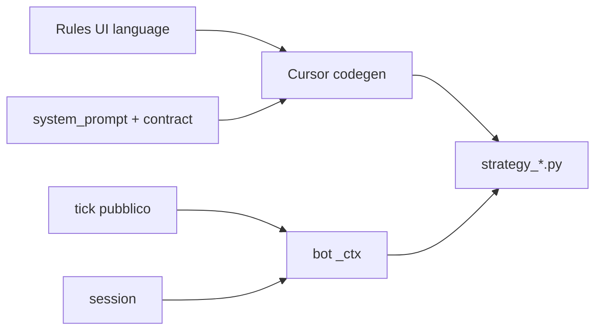

# Lessico rules dashboard → ctx codegen

## Principio (da fissare nel prompt)

Le **rules** sono scritte dall’utente che guarda la dashboard: etichette, % e numeri come in UI. Il codegen deve **sempre** mappare quel linguaggio ai campi reali di `ctx`, mai trattare i nomi UI come variabili Python.

Modello di riferimento già presente: zone colorate → intervalli su `sec` countdown ([`dashv2/strategy_system_prompt.md`](dashv2/strategy_system_prompt.md) righe 13–19). Stesso stile per tutto il resto.

## Gap attuale (evidenza)

- Contract elenca solo i nomi: `dwin_a, dwin_b, risk` senza shape ([`dashv2/strategy_codegen.py`](dashv2/strategy_codegen.py) `_CONTRACT`).
- `test-perc-2` fa `float(ctx["dwin_a"])` ma il bot passa dict `{"p_win_pct": N, "n": …}` ([`dashv2/bots/bot_process.py`](dashv2/bots/bot_process.py), [`_dwin_public`](dashv2/engine/plugins/replay.py)).
- UI orienta la % alla card con `100 - raw` se lato ≠ `dwin_ref_side` ([`dwinPctForSide`](dashv2/static/js/render.js)); le rules intendono **quel** numero.
- Campi in UI ma **assenti** dal ctx bot: `LIQ2` (`liq2_ask_usd` sul tick), `PTB` (`ptb_chainlink` sulla session). Senza aggiungerli, documentarli sarebbe bug silenzioso.



## 1. Riscrittura [`dashv2/strategy_system_prompt.md`](dashv2/strategy_system_prompt.md)

Tenere le regole già buone (countdown, quota=ask, mtm, size, indent, zone). Aggiungere una sezione **LESSICO DASHBOARD → CTX** strutturata così (sinonimi elastici + campo reale + regola di lato):

| Concetto UI (sinonimi tipici) | Campo ctx | Note |
|---|---|---|
| SEC TO END, secondi mancanti, countdown | `sec` | countdown 300→0 |
| zone bianca/verde/azzurra/gialla/rossa | range su `sec` | come oggi |
| BTC/USD, prezzo BTC | `chainlink_btc` | |
| PTB | `ptb_chainlink` | |
| DELTA, delta, scostamento | `delta_usd` | int USD col segno |
| quota UP/DOWN, ask, centesimi sui pulsantoni | `up_ask_c` / `down_ask_c` | default se dice solo “quota” |
| bid | `up_bid_c` / `down_bid_c` | solo se chiesto esplicitamente |
| quota maggioritaria / lato favorito | ask di `majority_side` | |
| Model A / indicatore A / DWinA / percentuale A | `dwin_a["p_win_pct"]` (+ `n`) | **% come in card** |
| Model B / indicatore B / DWinB / percentuale B | `dwin_b["p_win_pct"]` | **% come in card** |
| Rq / Rs (risk) | `risk[side]["rq"|"rs"]` | per card UP/DOWN |
| LIQ2 | `liq2_ask_usd` | USD notional ask top-2 lato majority |
| Size | `size_usd` su place / `open_orders[].size_usd` | |
| PNL / gain / profitto / MTM | `open_orders[].mtm_usd` | |
| Open orders | `open_orders` | filtrare per `strategy_id` |

**Regole di disambiguazione (obbligatorie nel prompt):**

1. **Lato implicito:** se le rules non dicono UP/DOWN, Model A/B e Rq/Rs si riferiscono alla **card del lato dell’azione** (ingresso → `majority_side`; gestione ordine → `order["side"]`).
2. **% Model A/B come in card** (non il grezzo TXT):
   - `raw = dwin_a["p_win_pct"]` (o B); `ref = dwin_ref_side`
   - se `side == ref` → `raw`, altrimenti `100 - raw`
   - confronti tipo `>= 75` usano questo intero 0–100; `None` / linette → condizione falsa
3. **Shape:** `dwin_a` / `dwin_b` sono dict (o `None`), **mai** float. Vietato `float(dwin_a)`.
4. **Rq/Rs:** interi o `None`; in UI `Rq 9`+`Rs 9` sul lato non-favorito è “blank” (non usare come segnale forte salvo richiesta esplicita).
5. **OUTCOME / anti-spoiler:** non usare outcome durante il round.
6. **Vol (`vol`):** in ctx ma non in UI oggi → usare solo se le rules lo nominano esplicitamente (V30/V60/…).

Snippet canonico da includere nel prompt (il modello deve copiarlo/adattarlo, non reinventarlo):

```python
def dwin_pct_for_side(ctx, side, key):  # key "a"|"b"
    block = ctx.get("dwin_a") if key == "a" else ctx.get("dwin_b")
    raw = None if not block else block.get("p_win_pct")
    ref = ctx.get("dwin_ref_side")
    if raw is None or ref is None:
        return None
    return raw if side == ref else 100 - raw
```

## 2. Espandere `_CONTRACT` in [`dashv2/strategy_codegen.py`](dashv2/strategy_codegen.py)

Documentare shape esatte nel blocco ctx:

- `dwin_a`: `{"p_win_pct": int|None, "n": int|None} | None`
- `dwin_b`: `{"p_win_pct": int|None} | None`
- `dwin_ref_side`: `"Up"|"Down"|None`
- `risk`: `{"Up": {"rq", "rs"}, "Down": {"rq", "rs"}}` con valori `int|None`
- `liq2_ask_usd`, `ptb_chainlink` (dopo punto 3)
- richiamo: “Model A/B / indicatore A/B → dwin_*; % sempre orientata alla card”

Il contract resta la fonte tipata; il `.md` resta il lessico sinonimi + default semantici.

## 3. Allineare ctx bot ai campi UI

In [`dashv2/bots/bot_process.py`](dashv2/bots/bot_process.py):

- aggiungere `liq2_ask_usd` dal tick
- tenere ultimo payload `session` e passare `ptb_chainlink` (e se utile `market_start_ts`) in `_ctx()`

Così il lessico PTB/LIQ2 è eseguibile, non solo documentato.

## 4. Fix immediato `test-perc-2`

Patch manuale di [`dashv2/history/strategies/strategy_f22a8e11ec03.py`](dashv2/history/strategies/strategy_f22a8e11ec03.py): `_model_ok` usa `dwin_pct_for_side` sul `majority_side` con soglia 75 (OR A/B). Nessuna chiamata Cursor obbligatoria; alla prossima edit rules dall’UI userà il nuovo prompt.

## 5. Test

Estendere [`dashv2/tests/test_strategy_codegen.py`](dashv2/tests/test_strategy_codegen.py):

- `reload_strategy_codegen_system_prompt` contiene mapping Model A / Rq / card / `p_win_pct`
- `build_codegen_prompt` / contract contiene shape `dwin_a` e divieto float

Niente test live Cursor (costo); smoke = unittest + eventuale reload strategy in UI.

## 6. Docs / agent (minimo)

- Una riga in [`docs/dashv2-architecture.md`](docs/dashv2-architecture.md) (sezione deterministic codegen): lessico UI→ctx vive in `strategy_system_prompt.md` + shape in `_CONTRACT`.
- In [`dashv2/agent_system_prompt.md`](dashv2/agent_system_prompt.md): quando propone rules, usare **etichette dashboard** (Model A, Rq, zona rossa, LIQ2…); non inventare nomi campi Python.

## Fuori scope

- Helper Python runtime condiviso importabile dalle strategy (le strategy restano moduli standalone generati).
- Mostrare `vol` in UI.
- Rigenerazione automatica di tutte le strategy esistenti.