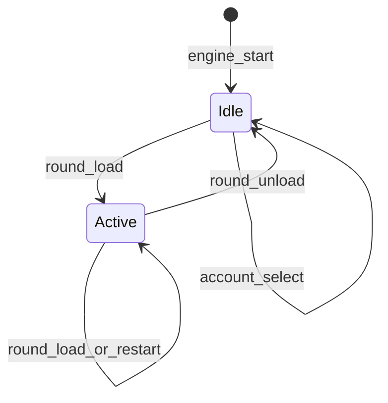
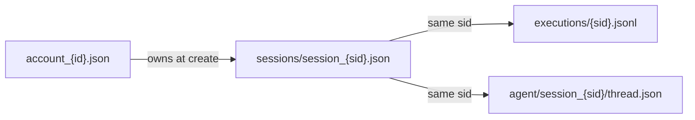

# Session first-class + chat per sessione

## Decisioni fissate

- **Scope:** chat session-scoped + registro sessioni leggero (non refactor ampio di history UI).
- **Ownership:** alla mint (`round.load` / `_restart_round`) si stampano `account_id` attivo sul registro.
- **Lock account:** con round caricato (`loaded=True`) cambio account e NEW account sono **vietati** (backend + UI).
- **Unload:** pulsante **UNLOAD SESSION** (non “unload account”) nella riga Account Management, allineato a destra (zona rossa nello screenshot). Scarica il round dall’engine → `loaded=False` → sblocca il cambio account senza restart processi.
- **No retrocompatibilità** su firme/path agent chat: thread `account_*` legacy ignorabili. Nessuna migrazione automatica.

## Ciclo load / unload

| Momento | `loaded` | Account switchabile? |
|---------|----------|----------------------|
| Avvio engine, nessun round | No | Sì |
| Dopo `round.load` / restart sessione | Sì | No |
| Refresh browser con engine up | Sì (sync) | No |
| Dopo **UNLOAD SESSION** | No | Sì |
| Select sessione storica nel dropdown AI | Non tocca `loaded` | Dipende da `loaded` engine |

## Modello dati

Nuovo file [`dashv2/sessions.py`](dashv2/sessions.py):

- Path: `history/sessions/session_{session_id}.json`
- Schema: `session_id`, `account_id`, `market_start_ts`, `started_at_utc` (+ opz. `active_strategy_ids`)
- API: `create_session`, `load_session`, `list_sessions_for_account` (sort `started_at_utc` desc)

Alla mint in [`replay.py`](dashv2/engine/plugins/replay.py) (`_cmd_round_load` / `_restart_round` / `_write_session_begin`):

1. Richiedere `active_account_id` (eccezione se assente).
2. `create_session(...)` sul registro.
3. `session.begin` in exec log con `account_id` (fonte di verità = registro).

### `round.unload`

Nuovo comando human-only in engine + ACL [`server.py`](dashv2/server.py) / docs:

- Se non `loaded` → eccezione.
- Se `orders.open_orders` → eccezione (chiudi/cancella prima; niente unload “sporco”).
- Se `playing` → stop (`playing=False`).
- Clear: `loaded=None`, `session_id=None`, `session_started_at_utc=None`, `round_ended=False`, orders reset/clear, chart/tick vuoti dove serve.
- Emit: `session` (`loaded:false`), `orders`, `history`, `accounts`, `bot.status`; server aggiorna `_live_ctx` e focus agent (live assente → focus resta sull’ultima sessione storica dell’account o `null` se lista vuota).
- **Non** cancella registro/exec log/chat su disco (la sessione resta consultabile dal dropdown agent).

### Lock cambio account

- `_cmd_account_select` / `_cmd_account_create`: se `self.loaded` → eccezione.
- UI [`render.js`](dashv2/static/js/render.js): `#accountSelect` e `#newAccountBtn` disabled se `session.loaded`; `#unloadSessionBtn` enabled solo se `loaded` (e tipicamente senza open orders — altrimenti click → errore ack).

### UI pulsante

In [`index.html`](dashv2/static/index.html) riga account (accanto a NEW / RENAME / EDIT):

- Contenitore flex: controlli account a sinistra, **`UNLOAD SESSION`** a destra (`ms-auto` / `justify-content-between`).
- Label fissa: **UNLOAD SESSION** (stile Caps come gli altri bottoni account).
- Wire in [`app.js`](dashv2/static/js/app.js): `emitAck("round.unload", {})` → aggiorna stato da eventi `session`/`accounts`.

## Chat agent → `session_id`

[`agent_chat.py`](dashv2/agent_chat.py): path `history/agent/session_{session_id}/thread.json`; firme keyed su `session_id`.

[`agent_service.py`](dashv2/agent_service.py): `run_turn(session_id, account_id, user_text)`.

[`server.py`](dashv2/server.py):

- history/clear/send richiedono `session_id`; eventi con `session_id`
- `_agent_focus_payload`: `list_sessions_for_account(active_account_id)` (+ meta exec log)
- Dopo unload: `live_session_id=null`; lista storica account resta
- Nuova sessione live: forza focus su di essa

## Frontend agent

- `loadAgentHistory()` su `session_id`; reload al cambio focus
- Clear/send con `session_id`; filter eventi per sessione corrente

## Cosa non entra in questo piano

- Refactor completo Closed order history come browser session-centric.
- API Socket `session.list` separate oltre al payload `agent.session`.
- Cancellazione disco di sessioni al unload.

## Docs / test / restart

- [`docs/dashv2-architecture.md`](docs/dashv2-architecture.md): registro sessioni, thread per session, `round.unload`, lock account.
- [`AGENTS.md`](AGENTS.md) se serve mappa UI/history.
- Test: sessions store; agent chat session-key; unload → `loaded=false` + account.select ok; select rifiutato se loaded; unload con open orders fallisce.
- Backend + static → `data/restart` + refresh browser.

## File principali

| Area | File |
|------|------|
| Registro | nuovo `dashv2/sessions.py` |
| Mint / unload / lock | `engine/plugins/replay.py` |
| ACL / focus | `server.py` |
| Chat | `agent_chat.py`, `agent_service.py` |
| UI | `static/index.html`, `app.js`, `render.js` |
| Test/docs | `tests/*`, architecture, AGENTS |
