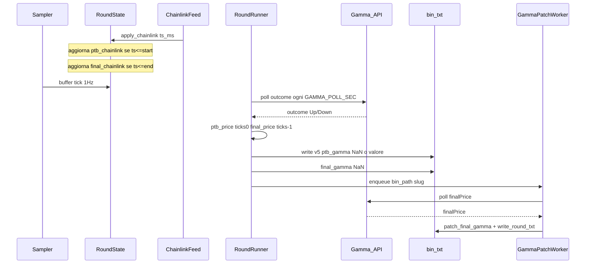

# Piano v5: settlement simmetrico e scrittura a due fasi

## Obiettivo

Eliminare il blocco post-round (7–12 min in attesa di `finalPrice` Gamma) mantenendo dati completi per analisi statistica del settlement. Ogni round produce subito un file utilizzabile; `final_gamma` arriva in patch asincrono.

## Decisioni confermate (nessuna ambiguità)

| Decisione | Valore |
|-----------|--------|
| Formato | **v5 only** — `read_round` / `verify` rifiutano v4 |
| Trigger prima scrittura | Arrivo **outcome** da Gamma (fallback timeout) |
| `ptb_chainlink` | Ultimo tick oracle con `ts_ms <= market_start_ms` |
| `final_chainlink` | Ultimo tick oracle con `ts_ms <= market_end_ms` |
| `ptb_price` | `ticks[0, 6]` — primo campione (sec ~300) |
| `final_price` | `ticks[-1, 6]` — ultimo campione (sec ~1) |
| `ptb_gamma` | Gamma `priceToBeat`; `NaN` se assente alla scrittura |
| `final_gamma` | Gamma `finalPrice`; `NaN` in v1, patch async |
| Delta colonna `.txt` | Sempre `chainlink_btc - ptb_chainlink` |
| Campi eliminati | `price_to_beat`, `ptb_provisional`, `ptb_delta`, `ptb_gamma_flag`, `final_provisional`, `final_delta`, `final_gamma_flag` |
| Sovrascritture | **Vietate** — ogni fonte ha il suo campo |

Valore assente Gamma: `float('nan')` nel double IEEE754 del bin (nessun flag, nessun default 0).

---

## Formato binario v5

File: [`src/binary_format.py`](f:\btc5min\src\binary_format.py)

```python
VERSION = 5
HEADER_FMT = "<4sHII B x I d d d d d d d"
# offset 0:  magic (4)
# offset 4:  version (2)
# offset 8:  market_start_ts (4)
# offset 12: market_end_ts (4)
# offset 16: outcome (1)  — 1=Up, 2=Down
# offset 17: pad (1)
# offset 20: tick_count (4)
# offset 24: fee_rate (8)
# offset 32: ptb_price (8)
# offset 40: ptb_chainlink (8)
# offset 48: ptb_gamma (8)
# offset 56: final_price (8)
# offset 64: final_chainlink (8)
# offset 72: final_gamma (8)   ← patch async scrive solo questi 8 byte
# HEADER_SIZE = 80
```

Record tick + orderbook: **invariati** rispetto a v4.

Funzioni nuove in `binary_format.py`:

- `patch_final_gamma(bin_path, value)` — `open(r+b)`, seek 72, `write(struct.pack('<d', value))`, close
- `patch_ptb_gamma(bin_path, value)` — seek 48 (solo se serve patch tardivo ptb)
- Costanti `OFFSET_PTB_GAMMA = 48`, `OFFSET_FINAL_GAMMA = 72` documentate nel file

`read_round`: se `version != 5` → eccezione esplicita.

---

## Flusso runtime



### Fase 1 — durante il round ([`src/round_state.py`](f:\btc5min\src\round_state.py))

Riscrittura `apply_chainlink`:

```python
if ts_ms <= self._ptb_start_ms:
    self.ptb_chainlink = value          # ultimo valido al boundary start
if ts_ms <= self._final_end_ms:
    self._final_chainlink_live = value  # ultimo valido al boundary end (aggiornato fino a market_end)
```

Rimuovere: `price_to_beat`, `ptb_provisional`, `final_provisional`, `ptb_delta`, `final_delta`, flag, logica `recv_ms`, sovrascritture in `apply_gamma_*`.

`apply_gamma_ptb(value)`: imposta solo `self.ptb_gamma = value` (no touch `ptb_chainlink`).

`apply_gamma_final(value)`: imposta solo `self.final_gamma = value` (no touch `final_chainlink`).

`apply_gamma_outcome(outcome)`: invariato.

**Display live** (sampler/log/[`feed_clob.py`](f:\btc5min\src\feed_clob.py)): `display_ptb()` = `ptb_gamma if ptb_gamma is not None else ptb_chainlink` — solo per log e side hint; il `.txt` usa **sempre** `ptb_chainlink` per delta (scelta utente).

`ensure_ptb_chainlink()` a fine pre-round se nessun tick oracle:
- se `chainlink_ts_ms <= market_start_ms` → `ptb_chainlink = chainlink_price`
- altrimenti eccezione

`ensure_final_chainlink()` a `market_end`:
- `final_chainlink = _final_chainlink_live` se impostato
- else se `chainlink_ts_ms <= market_end_ms` → `chainlink_price`
- altrimenti eccezione

`prime_chainlink`: se `ts_ms <= market_start_ms` → aggiorna anche `ptb_chainlink`.

### Fase 2 — post `market_end` ([`src/round_runner.py`](f:\btc5min\src\round_runner.py))

1. `state.stop.set()` + `sampler.join`
2. `ensure_final_chainlink()` + `ensure_ptb_chainlink()` se necessario
3. Eccezione se `ptb_chainlink` o `final_chainlink` mancanti
4. **`poll_gamma_outcome()`** — nuova funzione in [`src/market.py`](f:\btc5min\src\market.py):
   - Poll ogni `GAMMA_POLL_SEC`
   - Esce quando `state.gamma_outcome` è valorizzato **oppure** `time.time() >= market_end_ts + OUTCOME_WAIT_SEC`
   - Durante poll: continua ad applicare `apply_gamma_ptb` se arriva (per `ptb_gamma` in header)
   - **Non** attende `finalPrice`
5. Se outcome assente dopo timeout: `outcome = outcome_from_prices(final_chainlink, ptb_chainlink)` + warning `.warn`
6. `enrich_gains` + `write_round` v1
7. `state.chainlink_done.set()` + unregister feed — **libera memoria subito**
8. `GammaPatchWorker.enqueue(asset, interval, start_ts, bin_path)` se `math.isnan(final_gamma)`

Rimuovere completamente il blocco su `FINAL_PRICE_WAIT_SEC` nel thread round.

### Fase 3 — patch async (nuovo [`src/gamma_patch.py`](f:\btc5min\src\gamma_patch.py))

Thread daemon singleton avviato da [`src/main.py`](f:\btc5min\src\main.py):

- Coda `(asset, interval, start_ts, bin_path)`
- Per ogni job: poll `fetch_market_by_slug` ogni `GAMMA_POLL_SEC` fino a `finalPrice` o `market_end_ts + GAMMA_PATCH_WAIT_SEC`
- Su successo: `patch_final_gamma` → `write_round_txt` → rimuovi job
- Opzionale: se `ptb_gamma` era NaN in header, `patch_ptb_gamma` nello stesso ciclo
- Log: `round {ts} final_gamma patched {value}`

---

## Header builder

[`src/settlement.py`](f:\btc5min\src\settlement.py) — `build_round_header` v5:

```python
{
  "market_start_ts", "market_end_ts", "outcome",
  "tick_count", "fee_rate",
  "ptb_price": round(ticks[0,6], 2),
  "ptb_chainlink": round(state.ptb_chainlink, 2),
  "ptb_gamma": round(state.ptb_gamma, 2) if state.ptb_gamma else nan,
  "final_price": round(ticks[-1,6], 2),
  "final_chainlink": round(state.final_chainlink, 2),
  "final_gamma": nan,
}
```

Outcome: da `gamma_outcome` se presente, altrimenti calcolato da `final_chainlink` vs `ptb_chainlink`.

---

## setup.json

[`setup.json`](f:\btc5min\setup.json):

| Chiave | Valore proposto | Uso |
|--------|-----------------|-----|
| `outcome_wait_sec` | **120** | Max attesa outcome prima della scrittura forzata |
| `gamma_patch_wait_sec` | **1200** | Max vita job async per `final_gamma` |
| `gamma_poll_sec` | 10 | Invariato |
| Rimuovere | `settlement_wait_sec`, `final_price_wait_sec` | Non più usati |

[`src/setup.py`](f:\btc5min\src\setup.py): esporre `OUTCOME_WAIT_SEC`, `GAMMA_PATCH_WAIT_SEC`; rimuovere `FINAL_PRICE_WAIT_SEC`, `SETTLEMENT_WAIT_SEC`.

---

## Verify v5

[`src/verify.py`](f:\btc5min\src\verify.py) — regole aggiornate:

| Check | Regola |
|-------|--------|
| V9 | `ptb_chainlink > 0` |
| V11 | `final_chainlink > 0` |
| V11c | `final_price > 0` |
| V11d | `ptb_price > 0` |
| V19a | `\|ptb_price - ticks[0,6]\| < 0.02` |
| V19b | `\|final_price - ticks[-1,6]\| < 0.02` |
| V13 | Se `not isnan(final_gamma)` e `not isnan(ptb_gamma)`: outcome coerente con `final_gamma >= ptb_gamma`; altrimenti con `final_chainlink >= ptb_chainlink` |
| V19c-V19d vecchi | **Rimossi** (niente delta nel file) |
| Note OK | `final_gamma pending` se NaN; `ptb_gamma pending` se NaN |

---

## Convert e reader

[`src/convert.py`](f:\btc5min\src\convert.py) — header:

```
ptb_price / ptb_chainlink / ptb_gamma
final_price / final_chainlink / final_gamma
outcome
```

`nan` stampato come `nan` nel txt.

Delta righe data: `format_delta(chainlink, header["ptb_chainlink"])`.

[`src/reader.py`](f:\btc5min\src\reader.py): stessi 6 campi.

---

## File toccati (ordine implementazione)

1. [`src/binary_format.py`](f:\btc5min\src\binary_format.py) — v5 + patch
2. [`setup.json`](f:\btc5min\setup.json) + [`src/setup.py`](f:\btc5min\src\setup.py)
3. [`src/round_state.py`](f:\btc5min\src\round_state.py) — tracking oracle `<=`
4. [`src/market.py`](f:\btc5min\src\market.py) — `poll_gamma_outcome` (sostituisce exit su finalPrice)
5. [`src/settlement.py`](f:\btc5min\src\settlement.py)
6. [`src/round_runner.py`](f:\btc5min\src\round_runner.py) — nuovo flusso scrittura
7. [`src/gamma_patch.py`](f:\btc5min\src\gamma_patch.py) + [`src/main.py`](f:\btc5min\src\main.py)
8. [`src/feed_clob.py`](f:\btc5min\src\feed_clob.py) — `display_ptb` per log
9. [`src/verify.py`](f:\btc5min\src\verify.py), [`src/convert.py`](f:\btc5min\src\convert.py), [`src/reader.py`](f:\btc5min\src\reader.py)

Nessun migrator v4→v5.

---

## Deploy su poly (container `ticksaver`)

**Obbligatorio:** dopo il deploy del codice v5 e **prima** del riavvio del servizio, cancellare tutti i file in `data/` così restano solo round nel nuovo formato. I file v4 non sono più leggibili dai tool aggiornati e mescolarli con v5 creerebbe dataset inconsistente.

Sequenza:

1. `systemctl stop btc5min`
2. Sync codice su `/opt/btc5min` (come da procedura abituale)
3. **Pulizia data** — rimuovere tutto il contenuto di `/opt/btc5min/data/`:
   - `.bin`, `.txt`, `.warn` (round v4)
   - log e debug opzionali ma consigliati per ripartenza pulita: `collector.log`, `chainlink-debug.ndjson`, ecc.
4. `systemctl start btc5min`
5. Verifica: `ls -la /opt/btc5min/data/` vuota o solo file nuovi; dopo il primo round `python3 -m src.verify data/` su file v5

Comando esempio (da eseguire su poly dopo stop):

```bash
rm -f /opt/btc5min/data/*
```

**Locale (`f:\btc5min\data\`):** stessa policy consigliata prima del primo run v5 — cancellare i `.bin`/`.txt`/`.warn` v4 esistenti per evitare confusione in verify/analisi.

---

## Test plan

1. **Run locale `--once`**: file scritto entro ~30s da `market_end`; header con 6 prezzi; `final_gamma=nan`
2. **Attesa 2–5 min**: patch async; `final_gamma` valorizzato; `.txt` rigenerato
3. **Verify**: V19a/V19b su `ptb_price`/`final_price` vs tick; V13 con e senza gamma
4. **Confronto manuale**: `ptb_price` == riga sec 300; `final_price` == riga sec 1 del `.txt`
5. **Stress overlap**: 2 round consecutivi — nessun round “zombie” > `outcome_wait_sec` dopo il successivo spawn
6. **Deploy poly**: `grep` log per assenza attese `waiting for finalPrice`; presenza `final_gamma patched`

---

## Rischi noti

- **Outcome vs prezzi locali**: tra v1 e patch, `outcome` (Gamma) può non coincidere con `sign(final_chainlink - ptb_chainlink)` — atteso; si risolve confrontando con `final_gamma` dopo patch
- **File v4 in `data/`**: eliminati al deploy (vedi sezione Deploy poly); non si mantiene archivio v4 sul collector
- **Patch concorrente**: usare write atomico su bin (patch in-place su 8 byte è atomico su ext4 per allineamento) + rigenera txt dopo
