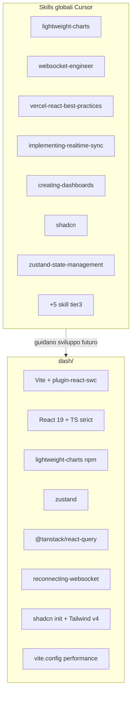

# Setup toolchain dashboard in `dash/`

## Obiettivo

Preparare l’ambiente frontend realtime in [`dash/`](dash/) come progetto **autonomo** (proprio `package.json`, `node_modules`, script dev/build), ottimizzato per aggiornamenti a ~1 Hz senza scatti. **Fuori scope:** layout dashboard, componenti chart, store con dati `.bin`/WS, bridge API Python.

## Architettura prevista (solo infrastruttura, nessuna UI business)



---

## Fase 1 — Installazione skill globali (13)

Eseguire in sequenza con `-g -y`:

| # | Comando | Ruolo |
|---|---------|-------|
| 1 | `npx skills add tradingview/lightweight-charts@lightweight-charts -g -y` | API candele/barre live |
| 2 | `npx skills add jeffallan/claude-skills@websocket-engineer -g -y` | Architettura WS |
| 3 | `npx skills add vercel-labs/agent-skills@vercel-react-best-practices -g -y` | Anti re-render |
| 4 | `npx skills add ancoleman/ai-design-components@implementing-realtime-sync -g -y` | Storico → live |
| 5 | `npx skills add ancoleman/ai-design-components@creating-dashboards -g -y` | Pattern dashboard |
| 6 | `npx skills add shadcn/ui@shadcn -g -y` | Componenti UI |
| 7 | `npx skills add jezweb/claude-skills@zustand-state-management -g -y` | Stato tick |
| 8 | `npx skills add asyrafhussin/agent-skills@react-vite-best-practices -g -y` | Vite best practices |
| 9 | `npx skills add patternsdev/skills@vite-bundle-optimization -g -y` | Bundle leggero |
| 10 | `npx skills add nickcrew/claude-ctx-plugin@react-performance-optimization -g -y` | Performance React |
| 11 | `npx skills add wshobson/agents@tailwind-design-system -g -y` | Design tokens |
| 12 | `npx skills add anthropics/skills@frontend-design -g -y` | Polish UI |
| 13 | `npx skills add ancoleman/ai-design-components@streaming-data -g -y` | Pattern streaming |

Verifica post-install: `npx skills check` (opzionale).

---

## Fase 2 — Scaffold minimo Vite in `dash/`

Da root repo:

```bash
cd f:\btc5min
npm create vite@latest dash -- --template react-ts
cd dash
npm install
```

**Cosa si crea (template ufficiale Vite):**
- [`dash/package.json`](dash/package.json), [`dash/vite.config.ts`](dash/vite.config.ts), [`dash/tsconfig.json`](dash/tsconfig.json)
- [`dash/index.html`](dash/index.html), [`dash/src/main.tsx`](dash/src/main.tsx), [`dash/src/App.tsx`](dash/src/App.tsx) — **App.tsx lasciato vuoto** (solo placeholder minimo tipo `<div />` o messaggio neutro “dash ready”, senza chart/layout)
- [`dash/src/index.css`](dash/src/index.css) — verrà sostituito/esteso da Tailwind

**Cosa NON si crea:**
- Nessun componente chart, pannello quote, timeline `sec`, store Zustand con dati
- Nessun hook WS, nessun fetch verso `.bin`
- Nessuna cartella `api/` Python nel repo root

---

## Fase 3 — Dipendenze npm (performance-first)

### Runtime

```bash
npm install lightweight-charts zustand @tanstack/react-query reconnecting-websocket
npm install clsx tailwind-merge class-variance-authority lucide-react
```

| Pacchetto | Perché |
|-----------|--------|
| `lightweight-charts` | Chart engine Canvas/WebGL, `update()` incrementale senza ridisegno completo |
| `zustand` | Stato tick con selector granulari, fuori dal render tree del chart |
| `@tanstack/react-query` | Cache/stale-while-revalidate per round storici via REST (fase successiva) |
| `reconnecting-websocket` | WS browser con backoff automatico (allineato a [`src/feed_chainlink.py`](src/feed_chainlink.py) / [`src/feed_clob.py`](src/feed_clob.py)) |
| `clsx` + `tailwind-merge` + `cva` + `lucide-react` | Prerequisiti shadcn |

### Dev / build

```bash
npm install -D @vitejs/plugin-react-swc tailwindcss @tailwindcss/vite
npm install -D eslint @eslint/js typescript-eslint eslint-plugin-react-hooks eslint-plugin-react-refresh
```

**Scelta chiave:** `@vitejs/plugin-react-swc` al posto di `@vitejs/plugin-react` (Babel) — HMR e compile più veloci.

**Non installare ora** (evita bundle gonfiato e scatti): Recharts, Chart.js, D3, ECharts, Redux, MobX, Socket.io client (overkill se il bridge sarà WS nativo).

---

## Fase 4 — Init shadcn (solo base, zero componenti dashboard)

```bash
cd dash
npx shadcn@latest init
```

Opzioni consigliate per tema trading dark (fluido, basso contrasto aggressivo):
- Style: **New York** o **Default**
- Base color: **Zinc** (neutro, adatto a chart scuro)
- CSS variables: **sì**
- `src/index.css`: integrazione variabili shadcn

**Non eseguire** `npx shadcn add button card tabs ...` in questo step — solo `init` produce:
- [`dash/components.json`](dash/components.json)
- [`dash/src/lib/utils.ts`](dash/src/lib/utils.ts) con `cn()`
- Tema CSS in [`dash/src/index.css`](dash/src/index.css)

---

## Fase 5 — Configurazioni anti-jank

### [`dash/vite.config.ts`](dash/vite.config.ts)

- Plugin: `react-swc` + `@tailwindcss/vite`
- `build.target: 'esnext'`
- `optimizeDeps.include: ['lightweight-charts']` — pre-bundle al primo avvio
- `build.rollupOptions.output.manualChunks`: chunk separato `charts` per `lightweight-charts` (cache browser, main thread più leggero)
- `server.port: 5173` (default), `strictPort: true`

### [`dash/tsconfig.json`](dash/tsconfig.json) + [`dash/tsconfig.app.json`](dash/tsconfig.app.json)

- `"strict": true`
- `"noUnusedLocals": true`, `"noUnusedParameters": true`
- Path alias `@/*` → `./src/*` (richiesto da shadcn)

### [`dash/src/main.tsx`](dash/src/main.tsx)

Solo wiring minimo futuro-proof, **senza logica dati**:

```tsx
import { StrictMode } from 'react'
import { createRoot } from 'react-dom/client'
import { QueryClient, QueryClientProvider } from '@tanstack/react-query'
import App from './App'
import './index.css'

const queryClient = new QueryClient({
  defaultOptions: {
    queries: { staleTime: 30_000, refetchOnWindowFocus: false },
  },
})

createRoot(document.getElementById('root')!).render(
  <StrictMode>
    <QueryClientProvider client={queryClient}>
      <App />
    </QueryClientProvider>
  </StrictMode>,
)
```

`refetchOnWindowFocus: false` evita spike inutili durante uso intensivo della dashboard.

### [`dash/src/App.tsx`](dash/src/App.tsx)

Placeholder neutro — es. un `<main>` vuoto con classe Tailwind; **nessun chart montato**.

### ESLint

Config flat moderna (template Vite aggiornato) con `react-hooks` e `react-refresh`.

---

## Fase 6 — Gitignore e script comodi

### Aggiornare [`.gitignore`](.gitignore) root

Aggiungere:

```
dash/node_modules/
dash/dist/
```

### [`dash.bat`](dash.bat) (root repo, opzionale ma utile su Windows)

```bat
cd /d %~dp0dash
npm run dev
```

---

## Fase 7 — Smoke test (solo toolchain)

```bash
cd dash
npm run dev      # deve aprire senza errori
npm run build    # bundle OK con chunk charts separato
```

Nessun test E2E in questo step.

---

## Accortezze performance documentate per la fase layout (prossimo messaggio)

Queste **non** richiedono codice ora, ma saranno vincoli quando descriverai il layout:

1. **Chart fuori da React state pesante** — ref al chart Lightweight Charts; aggiornamenti via `series.update()`, non `setData()` ogni tick
2. **Zustand con selector** — `useStore(s => s.lastTick)` non `useStore()` intero
3. **Buffer circolare ~300 punti** — un round = 300 sec; no array che cresce all’infinito
4. **requestAnimationFrame batching** — se arrivano burst WS, accorpare update in un frame
5. **Storico vs live** — `setData()` solo al cambio round; live solo `update()`
6. **Bridge Python separato** (fase successiva) — FastAPI/uvicorn in root o `dash-api/` che espone `read_round()` da [`src/binary_format.py`](src/binary_format.py); il frontend non legge `.bin` direttamente

---

## Deliverable atteso al termine

| Artefatto | Stato |
|-----------|-------|
| 13 skill globali installate | pronte |
| [`dash/`](dash/) progetto Vite+React+TS | avviabile con `npm run dev` |
| Dipendenze chart/state/query/WS | installate, non usate |
| shadcn init (tema + utils) | pronto per `shadcn add` mirati |
| Config Vite/TS performance | applicata |
| Layout dashboard, chart, WS handler | **assenti** — da definire nel prossimo passo |

## Fuori scope esplicito

- Bridge API Python per `.bin` / WS Polymarket
- Componenti shadcn aggiuntivi (button, card, …) finché non servono al layout
- Modifiche a [`AGENTS.md`](AGENTS.md) — opzionale in un secondo momento
- Deploy produzione (Docker, nginx)
