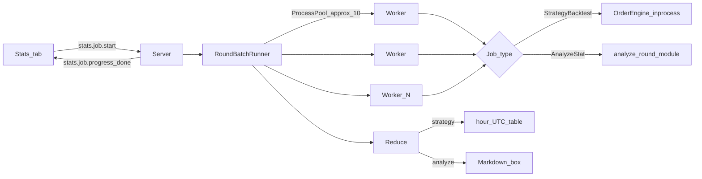

# Tab Stats — RoundBatch parallelo

## Decisioni già chiuse

- Simulazione **headless B**: stessi hook strategia + stesso `OrderEngine`/fill, senza Socket.IO/engine
- Risultati strategie: **24 righe** (ore UTC 00–23), aggregate su tutti i giorni del range; colonna mercato = `UTC_HOUR_MARKETS`
- Stats secondarie: pattern **rules → codegen Cursor → batch**, output Markdown
- Orchestrazione: **server** spawna pool ~10 processi; engine/bot fuori
- Scope round: **range giorni** selezionabile, default = tutto il DB

## Sezione 1 — Architettura (confermata)



### Confini processo

| Chi | Fa | Non fa |
|-----|-----|--------|
| **Browser (tab Stats)** | UI job, range giorni, strategia, chat stats, tabella/Markdown | simulazione |
| **Server** | comandi `stats.*`, spawn pool, progresso Socket.IO, reduce, codegen analyze | clock replay |
| **Worker (figli del server)** | carica un round, esegue job, ritorna dict per-round | Socket.IO |
| **Engine / Bot** | invariati | non partecipano al batch |

### Moduli nuovi (proposta path)

- [`dashv2/batch/runner.py`](dashv2/batch/runner.py) — listing round + `ProcessPoolExecutor` + progresso
- [`dashv2/batch/strategy_job.py`](dashv2/batch/strategy_job.py) — loop tick + `OrderEngine` + import `strategy_*.py`
- [`dashv2/batch/analyze_job.py`](dashv2/batch/analyze_job.py) — chiama `analyze_round` generato
- [`dashv2/batch/reduce.py`](dashv2/batch/reduce.py) — aggregazione 24 ore / Markdown
- UI: pane in [`dashv2/static/index.html`](dashv2/static/index.html) + render/app

Riuso: [`src/convert.py`](src/convert.py) `iter_round_bin_paths`, [`dashv2/rounds.py`](dashv2/rounds.py) per validità, [`dashv2/orders.py`](dashv2/orders.py) `OrderEngine`, [`dashv2/bots/runner.py`](dashv2/bots/runner.py) pattern import moduli.

### Job concorrenti

Un solo job batch alla volta (secondo job → errore esplicito). Replay live può restare attivo in parallelo (I/O disco condiviso; accettabile in v1).

---

## Sezione 2 — Contratti job (confermata)

### Interfaccia comune worker

Ogni round → un task pickle-friendly:

```python
# input
{"job": "strategy"|"analyze", "bin_path": str, "module_path": str, "strategy_id": str?, ...}
# output per-round (sempre)
{"market_start_ts": int, "hour_utc": int, "ok": bool, "error": str|None, ...job fields}
```

Round skippati (mancanti / senza txt / invalidi): non entrano nel pool; conteggio `skipped` nel summary.

### Job StrategyBacktest

1. `RoundRepository.load(mts)` (o equivalente headless sullo stesso merge bin+txt+risk)
2. `OrderEngine` fresco; `account_id="batch"`, `source="bot"`, `strategy_id` fissato
3. Import `strategy_{id}.py` (stesso pattern di `StrategyRunner`)
4. Loop sec 300→0 (tick reali del round, non clock):
   - costruisce `ctx` **identico** a `bot_process._ctx()` (stessi campi)
   - a sec 300: `on_round_start` poi tick; a ogni tick: `on_tick`; a fine: settlement + `on_round_end`
   - azioni `order.place|close|cancel` applicate via `OrderEngine` (stesso walk/fee del live)
   - tick `gap`/`partial`: place/close falliscono come live (eccezione → loggata nel risultato round, non abort intero job)
5. Output per-round:
   - `pnl_usd` (somma closed + settlement)
   - `n_orders`, `n_wins`, `n_losses` (a livello ordine; round “positivo” se `pnl_usd > 0`)
   - `traded: bool` (almeno un ordine)

**Size default:** stessi default size Up/Down della config dashboard (da `setup.json`), non size UI della sessione live.

### Job AnalyzeStat

1. Carica round (stesso load)
2. Chiama `analyze_round(round_view) -> dict` dal modulo generato
3. `round_view`: struttura stabile documentata (header, ticks array/list, books opzionali, txt-derived vol/risk/dwin) — **read-only**, niente ordini
4. Output per-round = dict ritornato + `market_start_ts` / `hour_utc`

Contratto codegen (fisso, come strategy hooks):

```python
def analyze_round(round_view: dict) -> dict:
    """Metriche scalari/liste JSON-serializzabili per questo round."""
    ...

def reduce_results(per_round: list[dict]) -> str:
    """Markdown finale aggregato (opzionale nel modulo; se assente, reduce server fa dump grezzo)."""
    ...
```

### Reduce strategie → tabella 24 ore

Per `hour_utc` in 0..23:

| Colonna | Definizione |
|---------|-------------|
| `hour` | `HH:00` |
| `market` | da `UTC_HOUR_MARKETS[hour]` (stesso elenco del picker) |
| `rounds` | # round nel bucket (con o senza trade) |
| `traded` | # round con almeno un ordine |
| `pos` | # round con `pnl_usd > 0` |
| `neg` | # round con `pnl_usd < 0` |
| `flat` | # round con `pnl_usd == 0` (incl. no-trade) |
| `pnl_sum` | somma `pnl_usd` |
| `pnl_avg` | `pnl_sum / rounds` (su tutti i round del bucket, non solo traded) |

Riga totale in fondo. Nessuna persistenza ledger account (il batch non tocca `history/accounts/`).

### Reduce analyze → Markdown

Se il modulo espone `reduce_results` → usarla; altrimenti il server produce un Markdown minimale con conteggi + sample delle chiavi aggregate. L’agente è incentivato a scrivere `reduce_results` nelle rules/codegen.

---

## Sezione 3 — UI tab Stats (confermata)

**Layout scelto: A — segmented** `Backtest | Analyze` (un solo sotto-pannello visibile).

### Dove vive

Nuova tab sinistra `#stats-tab` / `#statsPane` tra BOT e AGENT SESSION (o subito dopo BOT). Persistenza `localStorage` come le altre (`LEFT_TAB_IDS`).

### Sotto-pannello Backtest

Controlli:
- range giorni `from` / `to` (date UTC, default = min/max disponibili da `round_days`)
- select strategia (lista da evento `strategies`, stesso CRUD del tab BOT — solo scelta, no edit)
- bottone **Run** / **Cancel** (cancel termina il pool)
- barra progresso (`done/total` round + % )

Risultato:
- tabella 24 righe + totale (colonne Sezione 2)
- summary riga: strategy name, range, workers, elapsed, skipped/errors

### Sotto-pannello Analyze

- mini-chat dedicata (thread separato da AGENT SESSION, es. `history/agent/stats_{job_id}/` o thread `stats`)
- flusso rules → **Applica** → codegen → auto-run batch (o Run esplicito dopo apply)
- box Markdown risultato (render client-side semplice)
- stessi controlli range giorni del Backtest (condivisi in header Stats)

### Socket.IO (human-only)

| Comando | Ruolo |
|---------|--------|
| `stats.backtest.start` | `{strategy_id, day_from, day_to}` |
| `stats.analyze.start` | `{module_id o path, day_from, day_to}` dopo codegen |
| `stats.job.cancel` | stop job corrente |
| `stats.chat.send` / `stats.rules.apply` | analoghi agent, scope Stats |

| Evento | Payload |
|--------|---------|
| `stats.job.progress` | `{job_id, kind, done, total, errors}` |
| `stats.job.done` | `{job_id, kind, table?\|markdown?, summary}` |
| `stats.job.error` | `{job_id, message}` |
| `stats.chat.message` / `status` | come agent chat |

Workers default: **10** (configurabile in `setup.json` come `stats_workers`).

---

## Sezione 4 — Agent Analyze + persistenza (confermata)

### Flusso (parallelo alle strategy)

```
Chat Stats → fence ```rules``` → UI "Applica"
  → codegen Cursor (prompt dedicato analyze)
  → valida compile + presenza analyze_round
  → salva modulo su disco
  → (opz.) auto-start stats.analyze.start sul range corrente
  → pool → reduce_results → evento stats.job.done (markdown)
```

### Persistenza moduli analyze

Directory: `dashv2/history/stats/` (gitignored come `history/`)

| File | Contenuto |
|------|-----------|
| `analyze_{id}.json` | id, name, rules, created_at, module_file |
| `analyze_{id}.py` | `analyze_round` + opz. `reduce_results` |
| `_state.json` | ultimo `active_analyze_id` (opzionale) |

CRUD minimo in UI Analyze: lista/select, create (via chat+apply), delete. Niente editor Python manuale in v1 (come strategies: rules-first).

### Codegen

Nuovo prompt: `dashv2/stats_system_prompt.md` + `dashv2/stats_codegen.py` (specchio di `strategy_codegen.py`).

Contratto obbligatorio documentato nel prompt:
- input `round_view` (campi stabili: `market_start_ts`, `hour_utc`, `outcome`, ticks/series utili, vol/risk/dwin se presenti)
- output JSON-serializzabile
- vietato I/O rete, scrittura disco, import arbitrari pesanti (solo stdlib + numpy se già in env)

Chat agent: riuso `AgentService` / Cursor client con system prompt Stats distinto; thread keyed su `stats_thread` (non `session_id` replay).

### Auto-run

Dopo `stats.rules.apply` con successo → **auto-run** del batch analyze sul range giorni corrente della tab (default tutto). L’utente può Cancel.

---

## Sezione 5 — Errori, performance, test (confermata)

### Errori

- Job già running → `stats.job.error` immediato
- Round worker: eccezione → `{ok:false, error}` per quel round; job continua
- Codegen fallito → niente start batch; messaggio in chat
- Cancel → chiude pool, risultato parziale **non** mostrato come done (solo cancelled + done count)

### Performance

- ~10 worker; chunk round round-robin
- Load round riusa path dashboard; niente Socket.IO
- Stima: ~3k round × 300 tick headless — accettabile su macchina locale; progresso obbligatorio

### Test (unittest)

- `test_batch_reduce.py` — aggregazione 24h su fixture sintetiche
- `test_strategy_job_one_round.py` — un round fixture + strategy stub → pnl
- `test_analyze_job.py` — `analyze_round` stub → reduce markdown
- smoke manuale: Stats → Run backtest range 1 giorno → tabella; Analyze chat → apply → markdown

### Fuori scope v1

- Persistenza risultati storici job (solo ultimo in memoria/UI)
- Confronto multi-strategy side-by-side
- Export CSV tabella (aggiungibile dopo)
- Quarto processo dedicato / CLI

---

Design consolidato in [`docs/superpowers/specs/2026-07-19-stats-tab-batch-design.md`](../../docs/superpowers/specs/2026-07-19-stats-tab-batch-design.md).

Piano implementazione: [`docs/superpowers/plans/2026-07-19-stats-tab-batch.md`](../../docs/superpowers/plans/2026-07-19-stats-tab-batch.md).

