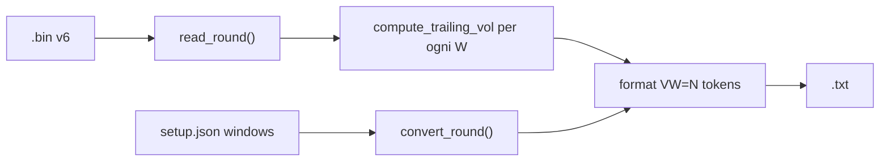

# Piano Indicatore Volatilità Intra-Round

## Prompt di riferimento

> Aggiungere una colonna di volatilità BTC per-secondo nella vista `.txt`, calcolata a posteriori ma in modo trailing/live-safe usando solo i tick già osservati nello stesso round. Il `.bin` resta formato canonico v6: la volatilità è derivata durante `python -m src.convert`, quindi ogni round rimane autonomo senza dipendere da round precedenti.

Estensione richiesta: **più indici `V` con periodi diversi sulla stessa riga** (es. `V30=12 V45=18`), con periodi e quantità definiti in [`setup.json`](setup.json).

## Obiettivo

Aggiungere al `.txt`, dopo `btc`, uno o più token `VW=N` per ogni finestra `W` configurata, con volatilità BTC locale per ogni secondo del round.

Scelte confermate:
- Indicatore: volatilità realizzata BTC intra-round su `chainlink_btc`.
- Salvataggio: solo derivato nel `.txt`, niente cambio `.bin` v6.
- Finestra: trailing/live-safe — per `sec_i` usa solo tick con `sec' ≤ sec_i` nello stesso round.
- **Multi-indice**: supporto di N finestre contemporanee (es. 30s e 45s) sulla stessa riga.

## Configurazione in setup.json

Due chiavi obbligatorie (nessun default nel codice):

```json
{
    "volatility_windows_sec": [30, 45],
    "volatility_min_changes": 5
}
```

| Chiave | Tipo | Significato |
| ------ | ---- | ----------- |
| `volatility_windows_sec` | `int[]` | Elenco periodi in secondi; **ogni elemento produce un indice `VW`**. Es. `[30]` → solo `V30`; `[30, 45]` → `V30` e `V45`. |
| `volatility_min_changes` | `int` | Minimo variazioni BTC valide nella finestra per emettere un valore; altrimenti `VW=---`. Condiviso da tutti gli indici. |

**Regole di validazione in `setup.py`:**
- `volatility_windows_sec` deve esistere ed essere una lista non vuota.
- Ogni elemento deve essere `int > 0`.
- Duplicati → eccezione (es. `[30, 30]` non ammesso).
- Ordine in output: **crescente per `W`** (es. `[45, 30]` in config → output `V30=… V45=…`).

**Valore iniziale proposto:** `[30]` (un solo indice; si aggiungono periodi senza cambiare codice).

In [`src/setup.py`](src/setup.py):
```python
VOLATILITY_WINDOWS_SEC = list(_req("volatility_windows_sec"))  # validazione + sort
VOLATILITY_MIN_CHANGES = int(_req("volatility_min_changes"))
```

## Formula

In [`src/convert.py`](src/convert.py), per **ogni** `W` in `VOLATILITY_WINDOWS_SEC`, calcolare una serie parallela ai tick prima dell’ordinamento `sec` decrescente.

### Definizioni (per ogni finestra W)

- `sec_i = floor(secs_to_expiry_i + 0.5)`.
- Finestra trailing: tick `j` con `sec_j ∈ [sec_i − W + 1, sec_i]`.
- Variazioni: `Δ_j = btc_j − btc_{j−1}` tra coppie consecutive nella finestra.
- `σ_i = std(Δ_j)` (`ddof=1`).
- **USD interno**: `vol_usd_i = σ_i × √(n_pairs)`.
- **Mostrato**: `round(vol_usd_i)` → `VW=N`.

### Invalidazione (per ogni VW)

- `VW=---` se `n_pairs < volatility_min_changes`.
- `VW=---` se riga corrente Chainlink stale.
- `VW=---` se nella finestra c’è BTC piatto ≥4 tick consecutivi (stall intra-round).

### Interpretazione

- `V30=12`: volatilità realizzata ~12$ sui micro-movimenti degli ultimi 30s osservati.
- `V45=18`: stessa metrica su 45s — più liscia, meno reattiva.
- Confronto utile: `V30` per rischio immediato, `V45` per regime leggermente più ampio; entrambi confrontabili con `|delta|`.

## Formato colonna nel TXT

Gli indici sono **token in coda alla riga**, dopo `btc`, separati da spazio, nell’ordine delle finestre (W crescente).

- **Header `data:`**: ultima colonna logica `vol` oppure etichette `V30  V45` allineate; in ogni caso le celle portano il formato completo `VW=N`.
- **Riga valida**: `V30=12  V45=18`.
- **Riga parziale/mista**: `V30=12  V45=---` (ogni indice invalidato indipendentemente).
- Nessun decimale, nessun `$` nella vista tabellare.

**Esempio con `[30, 45]`:**
```text
sec time quote     delta       gain%           btc                    vol
300 5:00 UP   52c   +12$  gain=  8.5%  btc=  97234.50  V30=---  V45=---
240 4:00 DOWN  61c   -28$  gain= 62.3%  btc=  97206.10  V30=18  V45=22
```

**Esempio con `[30]` solo:**
```text
240 4:00 DOWN  61c   -28$  gain= 62.3%  btc=  97206.10  V30=18
```

**Blocco `header:` del file** (metadati, non ripetuti per riga):
```text
  vol_windows_sec: [30, 45]
  vol_min_changes: 5
  vol_unit: usd_trailing
```

## Flusso di calcolo



1. Leggere `VOLATILITY_WINDOWS_SEC` da setup.
2. Per ogni `W`: `vols_usd[W] = compute_trailing_vol(ticks, W, min_changes)`.
3. Per ogni riga: concatenare `format_vol_token(W, vols_usd[W][i])` per tutti i `W`.

## File coinvolti

- [`setup.json`](setup.json) — `volatility_windows_sec`, `volatility_min_changes`.
- [`src/setup.py`](src/setup.py) — esportare e validare le due chiavi.
- [`src/convert.py`](src/convert.py)
  - `compute_trailing_vol(ticks, window_sec, min_changes) -> np.ndarray`
  - `format_vol_tokens(windows_sec, vols_by_window, tick_idx) -> str` → `"V30=12  V45=18"`
  - Estendere formattazione righe/header; calcolo una volta per round, non per riga.
- [`AGENTS.md`](AGENTS.md) — documentare multi-indice e setup.
- Collector / `.bin` / `verify` — invariati.

## Rischi e decisioni

| Decisione | Motivo |
| --------- | ------ |
| Array in `setup.json` invece di chiavi fisse `V30`, `V45` | Numero e periodi liberi senza toccare codice |
| `volatility_min_changes` unico per tutti i VW | Soglia minima dati identica; meno parametri da tunare |
| Ordine output W crescente | Leggibilità stabile anche se l’array in config è disordinato |
| Token `VW=N` in coda riga, non colonne `.bin` separate | Coerente con v6; rigenerabile da convert |
| Calcolo indipendente per ogni W | Finestre diverse possono essere `---` o valide in momenti diversi del round |

## Validazione

1. `volatility_windows_sec: [30]` → righe con solo `V30=N`.
2. `volatility_windows_sec: [30, 45]` → righe con `V30=N  V45=M`.
3. `volatility_windows_sec: []` o duplicati → eccezione in startup/convert.
4. `python -m src.convert data/` — warnings preservate.
5. `python -m src.verify data/` — `.bin` integro.
6. Round `gap-chainlink` — tutti i `VW=---` nella fascia stall.
7. A `sec=120`, nessun `VW` usa tick con `sec > 120`.
8. Cambio config `[30]` → `[30, 45]` + rigenerazione → compaiono entrambi i token.

## Fuori scope (fase 2)

- `volatility_min_changes` diverso per ogni W (possibile estensione futura).
- Indici compositi BTC + quote CLOB.
- Soglie operative `VW` vs `|delta|` — calibrazione su storico.
