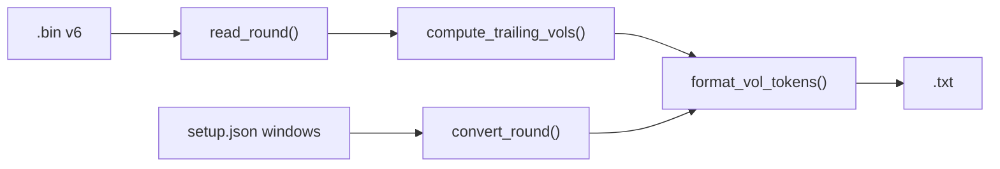

# Piano Indicatore Volatilità Intra-Round

**Stato:** implementato. Questo documento descrive il comportamento **effettivo** del codice in [`src/convert.py`](src/convert.py) e [`src/setup.py`](src/setup.py).

## Prompt di riferimento

> Aggiungere una colonna di volatilità BTC per-secondo nella vista `.txt`, calcolata a posteriori ma in modo trailing/live-safe usando solo i tick già osservati nello stesso round. Il `.bin` resta formato canonico v6: la volatilità è derivata durante `python -m src.convert`, quindi ogni round rimane autonomo senza dipendere da round precedenti.

Estensione richiesta: **più indici `V` con periodi diversi sulla stessa riga** (es. `V30=12  V45=18`), con periodi e quantità definiti in [`setup.json`](setup.json).

## Obiettivo

Aggiungere al `.txt`, dopo `btc`, uno o più token `VW=N` per ogni finestra `W` configurata, con volatilità BTC locale per ogni secondo del round.

Scelte confermate:
- Indicatore: volatilità realizzata BTC intra-round su `chainlink_btc`.
- Salvataggio: solo derivato nel `.txt`, niente cambio `.bin` v6.
- Finestra: trailing/live-safe — per `sec` corrente usa solo tick con `sec' ≥ sec` nello stesso round (asse countdown: presente + passato, mai futuro).
- **Multi-indice**: supporto di N finestre contemporanee sulla stessa riga.

## Configurazione in setup.json

Due chiavi obbligatorie (nessun default nel codice):

```json
{
    "volatility_windows_sec": [60],
    "volatility_min_changes": 5
}
```

Valore attuale in repo: `[60]` con `volatility_min_changes: 5`.

| Chiave | Tipo | Significato |
| ------ | ---- | ----------- |
| `volatility_windows_sec` | `int[]` | Elenco periodi in secondi; **ogni elemento produce un indice `VW`**. Es. `[60]` → solo `V60`; `[30, 45]` → `V30` e `V45`. |
| `volatility_min_changes` | `int` | Minimo variazioni BTC valide nella finestra per emettere un valore; altrimenti `VW=---`. Condiviso da tutti gli indici. |

**Regole di validazione in `setup.py`:**
- `volatility_windows_sec` deve esistere ed essere una lista non vuota.
- Ogni elemento deve essere `int > 0`.
- Duplicati → eccezione (es. `[30, 30]` non ammesso).
- `volatility_min_changes` deve essere `> 0`.
- Ordine in output: **crescente per `W`** (es. `[45, 30]` in config → output `V30=…  V45=…`).

In [`src/setup.py`](src/setup.py):

```python
VOLATILITY_WINDOWS_SEC = sorted([int(w) for w in _req("volatility_windows_sec")])  # validazione + sort
VOLATILITY_MIN_CHANGES = int(_req("volatility_min_changes"))
```

## Formula

In [`src/convert.py`](src/convert.py), per **ogni** `W` in `VOLATILITY_WINDOWS_SEC`, `compute_trailing_vol` calcola una serie parallela ai tick (indice array = indice tick, non ordine `sec` decrescente del `.txt`).

### Asse temporale (countdown)

`sec = floor(secs_to_expiry + 0.5)` — secondi mancanti alla scadenza. Valori **più alti** = più lontano dalla scadenza (inizio round). La finestra trailing è **verso il passato del round** (verso `sec` più alti), non verso il futuro.

### Definizioni (per ogni finestra W)

Per il tick corrente con `sec_i`:

- Finestra trailing: tick `j` con `sec_j ∈ [sec_i, sec_i + W − 1]` (presente + passato osservato, mai `sec_j < sec_i`).
- Variazioni: `Δ_k = btc_k − btc_{k−1}` tra coppie consecutive nella finestra (ordine per indice tick nel sottoinsieme).
- `σ = std(Δ, ddof=1)`.
- **USD interno**: `vol_usd = σ × √(n_pairs)` con `n_pairs = len(Δ)`.
- **Mostrato**: `round(vol_usd)` → `VW=N`; se `vol_usd == 0` → `VW=0` (BTC fermo nella finestra).

Implementazione (estratto):

```python
hi = sec_i + window_sec - 1
idxs = [j for j in range(n) if sec_i <= secs[j] <= hi]
deltas = [w_btcs[k] - w_btcs[k - 1] for k in range(1, len(w_btcs))]
out[i] = float(np.std(deltas, ddof=1)) * math.sqrt(len(deltas))
```

### Invalidazione (per ogni VW) — come implementato

- `VW=---` se meno di 2 tick nella finestra (`len(idxs) < 2`).
- `VW=---` se `len(deltas) < volatility_min_changes`.
- `VW=---` se la riga corrente è Chainlink stale (`chainlink_stale`: campione più vecchio di `stall_reconnect_sec` rispetto a `chainlink_recv_ms`).

**Non implementato** (era nel piano originale, rimosso dall’allineamento): invalidazione per BTC piatto ≥4 tick consecutivi nella finestra. Il codice non applica questa regola.

### Interpretazione

- `V60=12`: volatilità realizzata ~12$ sui micro-movimenti degli ultimi 60s osservati (countdown).
- Con più finestre: periodi più lunghi sono più lisci e meno reattivi.
- Confronto utile con `|delta|`: se `|delta| < VW` il movimento vs PTB è ancora nel rumore recente.

## Formato colonna nel TXT

Gli indici sono **token in coda alla riga**, dopo `btc`, separati da **due spazi** (`"  "`), nell’ordine delle finestre (W crescente).

- **Header `data:`**: colonna logica `vol` con larghezza dinamica (`vol_column_width()`).
- **Riga valida**: `V60=12` oppure `V30=12  V45=18`.
- **Riga parziale CLOB**: quote/gain `---`, ma i token `VW` sono comunque calcolati su `chainlink_btc`.
- **Riga mista**: `V30=12  V45=---` (ogni indice invalidato indipendentemente).
- Nessun decimale, nessun `$` nella vista tabellare.

**Esempio con `[60]` (config attuale):**

```text
sec   time  quote      delta        gain%             btc      vol
300   5:00  DOWN  57c     0$  gain= 51.3%  btc=  62458.00  V60=---
295   4:55  DOWN  52c    -9$  gain= 82.7%  btc=  62448.87  V60=6
```

**Esempio con `[30, 45]`:**

```text
240 4:00 DOWN  61c   -28$  gain= 62.3%  btc=  97206.10  V30=18  V45=22
```

**Blocco `header:` del file** (metadati, non ripetuti per riga):

```text
  vol_windows_sec: [60]
  vol_min_changes: 5
  vol_unit: usd_trailing
```

## Flusso di calcolo



1. Leggere `VOLATILITY_WINDOWS_SEC` da setup.
2. `vols_by_window = compute_trailing_vols(ticks)` → dict `{W: ndarray}`.
3. Per ogni riga (ordinamento `sec` decrescente): `format_vol_tokens(vols_by_window, tick_idx)`.

## File coinvolti

- [`setup.json`](setup.json) — `volatility_windows_sec`, `volatility_min_changes`.
- [`src/setup.py`](src/setup.py) — esportare e validare le due chiavi.
- [`src/convert.py`](src/convert.py)
  - `compute_trailing_vol(ticks, window_sec, min_changes) -> np.ndarray`
  - `compute_trailing_vols(ticks) -> dict[int, np.ndarray]`
  - `format_vol_token(window_sec, vol_usd) -> str`
  - `format_vol_tokens(vols_by_window, tick_idx) -> str`
  - `vol_column_width() -> int`
  - Header `vol_windows_sec` / `vol_min_changes` / `vol_unit`; calcolo una volta per round.
- [`AGENTS.md`](AGENTS.md) — documentazione utente allineata.
- Collector / `.bin` / `verify` — invariati.

## Rischi e decisioni

| Decisione | Motivo |
| --------- | ------ |
| Array in `setup.json` invece di chiavi fisse `V30`, `V45` | Numero e periodi liberi senza toccare codice |
| `volatility_min_changes` unico per tutti i VW | Soglia minima dati identica; meno parametri da tunare |
| Ordine output W crescente | Leggibilità stabile anche se l’array in config è disordinato |
| Token `VW=N` in coda riga, non colonne `.bin` separate | Coerente con v6; rigenerabile da convert |
| Calcolo indipendente per ogni W | Finestre diverse possono essere `---` o valide in momenti diversi del round |
| Nessun check BTC piatto intra-finestra | Non implementato; stale Chainlink e `min_changes` bastano per la fase 1 |

## Validazione (eseguita)

1. `volatility_windows_sec: [30]` → righe con solo `V30=N`.
2. `volatility_windows_sec: [30, 45]` → righe con `V30=N  V45=M`.
3. `volatility_windows_sec: []` o duplicati → eccezione in startup.
4. `python -m src.convert data/` — warnings preservate.
5. `python -m src.verify data/` — `.bin` integro.
6. Round con gap Chainlink — `VW=---` sulle righe stale.
7. A `sec=120`, nessun tick con `sec_j < 120` entra nella finestra (solo `sec_j ∈ [120, 120+W−1]`).
8. Cambio config `[60]` → `[30, 60]` + rigenerazione → compaiono entrambi i token.

## Fuori scope (fase 2)

- `volatility_min_changes` diverso per ogni W.
- Invalidazione per BTC piatto ≥4 tick consecutivi nella finestra.
- Soglia di copertura temporale minima della finestra (es. 80% di W) — rilevante per indice di rischio `R` (vedi piano separato).
- Indici compositi BTC + quote CLOB.
- Soglie operative `VW` vs `|delta|` — calibrazione su storico.
