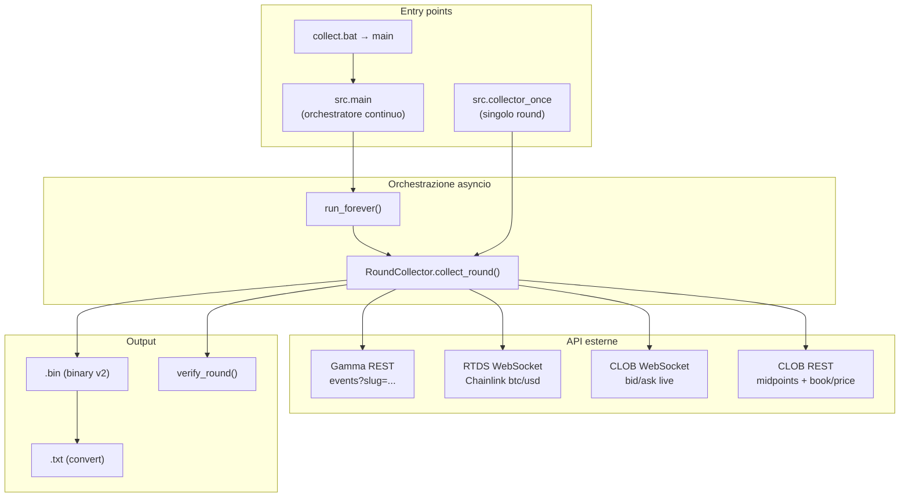

# Report tecnico: collector BTC5MIN

Analisi basata su codice attuale (`src/`), log `data/collector.log`, e file prodotti (`btc5m_1783303200.bin`, `btc5m_1783303800.bin` + `.txt`).

---

## 1. Panoramica architetturale

Il collector registra, per ogni round da 5 minuti del mercato Polymarket **BTC Up or Down 5m**, una serie temporale di:

- bid/ask del token **Up** e **Down** (CLOB)
- prezzo **Chainlink BTC/USD** (RTDS)
- `majority_gain`: guadagno relativo su $100 se si compra il lato "maggioritario" al book

I dati vengono bufferizzati in memoria per tutta la durata del round e scritti in un file binario alla scadenza.



**Modello di concorrenza:** un solo processo Python, **un solo thread**, event loop `asyncio`. Non ci sono thread OS né multiprocessing (il README parla di "processo parallelo per round" ma il codice non lo fa).

**Task asyncio attivi durante un round:**

| Task | Modulo | Ruolo |
|------|--------|-------|
| `_run()` Chainlink | `ws_chainlink.py` | WebSocket RTDS, aggiorna `price` e cattura `price_to_beat` |
| `_run()` CLOB | `ws_clob.py` | WebSocket order book, aggiorna bid/ask, chiama `_on_price()` |

Il loop principale di `collect_round` fa polling con `asyncio.sleep(0.05)`; le callback CLOB (`_on_price`) girano nello stesso event loop.

---

## 2. Entry point e avvio

### 2.1 `collect.bat` → `python -m src.main`

- Crea `data/collector.log` (stdout+stderr redirect)
- Avvia l'orchestratore continuo

### 2.2 `src/main.py` — orchestratore

Parametri fissi: `asset="btc"`, `interval="5m"`, output in `data/`.

Costante chiave: `PREP_AHEAD_SEC = 10` → tenta di avviare la raccolta **10 secondi prima** dell'inizio del round successivo.

Flusso:

1. Calcola `start_ts = current_round_start_ts("5m")` (floor del timestamp a multipli di 300s).
2. **Branch iniziale** (vedi §7.1 — è codice morto).
3. Loop infinito:
   - `next_ts = start_ts + 300`
   - Attende finché `time < next_ts - 10`
   - Se `time >= next_ts` → **salta** il round ("in progress")
   - Altrimenti `await collector.collect_round(next_ts)`
   - Eccezioni loggate, nessun crash del processo

### 2.3 `src/collector_once.py` — singolo round manuale

CLI: `--asset`, `--interval`, `--out`, `--start-ts` (opzionale; default = round corrente).

Utile per debug; non ha la logica di skip dell'orchestratore.

---

## 3. API e protocolli esterni

### 3.1 Gamma API (REST, sincrona)

| | |
|---|---|
| **URL** | `https://gamma-api.polymarket.com/events` |
| **Chiamata** | `GET ?slug=btc-updown-5m-{start_ts}` |
| **Quando** | All'inizio di ogni `collect_round`, via `wait_for_market()` |
| **Retry** | Ogni 2s per max 120s |
| **Blocca event loop** | Sì (`httpx.get` + `time.sleep` sincroni dentro coroutine async) |

**Dati estratti** (`market.py` → `parse_market`):

- `up_token_id`, `down_token_id` da `clobTokenIds`
- `market_start_ts`, `market_end_ts` da `eventStartTime`/`startDate` e `endDate`
- `priceToBeat` / `finalPrice` da metadata (usati solo in parse, **non** dal collector live per PTB)

### 3.2 RTDS Chainlink (WebSocket)

| | |
|---|---|
| **URL** | `wss://ws-live-data.polymarket.com` |
| **Subscribe** | `topic: crypto_prices_chainlink`, filtro `btc/usd` |
| **Quando** | `reconnect()` ~5s prima del round; resta attivo per tutta la raccolta |
| **Messaggi** | Tick singoli (`value`+`timestamp`) o batch storico (`data[]`) |
| **Reconnect** | Automatico con backoff 2→60s; anche manuale in `_wait_price_to_beat` |

**Cattura `price_to_beat`:** primo tick con `timestamp >= market_start_ts * 1000` (il più vicino all'apertura). Non usa il valore Gamma.

### 3.3 CLOB WebSocket

| | |
|---|---|
| **URL** | `wss://ws-subscriptions-clob.polymarket.com/ws/market` |
| **Subscribe** | `assets_ids: [up_token_id, down_token_id]`, `type: market` |
| **Quando** | Dopo che Chainlink ha un prezzo, prima di `market_start_ts` |
| **Eventi** | `book`, `best_bid_ask`, `price_change`, `market_resolved` |
| **Output** | `up_bid/ask`, `down_bid/ask`; quando tutti valorizzati → `ready=True` → callback `_on_price` |

### 3.4 CLOB REST (HTTP sincrono)

| | |
|---|---|
| **URL base** | `https://clob.polymarket.com` |
| **Endpoint** | `POST /midpoints`, `GET /book`, `GET /price` |
| **Quando** | A ogni cambio di secondo di countdown, in `_finalize_last_gain()` → `majority_gain()` |
| **Volume stimato** | ~**299 chiamate** `majority_gain` per round → **~600–900 richieste HTTP** per round |
| **Blocca event loop** | Sì (`httpx.Client` sincrono in contesto async) |

`majority_gain`: sceglie il token con midpoint più alto, simula acquisto market da $100 sul book asks, restituisce `(100/price)/100 - 1`.

---

## 4. Timeline dettagliata di un round

Esempio reale dal log: round `1783303200` (02:00–02:05 UTC).

```
T-10s (orchestratore)     collect_round(1783303200) avviato
T-?                       wait_for_market() → Gamma API
T-5s                      chainlink.reconnect() se non già connesso
T-5s                      attende prezzo Chainlink (max 15s)
T-~5s                     ClobFeed.start() → WS CLOB
T-0                       attende market_start_ts
T+0                       _wait_price_to_beat() max 30s
                          → log: "price_to_beat=63511.68"
T+0 … T+300s              loop: _try_sample() ogni 50ms
                          + callback WS su ogni update CLOB
T+300s                    _finalize_last_gain(), write .bin, .txt, verify
                          → log: "done 300 seconds outcome=Up"
```

### 4.1 Campionamento (`_try_sample`)

Un tick viene aggiunto solo quando:

1. CLOB `ready` (tutti e 4 i prezzi noti)
2. Chainlink `price` disponibile
3. `market_start_ts <= now < market_end_ts`
4. Il countdown intero `cd = floor(secs_to_expiry + 0.5)` è cambiato rispetto al precedente
5. `1 <= cd <= 300`

Ogni record contiene:

| Campo | Significato |
|-------|-------------|
| `recv_ts_ms` | Timestamp locale ricezione |
| `secs_to_expiry` | `market_end_ts - time.time()` (float, non intero) |
| `up_bid/ask`, `down_bid/ask` | Best bid/ask CLOB |
| `chainlink_btc` | Ultimo prezzo Chainlink |
| `majority_gain` | 0.0 al append; valorizzato sul tick **precedente** al cambio secondo |

Risultato osservato: **300 tick** per round (uno per secondo), `secs_to_expiry` da ~299.95 a ~1.33.

### 4.2 Settlement e scrittura file

`build_round_header()`:

- `final_chainlink` = prezzo Chainlink al tick con `secs_to_expiry` più vicino a 0
- `outcome` = Up se `final >= price_to_beat`, altrimenti Down

File prodotti:

- `btc5m_{start_ts}.bin` — ~10.864 byte (header 64B + 300×36B)
- `btc5m_{start_ts}.txt` — conversione leggibile via `convert.py`

---

## 5. Formato binario (v2)

**Header** (`HEADER_FMT`): magic `BTC5`, versione 2, start/end ts, price_to_beat, outcome (1=Up, 2=Down), final_chainlink, tick_count.

**Record** (`RECORD_FMT`): 8 campi float64/int come sopra.

Strumenti post-processing:

- `src.verify` — 14 controlli strutturali (V1–V14)
- `src.reader` — ispezione + export CSV
- `src.convert` — resample a secondi 300→1 con forward-fill

---

## 6. Evidenza da log e file prodotti

### 6.1 `collector.log`

| Evento | Interpretazione |
|--------|-----------------|
| `skipping round 1783302000 (in progress)` | Avvio a metà round corrente |
| `round 1783302300/2600 failed` — PTB non catturato | Chainlink senza tick al bordo round entro 30s |
| `round 1783303200 done 300 seconds` | Round completo OK |
| `skipping round 1783303500` | Round successivo saltato (bug orchestratore, §7.2) |
| `round 1783303800 done 300 seconds` | Raccolto il round dopo quello saltato |

### 6.2 File binari

Entrambi i `.bin` passano `verify` senza errori.

Round `1783303200`:

- `price_to_beat=63511.68`, outcome **Up** (final 63513.28)
- `majority_gain` da 0.01 a 0.92
- Anomalia al secondo 297: `up=0.01/0.99` (probabilmente glitch book momentaneo; spread formalmente valido)

---

## 7. Problemi di logica, bug e debito tecnico

### 7.1 Bug critico: orchestratore salta un round su due

Dopo `collect_round(N)` il processo è a `time ≈ N+300` (fine round). Il loop calcola `next_ts = N+300` e trova `time >= next_ts` → **skip sistematico**.

Conferma dal log:

- raccolto `1783303200` → skip `1783303500` → raccolto `1783303800` → skip `1783304100`

Il README descrive overlap/spawn parallelo; il codice è **sequenziale** e non può rispettare `PREP_AHEAD_SEC` se attende la fine del round precedente.

### 7.2 `majority_gain`: ~600–900 HTTP sincroni per round

Chiamato a ogni transizione di secondo, blocca l'event loop asyncio. Rischio: latenza campionamento, rate limit CLOB, WS Chainlink/CLOB in ritardo.

Per un POC di raccolta bid/ask questo è il punto più pesante e probabilmente superfluo in tempo reale (si potrebbe calcolare offline).

### 7.3 Fallimenti `price_to_beat` (log 03:45, 03:50)

La cattura dipende dal primo tick Chainlink con `ts >= market_start`. Se il WS manda solo batch storico o tick ritardati, scatta il timeout 30s. I reconnect ogni 5s dopo `start_ts` mitigano ma non bastano sempre.

`diag_ptb.py` esiste proprio per questo; non è integrato nel collector.

### 7.4 Codice morto / incoerenze

| Elemento | Problema |
|----------|----------|
| `main.py` riga 18: `if time.time() < start_ts` | **Mai vero** (`start_ts = floor(now)`). Branch morto. |
| `ChainlinkFeed.start()` | Mai chiamato; si usa solo `reconnect()` |
| `ClobFeed._resolved` | Scritto, mai letto |
| `write_warnings()` | Mai chiamato dal collector |
| `market.py` `priceToBeat` da Gamma | Parsato ma ignorato dal collector live |
| README "processo parallelo per round" | Non implementato |

### 7.5 Chiamate sincrone in contesto async

- `wait_for_market()` → `httpx.get` + `time.sleep(2)`
- `majority_gain()` → `httpx.Client` sincrono

Durante queste chiamate WS e campionamento sono bloccati.

### 7.6 Gestione errori permissiva

`main.py` cattura tutte le eccezioni per round e continua. Round persi senza retry né allarme forte (solo ERROR nel log).

### 7.7 Qualità dati CLOB

Tick con quote estreme (es. `up 0.01/0.99` a sec 297) passano `verify` perché `bid < ask`. Nessun filtro su spread o coerenza Up+Down ≈ 1.

### 7.8 `settlement` locale vs Gamma

L'outcome è calcolato dai tick Chainlink locali, non dall'API Gamma post-chiusura. Di solito coincide; in caso di discrepanza oracle il file potrebbe divergere dalla risoluzione ufficiale.

### 7.9 Duplicazione logging config

`logging.basicConfig` in `main.py`, `collector_worker.py`, `collector_once.py` — solo il primo ha effetto.

### 7.10 Cose che funzionano bene

- Formato binario compatto e verificabile
- Campionamento 1 Hz allineato al countdown
- Due round consecutivi raccolti con 300 tick ciascuno e verify OK
- WS CLOB con gestione multi-evento (`book`, `best_bid_ask`, `price_change`)
- Chainlink con normalizzazione timestamp ms/s (`ts_to_ms`)

---

## 8. Mappa moduli e responsabilità

| Modulo | Righe | Ruolo |
|--------|-------|-------|
| `main.py` | 63 | Orchestratore continuo |
| `collector_worker.py` | 147 | Core: `RoundCollector` |
| `collector_once.py` | 35 | CLI singolo round |
| `market.py` | 90 | Discovery Gamma + slug |
| `ws_chainlink.py` | 126 | Feed Chainlink RTDS |
| `ws_clob.py` | 111 | Feed CLOB bid/ask |
| `clob_api.py` | 58 | REST majority_gain |
| `round_buffer.py` | 29 | Buffer in-memory |
| `binary_format.py` | 76 | Serializzazione v2 |
| `settlement.py` | 32 | Header outcome |
| `verify.py` | 95 | Validazione file |
| `convert.py` | 115 | Export .txt |
| `reader.py` | 50 | Ispezione CLI |

**Totale core collector:** ~600 righe. Molteplicazioni e residui di refactor rendono il flusso meno lineare del necessario.

---

## 9. Raccomandazioni per versione minimale (solo analisi, no modifiche)

Ordine di priorità per una ripulitura:

1. **Orchestratore** — Avviare `collect_round(next_ts)` mentre il round precedente è ancora in corso (task parallelo), oppure non attendere `market_end_ts` nel task di scheduling. Obiettivo: **ogni** round, non uno sì e uno no.

2. **Rimuovere o spostare `majority_gain` live** — Calcolo offline sui `.bin` elimina centinaia di HTTP per round e sblocca l'event loop.

3. **Un solo entry point** — `main.py` o `collector_once.py` con flag `--once`; eliminare duplicazioni.

4. **Chainlink PTB** — Valutare uso di `priceToBeat` Gamma come confronto/fallback, o reconnect obbligatorio ~12s prima del round (come in `diag_ptb.py`).

5. **Async pulito** — `httpx.AsyncClient` o `asyncio.to_thread` per REST; `asyncio.sleep` al posto di `time.sleep` in `wait_for_market`.

6. **Codice morto** — Rimuovere branch morto in `main`, `_resolved`, `write_warnings` se inutilizzato, `start()` se ridondante con `reconnect()`.

7. **README allineato** — Descrivere il modello reale (single process, asyncio) non "spawn parallelo".

---

## 10. Schema temporale sintetico (round ideale)

```
|--T-10--|--T-5--|======= 300s round =======|--write--|
   ^           ^         ^           ^            ^
   orch        chainlink  CLOB+PTB   1Hz sample   .bin
   prep        reconnect  capture    + HTTP gain
```

**Stato attuale reale:** l'orchestratore non può fare "prep" del round N+1 a T-10 se è ancora bloccato sul campionamento/scrittura del round N fino a T+300 — da qui lo skip alternato.

---

## Sintesi

Il **nucleo di raccolta** (Gamma → WS Chainlink + CLOB → buffer → bin) è coerente e produce dati validi quando un round viene completato. I problemi principali sono nell'**orchestrazione** (perde metà dei round), nel **`majority_gain` sincrono** (carico eccessivo e blocking), e nel **debito di refactor** (codice morto, README non allineato, mix sync/async). Per una versione minimale funzionante basterebbe principalmente sistemare lo scheduling e alleggerire/rimuovere le chiamate REST durante la raccolta.
