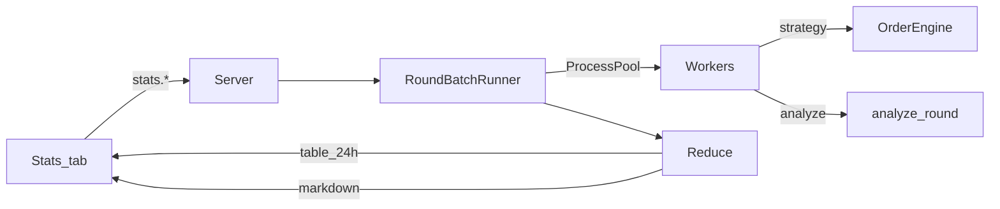

# Design: Tab Stats + RoundBatch parallelo

Data: 2026-07-19  
Stato: approvato in brainstorming (sezioni 1–5)

## Obiettivo

Aggiungere alla dashboard dashv2 una tab **STATS** che:

1. **Backtest strategie** — esegue una strategy già testata live (`on_round_start` / `on_tick` / `on_round_end`) su tutti i round (o un range giorni) in modo batch, parallelo (~10 processi), headless; risultati in tabella 24 ore UTC.
2. **Analyze stats** — stesso scanner parallelo, ma con codice Python generato da un agente (rules → codegen), output Markdown aggregato.

## Decisioni

| Tema | Scelta |
|------|--------|
| Fedeltà simulazione | Headless: stessi hook + stesso `OrderEngine`/fill/fee/settlement; niente Socket.IO/engine/bot |
| Aggregazione backtest | 24 righe (ore UTC 00–23) su tutti i giorni del range; colonna `market` = `UTC_HOUR_MARKETS` |
| Analyze | Rules-first → codegen Cursor → batch; Markdown |
| Orchestrazione | Server dashv2 spawna `ProcessPoolExecutor`; engine/bot non partecipano |
| Scope round | Range `day_from`/`day_to` UTC; default = tutto il DB |
| UI | Tab STATS con segmented **Backtest \| Analyze** |
| Job concorrenti | Un solo job batch alla volta |
| Workers | Default 10 (`setup.json` → `stats_workers`) |

## Architettura



| Processo | Responsabilità |
|----------|----------------|
| Browser | UI job, range, strategia, chat analyze, tabella/Markdown |
| Server | Comandi `stats.*`, pool, progresso, reduce, codegen analyze |
| Worker (figli) | Load un round, esegue job, ritorna dict |
| Engine / Bot | Invariati; fuori dal batch |

Replay live può restare attivo durante un job (I/O disco condiviso accettabile in v1).

## Moduli nuovi

| Path | Ruolo |
|------|-------|
| `dashv2/batch/runner.py` | Listing round filtrati + pool + progresso |
| `dashv2/batch/strategy_job.py` | Loop tick + `OrderEngine` + import strategy |
| `dashv2/batch/analyze_job.py` | Chiama `analyze_round` |
| `dashv2/batch/reduce.py` | Tabella 24h / Markdown fallback |
| `dashv2/stats_codegen.py` | Codegen + validazione moduli analyze |
| `dashv2/stats_system_prompt.md` | Prompt contratto analyze |
| `dashv2/static/*` | Tab STATS (index, app, render, css) |

Riuso: `RoundRepository` / `iter_round_bin_paths`, `OrderEngine`, pattern `StrategyRunner`, Cursor client / pattern agent chat.

## Contratti job

### Worker I/O

```python
# input (pickle-friendly)
{"job": "strategy"|"analyze", "bin_path": str, "module_path": str, "strategy_id": str | None, ...}

# output per-round
{"market_start_ts": int, "hour_utc": int, "ok": bool, "error": str | None, ...}
```

Round invalidi/mancanti: esclusi dal pool; conteggio `skipped` nel summary.

### StrategyBacktest

1. Load round (stesso merge bin+txt+risk della dashboard).
2. `OrderEngine` fresco; `account_id="batch"`, `source="bot"`, `strategy_id` fissato.
3. Import `strategy_{id}.py`.
4. Loop sec 300→0 (dati tick, non clock 1 Hz):
   - `ctx` identico a `bot_process._ctx()`
   - `on_round_start` a inizio; `on_tick` ogni tick; settlement poi `on_round_end`
   - azioni `order.place|close|cancel` via `OrderEngine`
   - azione fallita (gap/partial/liq): loggata, round **continua** (non abort del round)
   - eccezione non gestita nel modulo strategy: round `{ok:false}`; job batch continua
5. Output: `pnl_usd`, `n_orders`, `n_wins`, `n_losses`, `traded`

Size: default Up/Down da `setup.json` (non size della sessione UI).  
Il batch **non** scrive `history/accounts/`.

### AnalyzeStat

```python
def analyze_round(round_view: dict) -> dict: ...
def reduce_results(per_round: list[dict]) -> str: ...  # opzionale
```

`round_view` read-only (header, ticks, books opzionali, vol/risk/dwin). Niente ordini.

### Reduce backtest → tabella

Per ogni `hour_utc` 0..23:

| Colonna | Definizione |
|---------|-------------|
| hour | `HH:00` |
| market | stesso elenco del picker (`UTC_HOUR_MARKETS` in JS); copia costante in `dashv2/batch/reduce.py` (una sola fonte Python per il reduce) |
| rounds | # round nel bucket |
| traded | # con almeno un ordine |
| pos | `pnl_usd > 0` |
| neg | `pnl_usd < 0` |
| flat | `pnl_usd == 0` (include no-trade) |
| pnl_sum | somma |
| pnl_avg | `pnl_sum / rounds` |

Riga totale in fondo.

### Reduce analyze → Markdown

Se il modulo espone `reduce_results`, usarla; altrimenti Markdown minimale server-side.

## UI

- Tab `#stats-tab` / `#statsPane` dopo BOT; `LEFT_TAB_IDS` + localStorage.
- Segmented **Backtest | Analyze**.
- Range giorni condiviso in header Stats (default min/max da `round_days`).

**Backtest:** select strategia, Run/Cancel, progress, tabella 24h + summary (nome, range, workers, elapsed, skipped/errors).

**Analyze:** chat dedicata (thread non legato a `session_id` replay), Applica rules, box Markdown, lista/select/delete moduli.

### Socket.IO (human-only)

Comandi: `stats.backtest.start`, `stats.analyze.start`, `stats.job.cancel`, `stats.chat.send`, `stats.rules.apply`.

Eventi: `stats.job.progress`, `stats.job.done`, `stats.job.error`, `stats.chat.message` / `status`.

## Persistenza analyze

`dashv2/history/stats/` (sotto history già gitignored):

- `analyze_{id}.json` — metadati + rules
- `analyze_{id}.py` — modulo
- `_state.json` — ultimo `active_analyze_id` (opzionale)

Dopo `stats.rules.apply` ok → **auto-run** batch sul range corrente (Cancel consentito).

Codegen: vietati rete, scrittura disco, import arbitrari; solo stdlib (+ numpy se già in env).

## Errori

- Secondo job mentre uno gira → errore immediato
- Eccezione worker → `{ok:false}` sul round; job continua
- Codegen fallito → niente batch; messaggio in chat
- Cancel → pool chiuso; niente `done` con risultato parziale (solo cancelled + conteggio)

## Test

- `test_batch_reduce.py` — aggregazione 24h
- `test_strategy_job_one_round.py` — fixture + stub strategy → pnl
- `test_analyze_job.py` — stub analyze → markdown
- Smoke: backtest 1 giorno; analyze chat → apply → markdown

## Fuori scope v1

- Storico risultati job
- Confronto multi-strategy
- Export CSV
- Quarto processo / CLI dedicata

## Riferimenti

- Strategie live: `dashv2/bots/bot_process.py`, `dashv2/orders.py`, `dashv2/strategy_codegen.py`
- Round: `dashv2/rounds.py`, `src/convert.py`, `docs/round-format.md`
- Architettura UI/IPC: `docs/dashv2-architecture.md`
