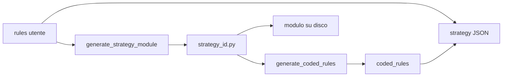

# Design: Strategy coded_rules (reverse-pass)

Data: 2026-07-19  
Stato: approvato in brainstorming

## Obiettivo

Dopo il codegen del modulo Python di una strategy deterministic, una seconda chiamata al modello rilegge solo il `.py` e produce un testo schematico **Coded rules**, salvato in un campo separato da `rules`. L’utente confronta intento (`rules`) vs comportamento implementato (`coded_rules`) senza dover leggere il Python.

## Decisioni

| Tema | Scelta |
|------|--------|
| Campo | `coded_rules` (stringa) nel JSON strategy, distinto da `rules` |
| Sovrascrittura rules | No: `rules` resta l’intento utente |
| UI | Modal con tab **Rules** \| **Coded rules** (readonly); dopo codegen resta aperta su Coded rules |
| Schema output | Solo tre sezioni obbligatorie: `Apertura:`, `Chiusura:`, `Vincoli:` |
| Contenuto sezioni | Bullet colloquiali (termini dashboard); numeri espliciti; vietato citare variabili codice/`ctx` |
| Quando generare | Dopo ogni codegen riuscito (create deterministic, update con `rules_changed`, `agent.rules.apply`) |
| Fallimento reverse-pass | Python salvato comunque; `coded_rules` vuoto; warning in progress/log |
| Clone | Copia anche `coded_rules` |
| Strategie esistenti | `coded_rules` assente/vuoto finché non si rigenera |

## Flusso



1. Codegen + validate (come oggi).
2. `generate_coded_rules(source)` → seconda `call_model` con prompt: leggi solo il sorgente; output solo le tre sezioni; fatti osservabili; niente inventare.
3. Persistenza: `write_module` + JSON con `rules` + `coded_rules`.

## Formato `coded_rules` (imposto)

```
Apertura:
- ...

Chiusura:
- ...

Vincoli:
- ...
```

Sotto ogni heading: elenco di condizioni/vincoli derivati dal codice. Se una sezione non ha nulla di rilevante nel modulo, può contenere un bullet esplicito tipo `- (nessuna)` piuttosto che omettere la sezione.

## UI

- Modal deterministic: tab **Rules** (editabile) e tab **Coded rules** (`readonly`).
- Create: Coded rules vuoto fino al save/codegen.
- Dopo save con codegen: la modale resta aperta, aggiorna Coded rules e passa a quella tab.
- Save senza regen (solo name/desc o rules invariate): chiude la modale come prima.

## Fuori scope

- Promuovere `coded_rules` → `rules` con conferma utente.
- Rigenerare solo coded_rules senza rifare il Python.
- Diff automatico rules vs coded_rules.
- Analyze/stats (solo strategy deterministic).
